### <span class="hl">TL;DR</span>

An attacker operating from **47.128.63.0** targeted a WordPress installation at `feefaworldcup.co.th`. After scanning with Nmap Scripting Engine and WPScan v3.8.28, the attacker identified the **Perfect Survey** plugin and exploited **CVE-2021-24762** - an unauthenticated SQL injection in the `get_question` AJAX action - using sqlmap 1.9.3. A multi-vector UNION+XSS+RCE probe confirmed the injection at **02:25:31**, and systematic blind SQLi extraction of `user_pass` from `wordpress.wp_users` ran until **03:11:50**. Using cracked credentials, the attacker accessed `mourinho.j` at **02:35**, Kerberoasted `alonso.x` with RC4-HMAC encryption at **02:40**, then at **02:50** created a rogue computer account `MADRID$`, abused Resource-Based Constrained Delegation against `APP-BKUP01$`, and at **02:54** exploited Active Directory Certificate Services with a forged SAN for `administrator@worldcup.ball` to achieve full domain compromise on `PACIFIC-DC.worldcup.ball`.

### <span style="color:red">Initial Triage</span>

Knowing a web attack had occurred, I started the investigation in **Kibana** by analyzing `access.log` - the HTTP access log ingested from the target web server. I examined the `source.address` field distribution to identify the dominant traffic source.

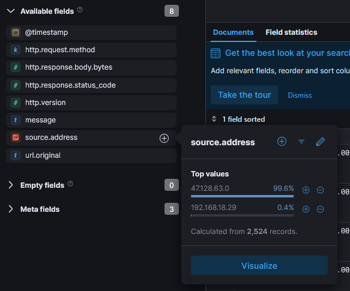

**47.128.63.0** accounted for 99.6% of all 2,524 records, with the remaining 0.4% from `192.168.18.29` - almost certainly internal traffic. I filtered all subsequent queries to `source.address: 47.128.63.0` and examined the `http.response.status_code` field to understand the nature of the requests.

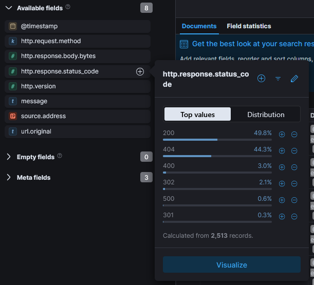

The distribution showed **200** at 49.8% and **404** at 44.3%, a pattern typical of automated scanning tools that probe many paths and receive 404 for non-existent resources while successfully hitting valid endpoints. This confirmed the traffic was tool-generated rather than manual browsing.

### <span style="color:red">Reconnaissance</span>
#### <span style="color:red">Nmap NSE</span>
I sorted the filtered events chronologically to trace the attacker's activity from the beginning. The first significant hit at **Sep 18, 2025 02:12:30** showed a GET request to `/wordpress/` with a response of 200 from User-Agent `Mozilla/5.0 (compatible; Nmap Scripting Engine; https://nmap.org/book/nse.html)` - **Nmap NSE** is the scripting engine component of the Nmap network scanner, used here to fingerprint the web application.

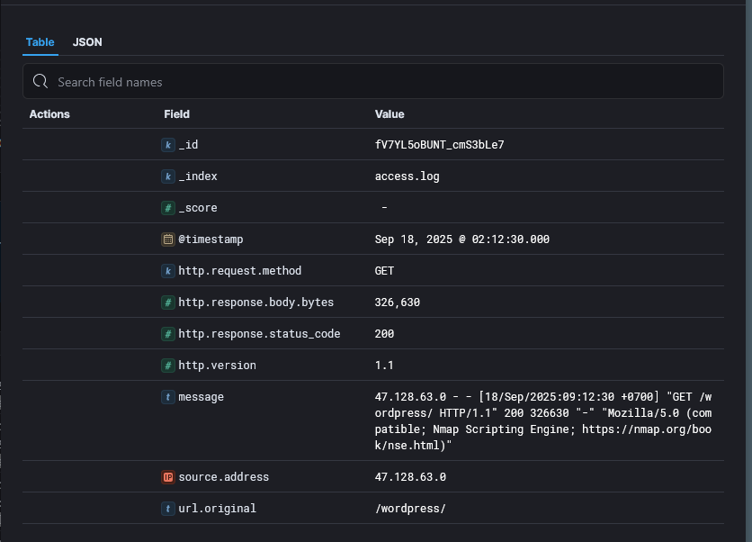
#### <span style="color:red">WPScan</span>
At **02:19:21** the User-Agent switched to `WPScan v3.8.28` - a dedicated **WordPress vulnerability scanner** - with the same `/wordpress/` target, indicating the attacker confirmed a WordPress installation from the Nmap results and escalated to targeted CMS scanning.

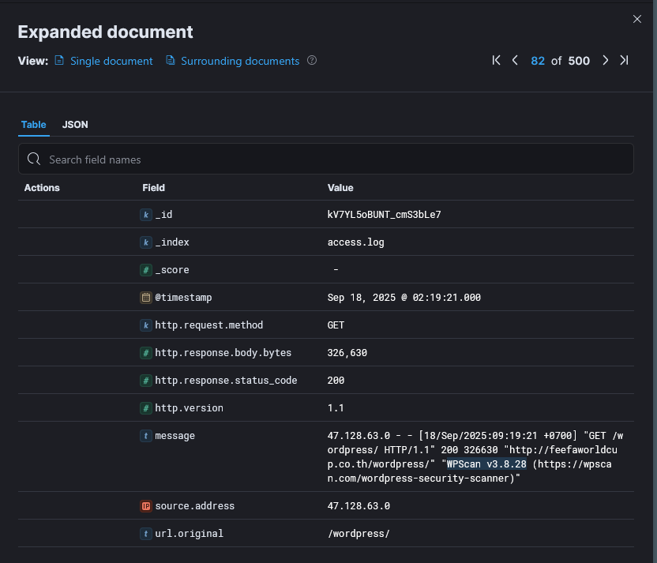

WPScan enumerated plugin paths, returning 200 responses for `/wordpress/wp-content/plugins/elementor/readme.txt`, `/wordpress/wp-content/plugins/perfect-survey/readme.txt`, `/wordpress/wp-content/plugins/solace-extra/readme.txt`, and `/wordpress/wp-content/plugins/user-registration/readme.txt`. At **02:20:04** it successfully retrieved `/wordpress/wp-includes/version.php` - a file that discloses the exact WordPress core version and installed component versions.

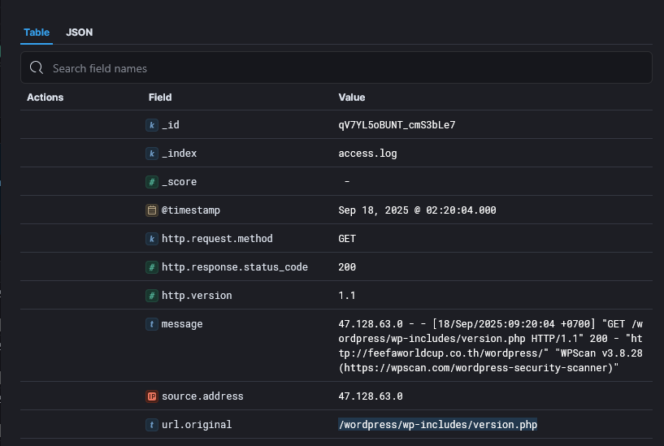

WPScan also accessed `/wordpress/wp-cron.php` - WordPress's built-in task scheduler endpoint, commonly probed to identify scheduling attack surfaces.

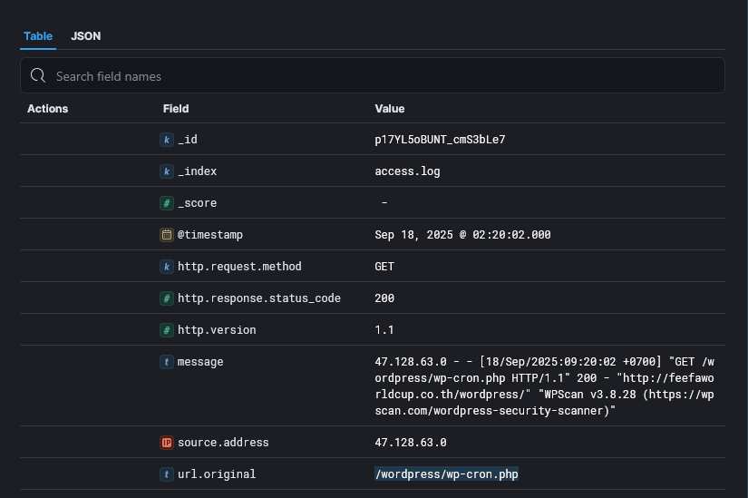

### <span style="color:red">Initial access</span>

At **02:23:39** the attacker issued a single clean GET request to `/wordpress/wp-admin/admin-ajax.php?action=get_question&question_id=1` with User-Agent `sqlmap/1.9.3`. This was the initial endpoint probe against the **Perfect Survey** plugin's `get_question` AJAX action.

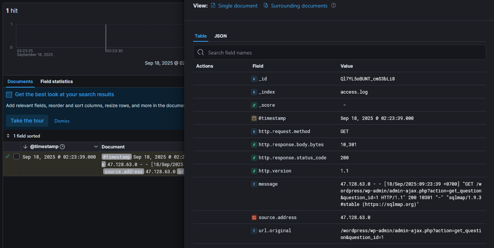
#### <span style="color:red">SQL Injection - CVE-2021-24762</span>
CVE-2021-24762 (CVSS 9.8 Critical) affects Perfect Survey versions before 1.5.2 - the plugin passes the `question_id` GET parameter directly into a SQL query without validation or sanitization. Because WordPress AJAX endpoints can be configured to accept unauthenticated requests, no credentials are required to reach this attack surface.

At **02:25:31**, 2 minutes after the initial probe, sqlmap sent the following exploitation payload (URL-decoded):

```
GET /wordpress/wp-admin/admin-ajax.php?action=get_question&question_id=1&KpuO=5677 AND 1=1 UNION ALL SELECT 1,NULL,'<script>alert("XSS")</script>',table_name FROM information_schema.tables WHERE 2>1--/**/; EXEC xp_cmdshell('cat ../../../etc/passwd')#
```
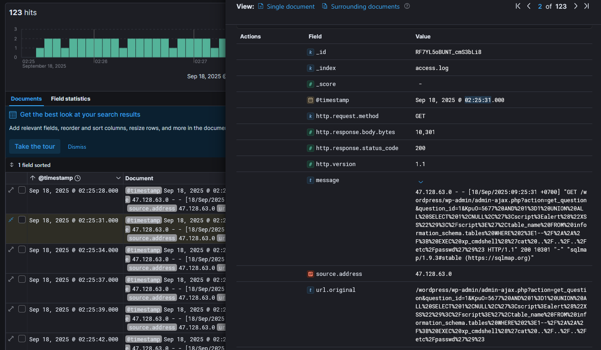

This is a multi-vector injection probe. The `UNION ALL SELECT ... FROM information_schema.tables` attempts to enumerate the database schema by appending an additional result set to the original query. The `<script>alert("XSS")</script>` string embedded in the UNION output tests whether SQL results are reflected unsanitized into the HTTP response. Finally, `EXEC xp_cmdshell('cat ../../../etc/passwd')` attempts OS command execution through SQL Server's shell procedure with a path traversal to read the system password file. The server responded with **HTTP 200** and **10,301 bytes**, confirming the injection was processed and the payload reached the database layer.

With injection confirmed, sqlmap shifted to systematic **blind boolean-based** extraction of the `user_pass` column from `wordpress.wp_users`. At **02:52:47** requests of the following pattern were observed:

```
GET /wordpress/wp-admin/admin-ajax.php?action=get_question&question_id=1 AND ORD(MID((SELECT IFNULL(CAST(user_pass AS NCHAR),0x20) FROM wordpress.wp_users ORDER BY ID LIMIT 0,1),59,1))>96
```

This query extracts one character at a time from the password hash. The extraction campaign ran until **03:11:50**, at which point the last sqlmap request was recorded.

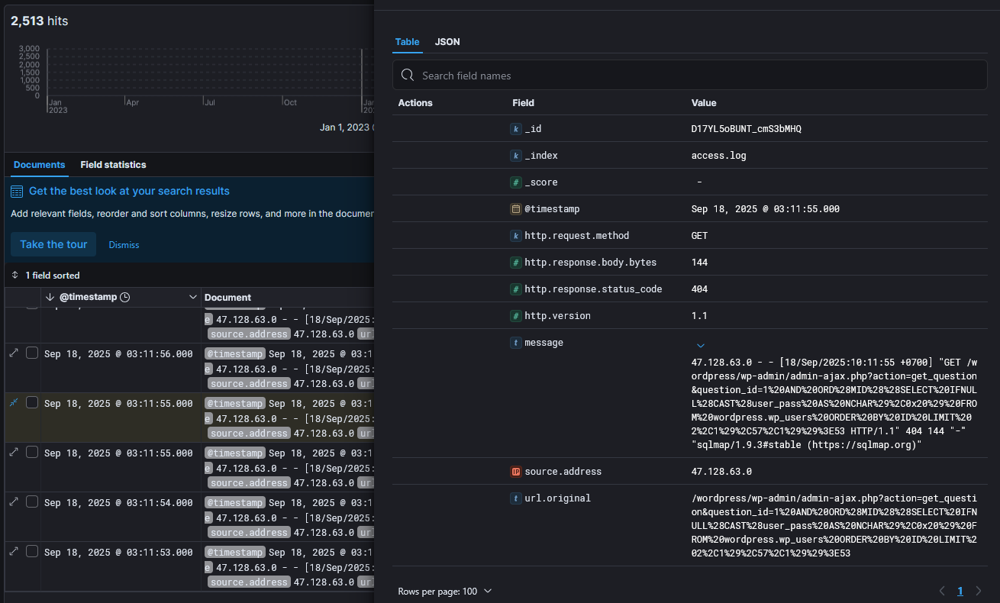

### <span style="color:red">Post-Exploitation and Lateral Movement</span>

With cracked WordPress credentials, the attacker pivoted into Active Directory. I correlated the timeline by examining Windows Security event logs alongside the web logs. The table of authentication events grouped by `target_user` and `ip_address` revealed the full lateral movement sequence.

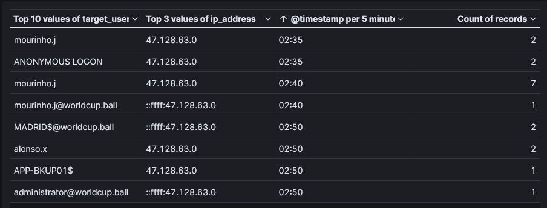

At **02:35** the attacker first accessed `mourinho.j` from **47.128.63.0**, with an `ANONYMOUS LOGON` event co-occurring in the same window - consistent with an initial unauthenticated LDAP or SMB reconnaissance step before authenticating. At **02:40** I found a cluster of **Event ID 4769** (Kerberos Service Ticket Request) events targeting `mourinho.j@worldcup.ball`.

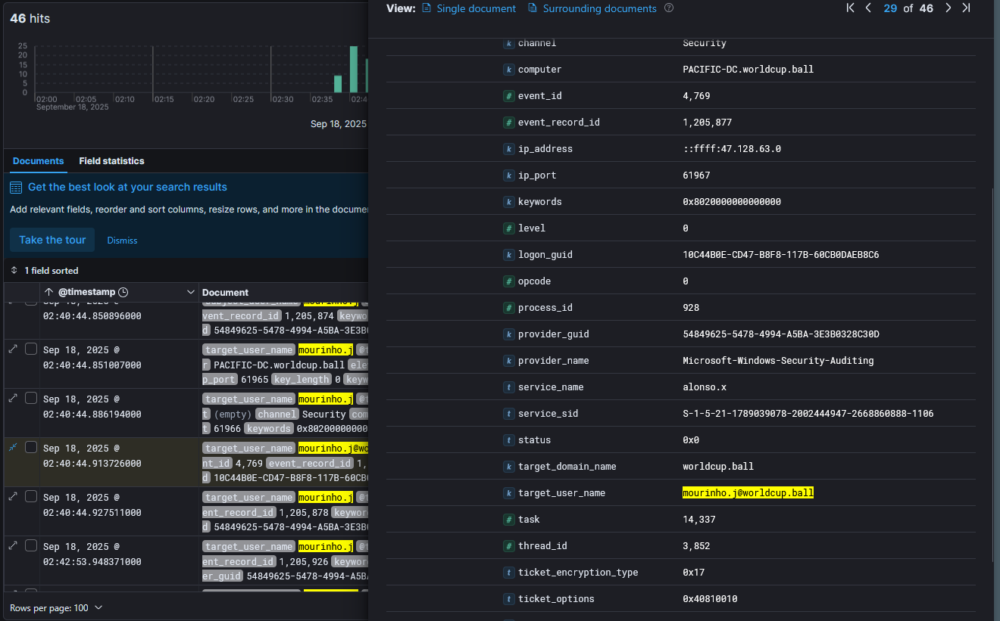

The expanded Event 4769 showed `target_user_name: mourinho.j@worldcup.ball`, `service_name: alonso.x`, and critically `ticket_encryption_type: 0x17` - **0x17 is RC4-HMAC**, the weak encryption type specifically requested during **Kerberoasting**, an attack where the attacker requests a TGS ticket for a service account, receives it encrypted with the account's NTLM hash, and cracks it offline. This confirmed the attacker used `mourinho.j`'s session to Kerberoast `alonso.x` and subsequently cracked its password offline, gaining access as `alonso.x` at **02:50**.

At **02:50:30**, acting as `alonso.x`, the attacker created a new computer account - **Event ID 4741** (Computer Account Created) - with `sam_account_name: MADRID$` on `PACIFIC-DC.worldcup.ball`.

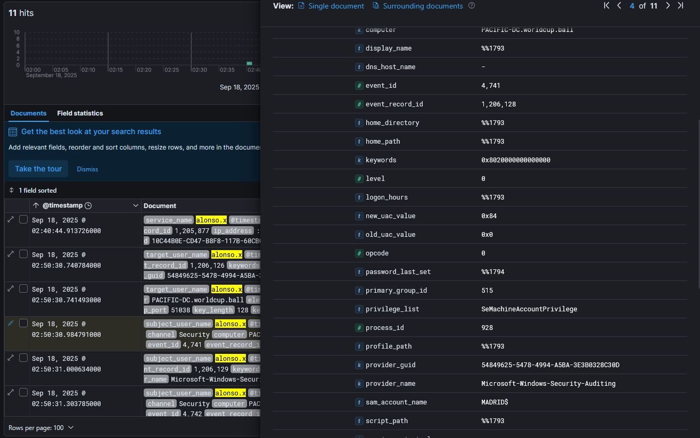

Creating a rogue computer account is a prerequisite for a **Resource-Based Constrained Delegation (RBCD)** attack - by controlling a computer account, the attacker can configure delegation rights to impersonate any user against a target service. One second later at **02:50:31**, **Event ID 4742** (Computer Account Changed) was logged with `target_user_name: APP-BKUP01$`, reflecting `alonso.x` writing RBCD attributes onto the backup server account to allow `MADRID$` to impersonate users against it.

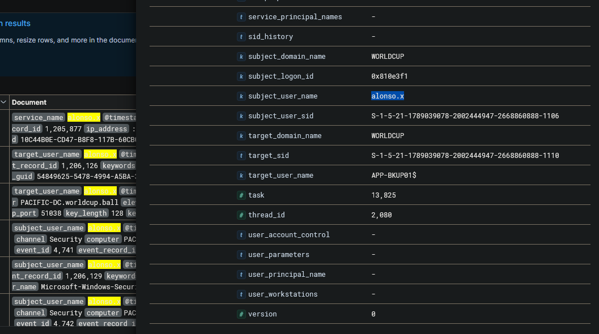

At **02:50:45** the attacker requested a service ticket to `APP-BKUP01$` via RBCD and successfully logged into it at **02:54:23**.

At **02:54:24**, **Event ID 4886** (Certificate Services received a certificate request) was logged with `attributes: CertificateTemplate:WorkstationAuth_Internal` and `SAN:upn=administrator@worldcup.ball`.

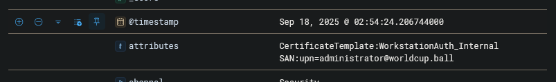

This is **ESC1-style AD CS abuse** - by requesting a certificate from a template that allows the requester to specify a Subject Alternative Name (SAN), the attacker embedded `administrator@worldcup.ball` as the UPN in the certificate. This certificate can then be used to authenticate as `administrator` via Kerberos PKINIT, bypassing password requirements entirely. At **02:54:32**, 8 seconds later, **Event ID 4769** fired on `PACIFIC-DC.worldcup.ball` with `target_user_name: administrator@worldcup.ball`, `service_name: Administrator`, and `ip_address: ::ffff:47.128.63.0` - confirming full domain administrator access was achieved.

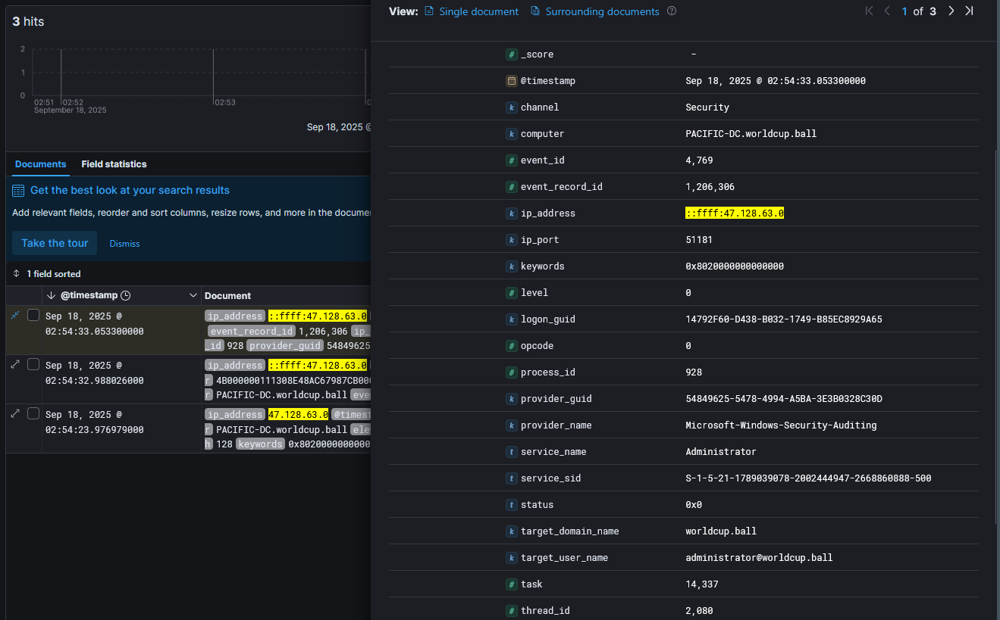

### <span class="hl">IOCs</span>

| Type | Value | Description |
|------|-------|-------------|
| IP | `47.128.63.0` | attacker IP, all attack stages |
| Host | `feefaworldcup.co.th` | targeted WordPress host |
| Host | `PACIFIC-DC.worldcup.ball` | Domain Controller, lateral movement target |
| Host | `APP-BKUP01$` | backup server, RBCD target |
| Domain | `worldcup.ball` | compromised AD domain |
| CVE | CVE-2021-24762 | Perfect Survey plugin SQLi, CVSS 9.8 |
| Plugin | `/wordpress/wp-content/plugins/perfect-survey/` | vulnerable plugin path |
| Account | `mourinho.j` | initial AD foothold via cracked WordPress credentials |
| Account | `alonso.x` | Kerberoasted service account, used for RBCD setup |
| Account | `MADRID$` | rogue computer account created by attacker |
| Account | `administrator@worldcup.ball` | final compromised account via AD CS abuse |

### <span class="hl">Attack Timeline</span>


%%{init: {'theme': 'base', 'themeVariables': { 'background': '#ffffff', 'mainBkg': '#ffffff', 'primaryTextColor': '#000000', 'lineColor': '#333333', 'clusterBkg': '#ffffff', 'clusterBorder': '#333333'}}}%%
graph TD
    classDef default fill:#f9f9f9,stroke:#333,stroke-width:1px,color:#000;
    classDef recon fill:#e1f5fe,stroke:#0277bd,stroke-width:2px,color:#000;
    classDef exploit fill:#ffebee,stroke:#c62828,stroke-width:2px,color:#000;
    classDef lateral fill:#f3e5f5,stroke:#6a1b9a,stroke-width:2px,color:#000;
    classDef persist fill:#fff3e0,stroke:#e65100,stroke-width:2px,color:#000;
    classDef pwned fill:#fce4ec,stroke:#880e4f,stroke-width:2px,color:#000;

    A([47.128.63.0 - Attacker]):::default --> B[02:12:30 - Nmap NSE scan<br/>feefaworldcup.co.th/wordpress/]:::recon
    B --> C[02:19:21 - WPScan v3.8.28<br/>Perfect Survey plugin discovered<br/>version.php and wp-cron.php accessed]:::recon
    C --> D[02:23:39 - sqlmap 1.9.3<br/>CVE-2021-24762 initial probe<br/>/wp-admin/admin-ajax.php?action=get_question]:::exploit
    D --> E[02:25:31 - UNION+XSS+RCE payload<br/>HTTP 200 - injection confirmed]:::exploit
    E --> F[02:52:47 - Blind SQLi extraction<br/>user_pass from wordpress.wp_users<br/>ends at 03:11:50]:::exploit

    subgraph AD [Active Directory Compromise]
        F --> G[02:35 - mourinho.j access<br/>initial AD foothold]:::lateral
        G --> H[02:40:44 - Event 4769<br/>Kerberoasting alonso.x<br/>RC4-HMAC ticket requested]:::lateral
        H --> I[02:50 - alonso.x access<br/>hash cracked offline]:::lateral
        I --> J[02:50:30 - Event 4741<br/>MADRID$ computer account created]:::persist
        J --> K[02:50:31 - Event 4742<br/>RBCD configured on APP-BKUP01$]:::persist
        K --> L[02:54:23 - logged into APP-BKUP01$]:::persist
    end

    subgraph Escalation [Domain Escalation]
        L --> M[02:54:24 - Event 4886<br/>AD CS certificate request<br/>SAN: administrator@worldcup.ball]:::pwned
        M --> N[02:54:32 - Event 4769<br/>administrator@worldcup.ball TGS<br/>PACIFIC-DC.worldcup.ball]:::pwned
    end
