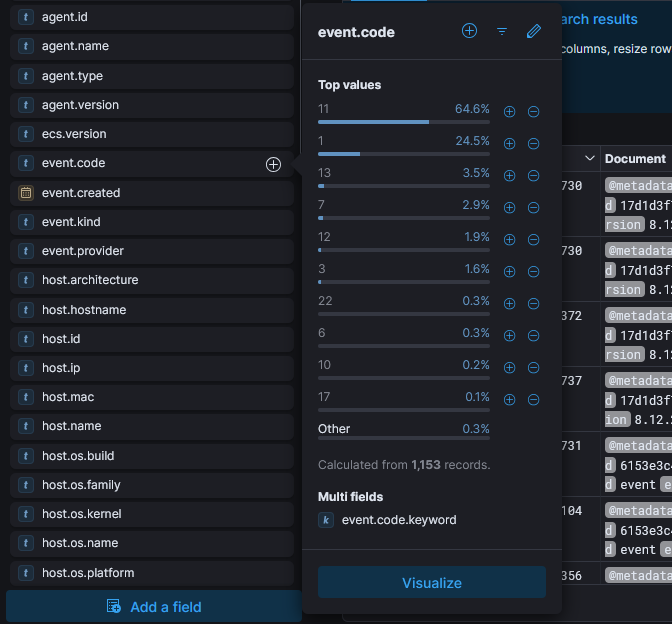
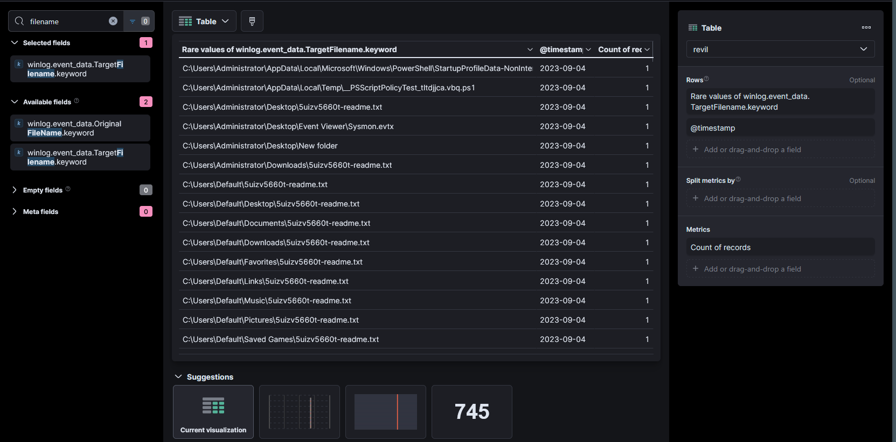
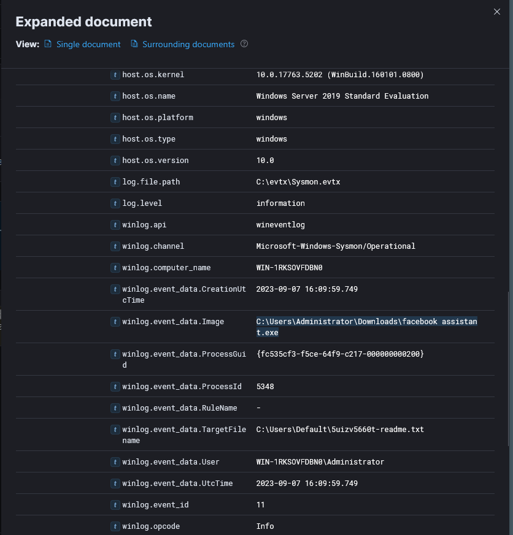
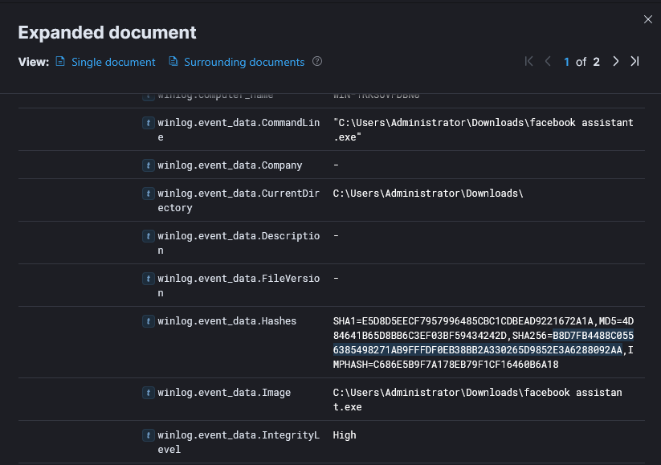
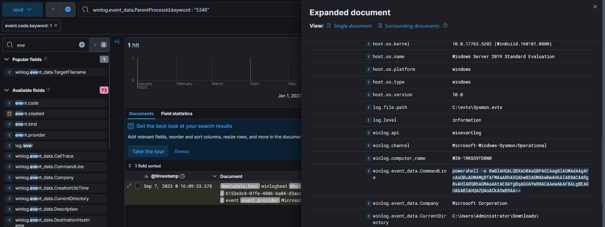
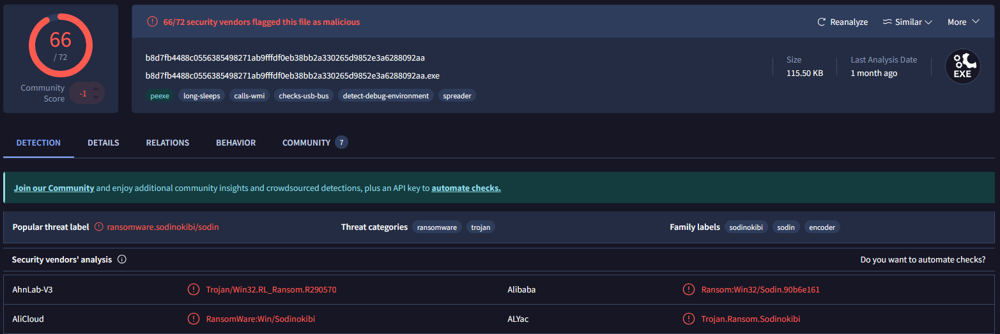
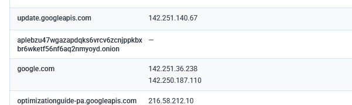

### <span class="hl">TL;DR</span>
An Administrator on host WIN-1RKSOVFDBN0 executed `facebook assistant.exe` from the Downloads folder. The process (PID 5348) created `5uizv5660t-readme.txt` ransom notes across multiple user profile directories, confirming active ransomware deployment. A child PowerShell process (PID 1860) executed command that shadow copy deletion via WMI - a standard ransomware anti-recovery technique. The executable hash was confirmed on VirusTotal as **ransomware.sodinokibi/sodin** (REvil). External

### <span style="color:red">Initial Triage</span>

I started the investigation in **Kibana** - the visualization and search interface for the **ELK stack**, which ingests Windows event logs via Sysmon. Since the scenario involved a ransomware attack, I began by examining the `event.code` field distribution, expecting a high volume of **Sysmon Event ID 11** events - the event type generated whenever a process writes a new file to disk.



The field summary confirmed Event ID 11 dominated at 64.6% of 1,153 records. I pivoted to examining rare values of `winlog.event_data.TargetFilename` to identify what files were being created across the system.



The table immediately surfaced `5uizv5660t-readme.txt` written across an unusually wide range of directories 
\- `C:\Users\Default\Desktop\`  
\- `C:\Users\Default\Documents\`  
\- `C:\Users\Default\Downloads\`  
\- `C:\Users\Default\Music\`  
\- `C:\Users\Default\Pictures\`  
\- `C:\Users\Default\Favorites\`  
\- `C:\Users\Default\Links\`  
\- `C:\Users\Default\Saved Games\`  
and others including `C:\Users\Administrator\Desktop\` and `C:\Users\Administrator\Downloads\`. A ransom note dropped uniformly across all user profile subdirectories is a definitive ransomware indicator. I noted the earliest timestamps were **2023-09-04**, establishing the infection date.

### <span style="color:red">Initial Execution</span>

To identify which process created the ransom notes, I expanded one of the FileCreate events for `5uizv5660t-readme.txt` and examined the originating image and process ID.



The expanded document showed the responsible process was `C:\Users\Administrator\Downloads\facebook assistant.exe` running as **WIN-1RKSOVFDBN0\Administrator** with PID **5348**, created at **2023-09-07 16:09:59**. The file was executed directly from the Administrator's Downloads folder with **High** integrity level. I extracted the hash from `winlog.event_data.Hashes`:

```
SHA1=E5D8D5EECF7957996485CBC1CDBEAD9221672A1A
MD5=4D84641B65D8BB6C3EF03BF59434242D
SHA256=B8D7FB4488C0556385498271AB9FFFDF0EB38BB2A330265D9852E3A6288092AA
IMPHASH=C686E5B9F7A178EB79F1CF16460B6A18
```



### <span style="color:red">Shadow Copy Deletion</span>

I searched for processes spawned by PID 5348 to identify any child activity, filtering on `winlog.event_data.ParentProcessId.keyword : "5348"` with `event.code : 1`.



The query returned 1 hit - a **PowerShell** process (PID 1860) launched at **2023-09-07 16:09:53** with a base64-encoded command line. Decoding the payload revealed:

```
Get-WmiObject Win32_Shadowcopy | ForEach-Object {$_.Delete();}
```

This command enumerates all **Volume Shadow Copies** via WMI and deletes them - the standard technique used by ransomware to prevent victims from restoring files from Windows built-in snapshots. The PowerShell binary was signed by Microsoft Corporation, confirming the attacker used a legitimate system binary (LOLBin) to execute the destructive command.

### <span style="color:red">Malware Confirmation</span>

I submitted the SHA256 `B8D7FB4488C0556385498271AB9FFFDF0EB38BB2A330265D9852E3A6288092AA` to VirusTotal for static reputation analysis.



66/72 vendors flagged the sample as **ransomware.sodinokibi/sodin** - this is **REvil**, a ransomware-as-a-service family operated by the threat group **GOLD SOUTHFIELD**.

### <span style="color:red">C2 Infrastructure</span>

I submitted the sample to **any.run** for dynamic analysis. The sandbox captured DNS resolution activity showing the sample contacted the Tor onion address:
```
aplebzu47wgazapdqks6vrcv6zcnjppkbxbr6wketf56nf6aq2nmyoyd.onion
```



This domain is the REvil payment and victim portal hosted on the Tor network, used to deliver decryption keys upon ransom payment. Its presence confirms the sample successfully attempted to beacon out to REvil C2 infrastructure.

### <span class="hl">IOCs</span>

**Hosts**  
\- `WIN-1RKSOVFDBN0` - compromised host, Windows Server 2019 Standard Evaluation  

**Files**  
\- `C:\Users\Administrator\Downloads\facebook assistant.exe` - SHA256: `B8D7FB4488C0556385498271AB9FFFDF0EB38BB2A330265D9852E3A6288092AA`  
\- `5uizv5660t-readme.txt` - ransom note dropped across all user profile directories  

**Domains**  
\- `aplebzu47wgazapdqks6vrcv6zcnjppkbxbr6wketf56nf6aq2nmyoyd.onion` - REvil Tor payment portal  
 
**Accounts**  
\- `WIN-1RKSOVFDBN0\Administrator` - account used to execute ransomware   

### <span class="hl">Attack Timeline</span>


%%{init: {'theme': 'base', 'themeVariables': { 'background': '#ffffff', 'mainBkg': '#ffffff', 'primaryTextColor': '#000000', 'lineColor': '#333333', 'clusterBkg': '#ffffff', 'clusterBorder': '#333333'}}}%%
graph TD
    classDef default fill:#f9f9f9,stroke:#333,stroke-width:1px,color:#000;
    classDef access fill:#e1f5fe,stroke:#0277bd,stroke-width:2px,color:#000;
    classDef exec fill:#ffebee,stroke:#c62828,stroke-width:2px,color:#000;
    classDef persist fill:#f3e5f5,stroke:#6a1b9a,stroke-width:2px,color:#000;
    classDef exfil fill:#fce4ec,stroke:#880e4f,stroke-width:2px,color:#000;
    classDef c2 fill:#e8f5e9,stroke:#2e7d32,stroke-width:2px,color:#000;
    classDef mal fill:#fff3e0,stroke:#e65100,stroke-width:2px,color:#000;

    A([WIN-1RKSOVFDBN0<br/>Administrator]):::default --> B[2023-09-07 16:09:53 - facebook assistant.exe<br/>executed from Downloads<br/>PID 5348, High integrity]:::access
    B --> C[2023-09-07 16:09:53 - PowerShell spawned<br/>PID 1860 - encoded command]:::exec
    C --> D[Shadow copy deletion<br/>Get-WmiObject Win32_Shadowcopy<br/>ForEach Delete]:::exec

    subgraph Ransomware [Ransomware Activity]
        D --> E[2023-09-07 16:09:59 - FileCreate Event ID 11<br/>5uizv5660t-readme.txt<br/>C:\Users\Default\* - all subdirs]:::mal
        E --> F[Ransom note dropped across<br/>Administrator and Default<br/>user profile directories]:::mal
    end

    subgraph C2 [C2 Beaconing]
        F --> G[DNS resolution<br/>aplebzu47wgazapdqks6vrcv6zcnjppkbxbr6wketf56nf6aq2nmyoyd.onion<br/>REvil Tor payment portal]:::c2
    end
