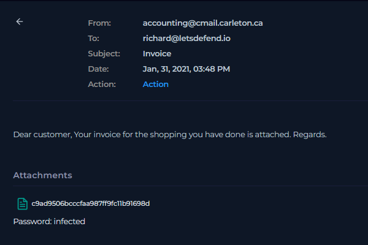
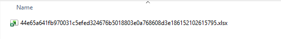
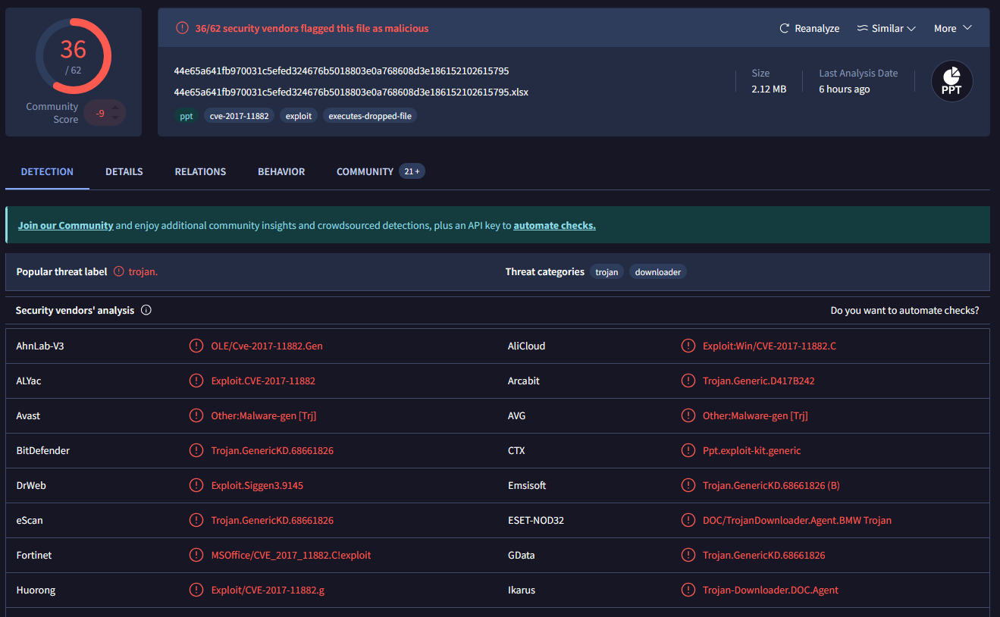
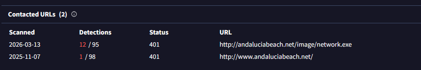
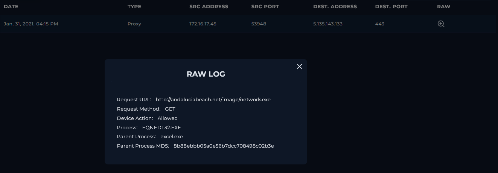
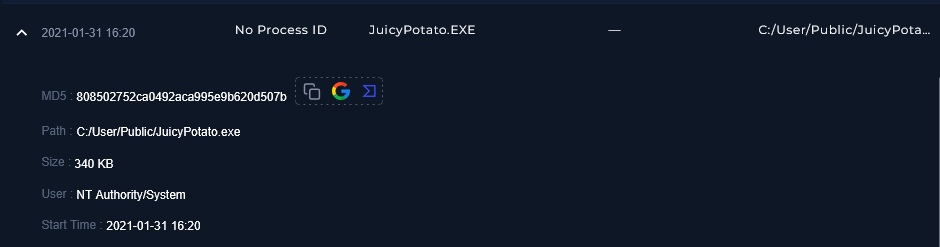

### <span style="color:lightblue">TL;DR</span>

A phishing email impersonating an invoice notification was delivered to `richard@letsdefend.io` from the spoofed address `accounting@cmail.carleton.ca`. The password-protected attachment contained a malicious Office file exploiting CVE-2017-11882 (Microsoft Equation Editor RCE). Upon opening, `EQNEDT32.EXE` was spawned by `excel.exe` and performed an outbound GET request to `http://andaluciabeach.net/image/network.exe`, successfully downloading a payload (`network.exe`) from `5.135.143.133`. The attacker subsequently dropped and executed `JuicyPotato.exe` from `C:/User/Public/` under `NT Authority/System`, achieving full local privilege escalation on the compromised host. The alert is classified as a True Positive with confirmed endpoint compromise.

### <span style="color:lightblue">Alert Overview</span>

| Field               | Value                                                   |
|---------------------|---------------------------------------------------------|
| EventID             | 45                                                      |
| Event Time          | Jan 31, 2021, 03:48 PM                                  |
| Rule                | SOC114 - Malicious Attachment Detected - Phishing Alert |
| Level               | Security Analyst                                        |
| SMTP Address        | 49.234.43.39                                            |
| Source Address      | accounting@cmail.carleton.ca                            |
| Destination Address | richard@letsdefend.io                                   |
| E-mail Subject      | Invoice                                                 |
| Device Action       | Allowed                                                 |

### <span style="color:lightblue">Investigation</span>

An inbound email arrived at `richard@letsdefend.io` from `accounting@cmail.carleton.ca` with the subject "Invoice" and a generic body — "Dear customer, Your invoice for the shopping you have done is attached. Regards." The email originated from SMTP address `49.234.43.39` and was delivered without being blocked by the mail gateway.



The email carried a password-protected attachment (password: `infected`) with the filename hash `c9ad9506bcccfaa987ff9fc11b91698d`. The extracted file was identified as:


```
Filename   44e65a641fb970031c5efed324676b5018803e0a768608d3e186152102615795.xlsx
MD5        c9ad9506bcccfaa987ff9fc11b91698d
SHA-1      e788183a2a021f74a21f609e514bb63c4ef2fe49
SHA-256    44e65a641fb970031c5efed324676b5018803e0a768608d3e186152102615795
File type  MS PowerPoint Presentation (OLE2 Encrypted Structured Storage)
File size  2.12 MB (2218496 bytes)
Magika     PPT
TrID       Microsoft Encrypted Structured Storage Object (96.9%), Generic OLE2 / Multistream Compound (3%)
TLSH       T145A5334026D14F16D93F52B080DF983653AFCD38FE941E9962063F69B47AA7A33C624D
```

VirusTotal analysis returned 36/62 detections. The file was tagged with `cve-2017-11882`, `exploit`, and `executes-dropped-file`. Multiple vendors classified it as a trojan downloader exploiting the Microsoft Office Equation Editor vulnerability CVE-2017-11882.





VirusTotal behavior analysis revealed two contacted URLs associated with the sample, both resolving to `andaluciabeach.net`, with `http://andaluciabeach.net/image/network.exe` flagged by 12/95 vendors.



The endpoint was contained. Review of Richard's proxy logs confirmed that the host `172.16.17.45` successfully performed a GET request to `http://andaluciabeach.net/image/network.exe` (resolving to `5.135.143.133`) at 16:15 on Jan 31, 2021. The request was initiated by `EQNEDT32.EXE` — the Microsoft Equation Editor process — spawned under `excel.exe`, confirming successful exploitation of CVE-2017-11882. The device action was recorded as Allowed, meaning the payload was downloaded.



Following the payload download, process logs revealed that `JuicyPotato.EXE` was executed at 16:20 from `C:/User/Public/JuicyPotato.exe` under the `NT Authority/System` context, indicating successful local privilege escalation after the initial compromise.


```
MD5    808502752ca0492aca995e9b620d507b
Path   C:/User/Public/JuicyPotato.exe
Size   340 KB
User   NT Authority/System
Time   2021-01-31 16:20
```

### <span style="color:lightblue">IOCs</span>

| Type        | Value                                                              |
|-------------|--------------------------------------------------------------------|
| MD5         | c9ad9506bcccfaa987ff9fc11b91698d                                   |
| SHA-256     | 44e65a641fb970031c5efed324676b5018803e0a768608d3e186152102615795   |
| SMTP IP     | 49.234.43.39                                                       |
| Sender      | accounting@cmail.carleton.ca                                       |
| Payload URL | http://andaluciabeach.net/image/network.exe                        |
| C2 IP       | 5.135.143.133                                                      |
| Domain      | andaluciabeach.net                                                 |
| MD5 (tool)  | 808502752ca0492aca995e9b620d507b (JuicyPotato.exe)                 |
| Host IP     | 172.16.17.45                                                       |

### <span style="color:lightblue">MITRE ATT&CK</span>

| Tactic               | Technique                                      | ID           |
|----------------------|------------------------------------------------|--------------|
| Initial Access       | Phishing: Spearphishing Attachment             | T1566.001    |
| Execution            | Exploitation for Client Execution (CVE-2017-11882) | T1203    |
| Execution            | User Execution: Malicious File                 | T1204.002    |
| Command and Control  | Ingress Tool Transfer                          | T1105        |
| Privilege Escalation | Exploitation for Privilege Escalation (JuicyPotato) | T1068   |
| Defense Evasion      | Obfuscated Files or Information (password-protected archive) | T1027 |