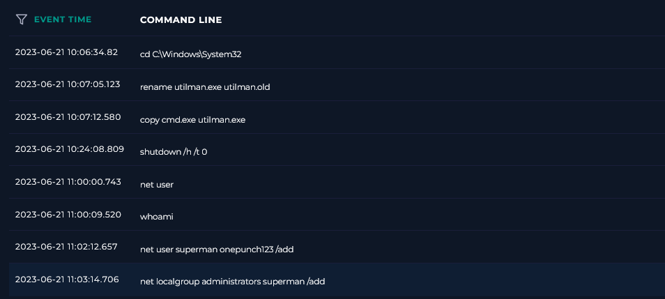
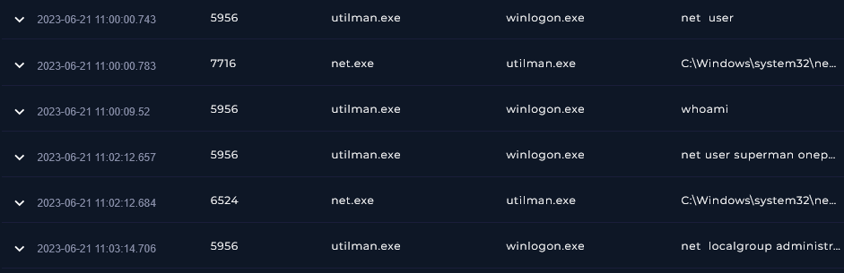
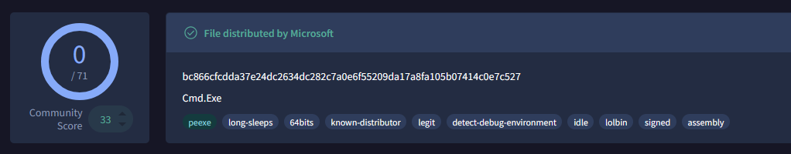

### <span class="hl">TL;DR</span>

An attacker replaced the legitimate Utilman.exe binary with cmd.exe on host Henry and triggered it from the Windows lock screen through Winlogon.exe. This gave the attacker a SYSTEM-level command prompt before authentication, allowing them to create the local user superman and add it to the Administrators group. The host was contained, the backdoor account was removed, Utilman.exe was restored, and the case requires forensic review to identify the initial access path.

### <span class="hl">Alert</span>
```
EventID :         161
Event Time :      Jun, 21, 2023, 11:02 AM
Rule :            SOC211 - Utilman.exe Winlogon Exploit Attempt
Level :           Security Analyst
Hostname :        Henry
IP Address :      172.16.17.149
Process Name :    Utilman.exe
Process Hash :    ded8fd7f36417f66eb6ada10e0c0d7c0022986e9
Parent Process :  Winlogon.exe
Command Line :    net user superman onepunch123 /add
Trigger Reason :  Command Launched from Winlogon
Device Action :   Allowed
```

### <span style="color:red">Identification</span>

#### <span class="hl">What is the suspicious activity?</span>

The attacker abused the **Accessibility Features** persistence technique - replacing *Utilman.exe* in System32 with a copy of *cmd.exe*. `Utilman.exe` is the binary behind the "Ease of Access" button on the Windows login screen. Because it's invoked by *Winlogon.exe* before user authentication, triggering it opens a command prompt running as SYSTEM with no credentials required.

The command history from the endpoint confirms the full setup sequence:



```cmd
cd C:\Windows\System32
rename utilman.exe utilman.old
copy cmd.exe utilman.exe
shutdown /h /t 0
```

After reboot, the attacker clicked the Ease of Access button on the lock screen and got a SYSTEM shell:

```cmd
net user
whoami
net user superman onepunch123 /add
net localgroup administrators superman /add
```

#### <span class="hl">What binary was used?</span>

The process tree confirms *winlogon.exe* as the parent of the substituted *utilman.exe*, which then spawned net.exe to create the user and elevate privileges.



I submitted the hash of the running binary to VirusTotal. This is `cmd.exe` - a legitimate Windows binary. That's exactly the point.



#### <span class="hl">What are LOLBins?</span>

**Living-off-the-Land Binaries (LOLBins)** are legitimate, trusted, signed system binaries that attackers repurpose to execute malicious actions. Because they're signed by Microsoft and present on every Windows installation, they bypass application whitelisting and generate less suspicion than dropped malware. `cmd.exe` here is a perfect example - zero detections, fully trusted, but used as a backdoor shell.

#### <span class="hl">Did the attack succeed?</span>

Yes. User **superman** was created and added to the local Administrators group. The attacker has persistent backdoor access to *Henry* without needing any existing credentials.

### <span style="color:red">Triage Decision</span>

**True Positive.** A confirmed Accessibility Features persistence attack resulted in unauthorized administrator account creation on host *Henry* (172.16.17.149). **Host must be contained.**

#### <span class="hl">What is the impact level?</span>

High. The attacker has a SYSTEM-level persistence mechanism and a local admin backdoor account. Any further lateral movement or data access from *Henry* should be investigated.

### <span style="color:red">Containment</span>

#### <span class="hl">Does the host need to be isolated?</span>

Yes. *Henry* (172.16.17.149) was isolated immediately to prevent lateral movement using the **superman** administrator account.

#### <span class="hl">Actions taken</span>

Host *Henry* (172.16.17.149) was contained. Account **superman** was disabled and removed. *Utilman.exe* was restored from *utilman.old* or a clean system source. The host was submitted for full forensic investigation to determine how the attacker first gained access to replace the binary before the reboot.

### <span class="hl">IOCs</span>

| Type | Value | Description |
|------|-------|-------------|
| Host | Henry (172.16.17.149) | compromised endpoint |
| File | C:\Windows\System32\utilman.exe | replaced with cmd.exe - LOLBin persistence |
| File | C:\Windows\System32\utilman.old | original renamed binary |
| Account | superman | backdoor local administrator account |
| Credential | onepunch123 | password set for superman account |