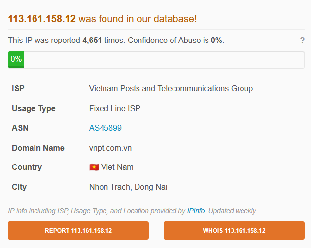
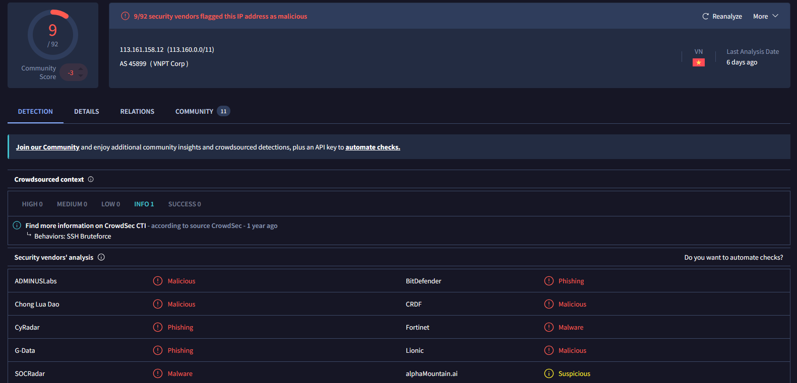
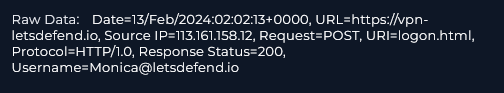
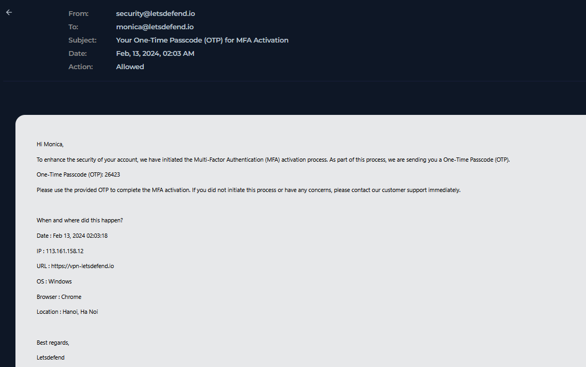
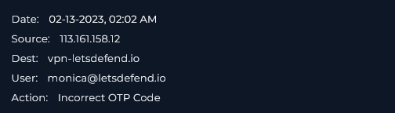

### <span class="hl">TL;DR</span>

An external IP from Vietnam attempted to authenticate to the corporate VPN using Monica's account. The password stage appears to have succeeded, but MFA blocked access after an incorrect OTP submission, so no VPN session was established and no internal systems were reached. The source IP was blocked, Monica's password should be reset, and prior login activity should be reviewed for unusual access.

### <span class="hl">Alert</span>
```
EventID :               225
Event Time :            Feb, 13, 2024, 02:04 AM
Rule :                  SOC257 - VPN Connection Detected from Unauthorized Country
Level :                 Security Analyst
Source Address :        113.161.158.12
Destination Address :   33.33.33.33
Destination Hostname :  Monica
Username :              monica@letsdefend.io
Alert Trigger Reason :  VPN Connection Detected from Unauthorized Country
URL :                   https://vpn-letsdefend.io
```
### <span style="color:red">Identification</span>

#### <span class="hl">Is the source malicious?</span>

*113.161.158.12* belongs to Vietnam Posts and Telecommunications Group (VNPT) located in Vietnam. AbuseIPDB shows 4,651 reports with 0% Confidence of Abuse - high report volume from a residential/ISP range is consistent with a compromised host used as a proxy or a VPN exit node.



VirusTotal flagged the IP **9/92 vendors** as malicious (Malicious, Phishing, Malware).



#### <span class="hl">What happened?</span>

At **02:02:13 AM**, the source IP submitted a POST request to `https://vpn-letsdefend.io/logon.html` as `Monica@letsdefend.io` and received HTTP 200 - meaning credentials were accepted at the password stage.



The MFA system then issued an OTP email to `monica@letsdefend.io` - subject "Your One-Time Passcode (OTP) for MFA Activation", OTP code 26423, login context: IP *113.161.158.12*, OS Windows, Browser Chrome, Location Hanoi, Vietnam.



At **02:02 AM**, the authentication log recorded `*`Incorrect OTP Code` from the same source - the attacker didn't have access to the OTP.



#### <span class="hl">Is the connection from the internal or external network?</span>

External. *113.161.158.12* is a Vietnamese ISP address with no relation to the LetsDefend corporate network.

#### <span class="hl">Has a critical system been affected?</span>

No. Authentication failed at the MFA stage. No VPN session was established and no internal resources were accessed.

#### <span class="hl">Is sensitive data at risk?</span>

No. The attacker had valid credentials for `monica@letsdefend.io` but was blocked by MFA before reaching any internal systems.

### <span style="color:red">Triage Decision</span>

**True Positive.** An external threat actor with monica's VPN password attempted to authenticate from an unauthorized country (Vietnam). MFA blocked the session. The attacker is likely an opportunistic credential stuffer given the IP's SSH brute-force history - or a targeted actor with access to previously leaked credentials.

#### <span class="hl">What is the impact level?</span>

Medium. Valid credentials were used, which means `monica@letsdefend.io`'s password should be considered compromised regardless of the failed MFA. No isolation needed - MFA held.

### <span style="color:red">Containment</span>

#### <span class="hl">Does the device need to be isolated?</span>

No. The authentication never succeeded and Monica's endpoint was not reached.

#### <span class="hl">Actions taken</span>

IP *113.161.158.12* blocked at the VPN gateway. `monica@letsdefend.io` notified and required to reset her password. Geo-blocking rule for Vietnam confirmed active on `vpn-letsdefend.io`. Monica's account reviewed for any prior successful logins from unexpected locations.

### <span class="hl">IOCs</span>

| Type | Value | Description |
|------|-------|-------------|
| IP | `113.161.158.12` | attacker source IP |
| Account | `monica@letsdefend.io` | targeted account - password considered compromised |
| URL | `https://vpn-letsdefend.io/logon.html` | targeted VPN login endpoint |

