### <span class="hl">TL;DR</span>

An attacker from 77.91.78.115 conducted a brute-force campaign against SecureTech Industries starting at 2024-09-09 16:29:05. Local account michaelwilliams on ST-WIN02 was compromised, followed four minutes later by domain account SECURETECH\mwilliams with an elevated token. RDP access was established at 17:00:22. The attacker dropped OfficeUpdater.exe via PowerShell, created a registry Run key for persistence, then staged a toolkit archive containing mimikatz.exe, PsExec.exe, and PowerView.ps1. Mimikatz accessed lsass.exe memory and extracted credentials for jsmith. Using jsmith, the attacker moved laterally to domain controller ST-DC01 at 17:34 and file server ST-FS01 at 17:50. On the DC, FileCleaner.exe was dropped and a scheduled task FilesCheck was created for hourly SYSTEM execution. BackupRunner.exe was also deployed and executed. On ST-FS01, Archive_8673812.zip was created for data exfiltration.

### <span style="color:red">Initial Access</span>

#### Brute-Force Identification

Knowing a brute-force attack had occurred, I started by filtering logs for event id 4625 to identify the attack source.
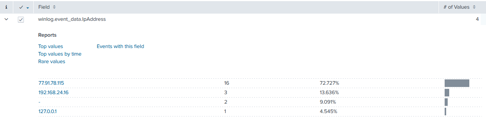

*77.91.78.115* responsible for 16 events - 72.7% of all failed logon activity. I submitted this IP to AbuseIPDB.
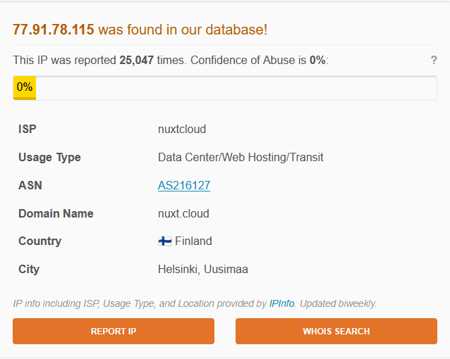

The lookup confirmed the IP had accumulated 25,047 abuse reports, belonging to provider nuxtcloud geolocated to Helsinki, Finland - a hosting provider frequently used for malicious infrastructure. The attack campaign began at **2024-09-09 16:29:05**.

#### Successful Authentication

At *16:56:05* the attacker successfully authenticated as local user `michaelwilliams` on machine ST-WIN02 from 77.91.78.115. No activity followed under this account.

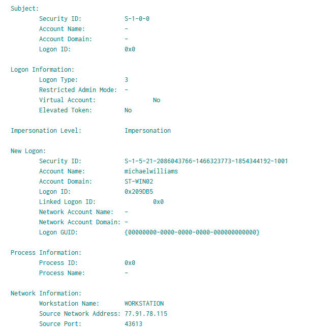

Four minutes later the attacker authenticated as domain account `SECURETECH\mwilliams` - this time with `Elevated Token: Yes`, indicating the account held administrative privileges. The workstation name was recorded as kali, identifying an attacker-controlled Linux machine.

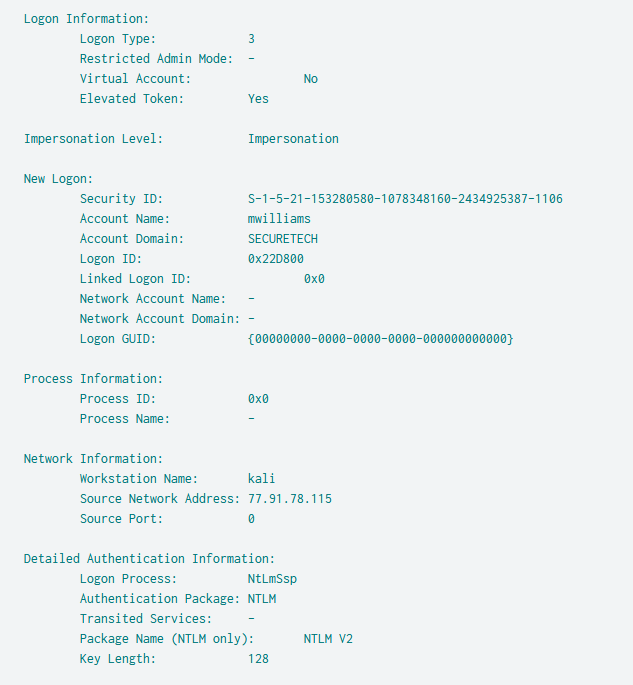

At *17:00:22* event id 1149 confirmed an interactive Remote Desktop session was established to ST-WIN02 by SECURETECH\mwilliams from 77.91.78.115.

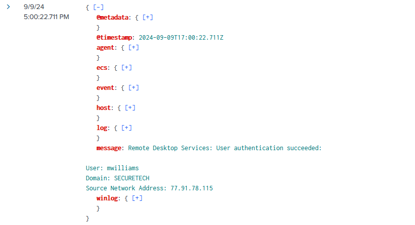

### <span style="color:red">Execution and Persistence</span>

#### Dropper Deployment

With an interactive RDP session active, the attacker executed PowerShell and at *17:12:14* created `C:\Windows\Temp\OfficeUpdater.exe`. The filename mimics a legitimate Microsoft Office update component to blend into the environment.

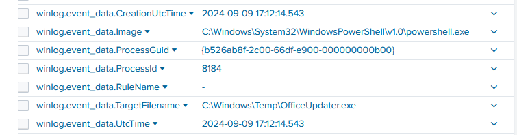

#### Registry Persistence

The attacker immediately established persistence by executing `reg.exe` with **High** integrity level to write a Run key:
```
reg add HKLM\SOFTWARE\Microsoft\Windows\CurrentVersion\Run /v OfficeUpdater /t REG_SZ /d "C:\Windows\Temp\OfficeUpdater.exe" /f
```

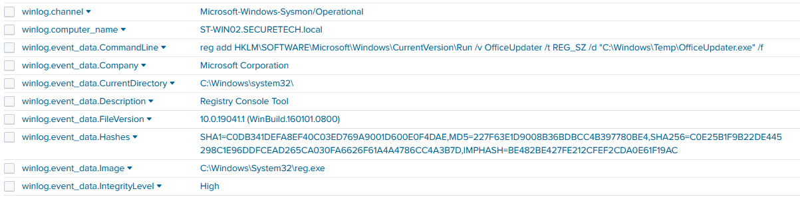

Writing to `HKLM` ensures the payload executes for all users on system startup, and requires administrative privileges - consistent with the elevated token observed at logon.

### <span style="color:red">Toolkit Staging</span>

At *17:22:57 - 17:23:07* PowerShell created `C:\Users\Public\Backup_Tools.zip` and Explorer extracted it into `C:\Users\Public\Backup_Tools\`, staging three tools.

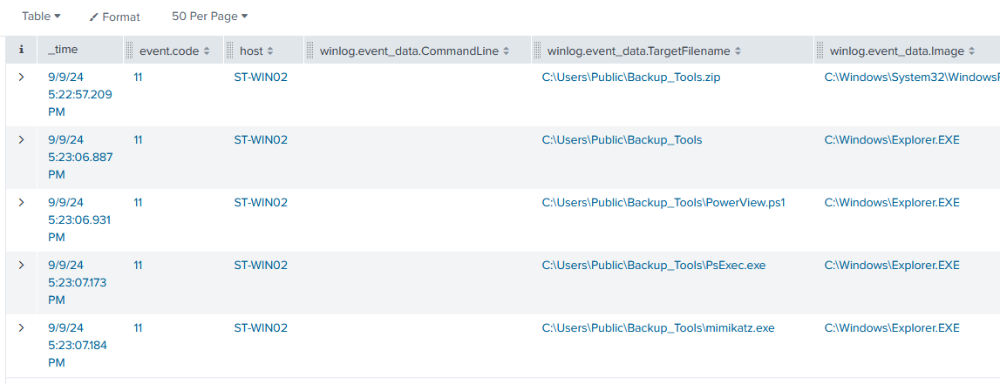

- `mimikatz.exe` is an open-source credential extraction tool capable of dumping plaintext passwords and NTLM hashes from LSASS memory. 
- `PsExec.exe` is a Sysinternals remote execution utility used for lateral movement. 
- `PowerView.ps1` is a PowerShell reconnaissance framework for Active Directory enumeration. 
Placing these in `C:\Users\Public\` ensures they are accessible from any user session without path restrictions.

### <span style="color:red">Credential Dumping</span>

#### Mimikatz Execution

At *17:27:34* and again at *17:39:11*, `mimikatz.exe` was launched from `C:\Users\Public\Backup_Tools\` via `powershell.exe` on `ST-WIN02`.

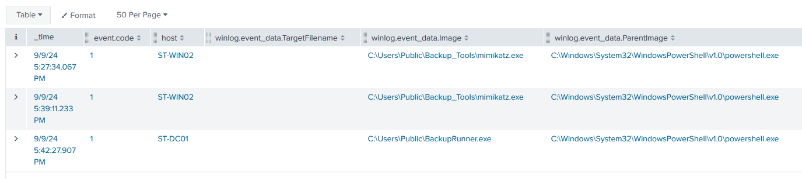

#### LSASS Memory Access

Sysmon event id 10 shows the credential dumping at *17:27*. This access directly yielded the credentials for `jsmith`.
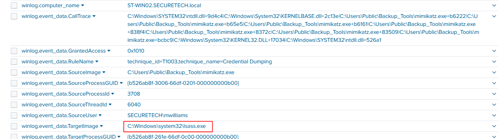


### <span style="color:red">Lateral Movement</span>

#### Domain Controller and File Server Access

At *17:34:15 - 17:34:17* Event ID 4624 network logons appeared on domain controller **ST-DC01** as `jsmith` from 77.91.78.115. At *17:50:13 - 17:50:15* the same pattern repeated on file server **ST-FS01**.

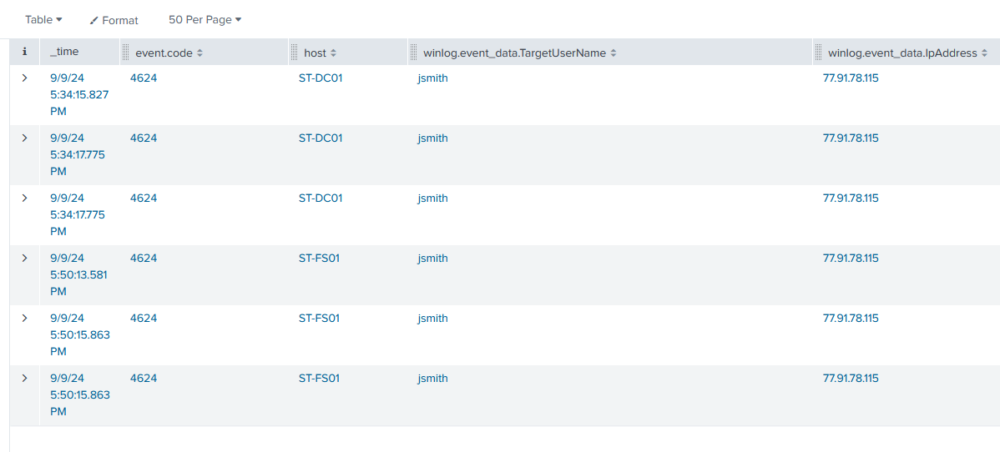

#### Persistence on Domain Controller

Between **17:36:36 and 17:42:27** on `ST-DC01`, the attacker dropped `C:\Windows\Temp\FileCleaner.exe` (Event ID 11) and created a scheduled task for persistent SYSTEM-level execution:

```
schtasks /create /tn "FilesCheck" /tr "powershell.exe -ExecutionPolicy Bypass -File C:\Windows\Temp\FileCleaner.exe" /sc hourly /ru SYSTEM
```

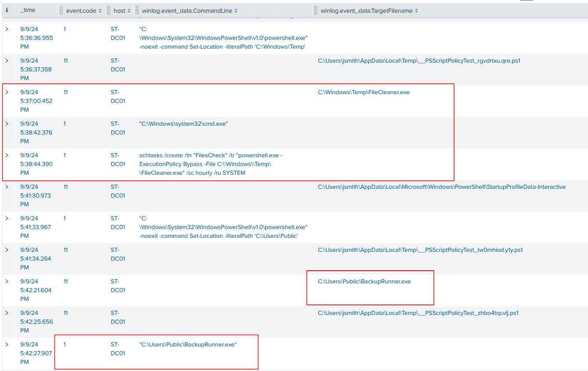

The task name `FilesCheck` blends with legitimate maintenance tasks. At **17:42:21** `BackupRunner.exe` was created in `C:\Users\Public\` and executed at **17:42:27**, establishing an additional execution foothold on the domain controller.

### <span style="color:red">Collection and Exfiltration Staging</span>

At **17:53:10** on `ST-FS01`, `SECURETECH\jsmith` used PowerShell to create `C:\Users\Public\Documents\Archive_8673812.zip` (Sysmon Event ID 11), staging collected data into a single archive in a publicly accessible directory in preparation for exfiltration.

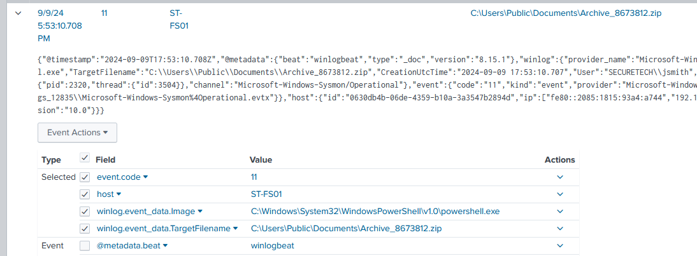

### <span class="hl">IOCs</span>

| Type | Value | Description |
|------|-------|-------------|
| IP | `77.91.78.115` | attacker IP, nuxtcloud AS216127, 25,047 AbuseIPDB reports |
| Host | `ST-WIN02` | initial compromised host |
| Host | `ST-DC01` | domain controller, lateral movement target |
| Host | `ST-FS01` | file server, lateral movement and exfiltration staging target |
| Domain | `SECURETECH` | compromised AD domain |
| File | `C:\Windows\Temp\OfficeUpdater.exe` | malicious dropper masquerading as Office updater |
| File | `C:\Users\Public\Backup_Tools.zip` | attacker toolkit archive |
| File | `C:\Users\Public\Backup_Tools\mimikatz.exe` | credential dumping tool |
| File | `C:\Users\Public\Backup_Tools\PsExec.exe` | lateral movement tool |
| File | `C:\Users\Public\Backup_Tools\PowerView.ps1` | AD reconnaissance framework |
| File | `C:\Windows\Temp\FileCleaner.exe` | persistence payload on ST-DC01 |
| File | `C:\Users\Public\BackupRunner.exe` | secondary payload on ST-DC01 |
| File | `C:\Users\Public\Documents\Archive_8673812.zip` | staged exfiltration archive on ST-FS01 |
| Registry | `HKLM\SOFTWARE\Microsoft\Windows\CurrentVersion\Run\OfficeUpdater` | persistence Run key |
| Task | `FilesCheck` | scheduled task on ST-DC01, hourly SYSTEM execution of FileCleaner.exe |
| Account | `michaelwilliams` | initial brute-forced local account on ST-WIN02 |
| Account | `SECURETECH\mwilliams` | brute-forced domain account, elevated token |
| Account | `SECURETECH\jsmith` | account obtained via LSASS dump, used for lateral movement |

### <span class="hl">Attack Timeline</span>


%%{init: {'theme': 'base', 'themeVariables': { 'background': '#ffffff', 'mainBkg': '#ffffff', 'primaryTextColor': '#000000', 'lineColor': '#333333', 'clusterBkg': '#ffffff', 'clusterBorder': '#333333'}}}%%
graph TD
    classDef default fill:#f9f9f9,stroke:#333,stroke-width:1px,color:#000;
    classDef access fill:#e1f5fe,stroke:#0277bd,stroke-width:2px,color:#000;
    classDef exec fill:#ffebee,stroke:#c62828,stroke-width:2px,color:#000;
    classDef persist fill:#f3e5f5,stroke:#6a1b9a,stroke-width:2px,color:#000;
    classDef cred fill:#fff3e0,stroke:#e65100,stroke-width:2px,color:#000;
    classDef lateral fill:#e8f5e9,stroke:#2e7d32,stroke-width:2px,color:#000;
    classDef exfil fill:#fce4ec,stroke:#880e4f,stroke-width:2px,color:#000;

    A([77.91.78.115 - kali]):::default --> B[16:29:05 - Brute-force begins<br/>Event ID 4625 - ST-WIN02]:::access
    B --> C[16:56:05 - michaelwilliams compromised<br/>local account ST-WIN02]:::access
    C --> D[17:00 - mwilliams SECURETECH<br/>elevated token NTLM v2]:::access
    D --> E[17:00:22 - RDP session established<br/>Event ID 1149 ST-WIN02]:::access

    subgraph Exec [Execution and Persistence - ST-WIN02]
        E --> F[17:12:14 - PowerShell drops<br/>OfficeUpdater.exe in Temp]:::exec
        F --> G[reg add HKLM Run OfficeUpdater<br/>High integrity persistence]:::persist
        G --> H[17:22:57 - Backup_Tools.zip extracted<br/>mimikatz.exe PsExec.exe PowerView.ps1]:::exec
    end

    subgraph Cred [Credential Dumping - ST-WIN02]
        H --> I[17:27:34 - mimikatz.exe launched<br/>Event ID 10 - lsass.exe accessed<br/>GrantedAccess: 0x1010]:::cred
        I --> J[jsmith credentials extracted]:::cred
    end

    subgraph Lateral [Lateral Movement]
        J --> K[17:34:15 - jsmith logon<br/>ST-DC01 from 77.91.78.115]:::lateral
        K --> L[17:37:00 - FileCleaner.exe dropped<br/>schtasks FilesCheck SYSTEM hourly]:::persist
        L --> M[17:42:27 - BackupRunner.exe executed<br/>ST-DC01]:::exec
        M --> N[17:50:13 - jsmith logon<br/>ST-FS01 from 77.91.78.115]:::lateral
    end

    subgraph Exfil [Collection]
        N --> O[17:53:10 - PowerShell creates<br/>Archive_8673812.zip on ST-FS01]:::exfil
    end
