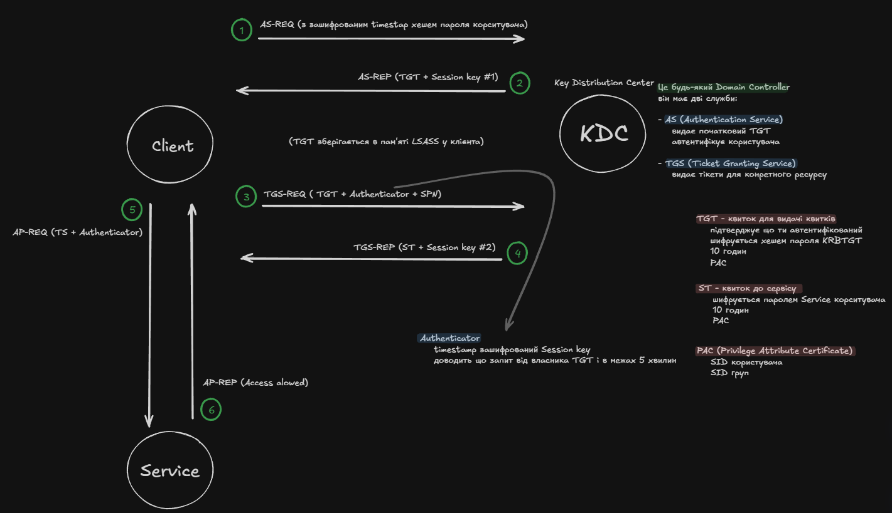
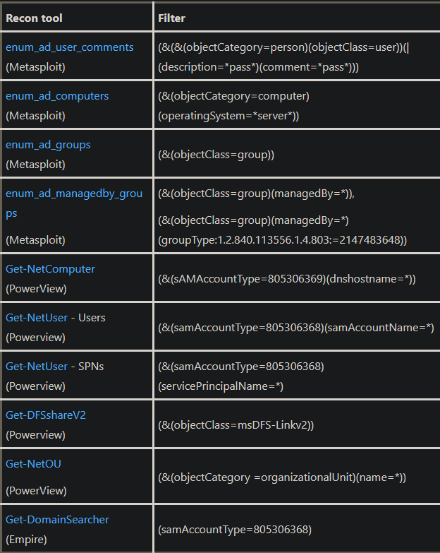
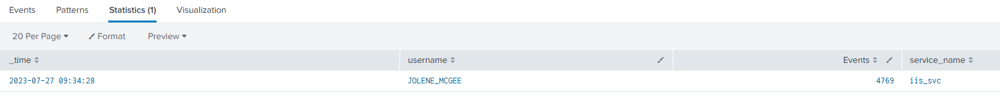
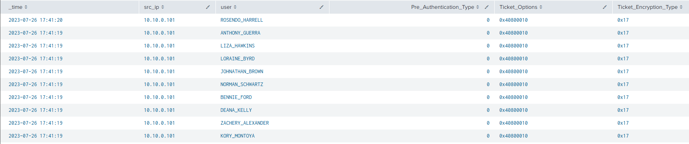

### <span style="color:red">Kerberos authentication</span>



Three events appear in sequence on the Domain Controller:
* **4768** - TGT Request: client requests a Ticket Granting Ticket from the KDC
* **4769** - Service Ticket Request: client presents the TGT and requests a TGS for a specific SPN
* **4624** - Logon: client presents the TGS to the target service and authenticates

Both Kerberoasting and AS-REP Roasting break this sequence in a detectable way.

### <span style="color:red">AD reconnaissance</span>
At first attackers must map the AD environment to find suitable targets before launching ticket-based attacks. They frequently rely on built-in Windows utilities to gather basic domain information. Common native commands used for this:

```cmd
whoami /all
wmic computersystem get domain
net user /domain
net group "Domain Admins" /domain
nltest /domain_trusts
```

**BloodHound** and its C# collector **SharpHound** automate this by generating a large volume of LDAP queries toward the Domain Controller. These can be detected using the *Microsoft-Windows-LDAP-Client* ETW provider. 
List of LDAP filters frequently used by reconnaissance tools:


### <span style="color:red">Kerberoasting</span>
Kerberoasting targets service accounts with `Service Principal Names`(SPN). The attack exploits the fact that TGS tickets are encrypted with the service account's password hash, which meaning anyone who can request a ticket can attempt to crack it offline.

Attack steps:
1. Attacker enumerates service accounts with SPNs via bloodhound
2. Request TGS tickets for those accounts using standard Kerberos APIs
3. Extract the encrypted portion of the ticket
4. Crack the hash offline 

Since requesting a TGS is a legitimate Kerberos operation, no error events are generated. The attack is entirely silent from the DC's perspective - *unless you look for what's missing*.

#### how to detect 
The key distinction between legitimate service access and Kerberoasting is the **missing logon event**. In legitimate access, a TGS request (4769) is always followed by a logon (4624 or 4648) when the user actually presents the ticket to the service. In Kerberoasting, the ticket is requested but never used - the attacker only wants the encrypted blob for offline cracking.

The following query finds users who generated Event ID 4769 within a time window but have no corresponding Event ID 4648:

```
index=* EventCode=4648 OR EventCode=4769
| dedup RecordNumber
| rex field=user "(?<username>[^@]+)"
| search username!=*$
| stats values(EventCode) as Events, values(service_name) as service_name, by _time, username
| where !match(Events,"4648")
```



### <span style="color:red">AS-REP roasting</span>
AS-REP Roasting targets accounts with `"Do not require Kerberos pre-authentication"` enabled. Normally, when requesting a TGT, the client must include a timestamp encrypted with their password hash - this proves identity before the KDC issues anything. With pre-authentication disabled, the KDC skips this validation and returns the AS-REP to anyone who asks, including an attacker.

Part of the AS-REP response is encrypted with the account's password hash. The attacker captures this response and cracks it offline without ever attempting to authenticate.

Attack steps:
1. Enumerate accounts with pre-authentication disabled via bloodhound
2. Send AS-REQ for each target account without a timestamp
3. Receive AS-REP containing encrypted hash material
4. Crack offline

#### how to detect

Event ID 4768 (TGT Request) contains a *Pre_Authentication_Type* field. A value of `0` means no pre-authentication was required. Any external request with this value is a candidate for AS-REP Roasting, because legitimate systems with this flag should be known and documented.

```
index=main EventCode=4768 Pre_Authentication_Type=0
| rex field=src_ip "(\:\:ffff\:)?(?<src_ip>[0-9\.]+)"
| table _time, src_ip, user, Pre_Authentication_Type, Ticket_Options, Ticket_Encryption_Type
```

