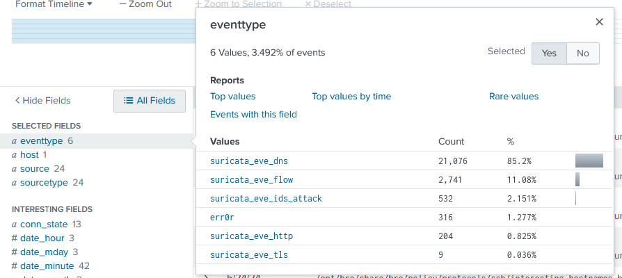
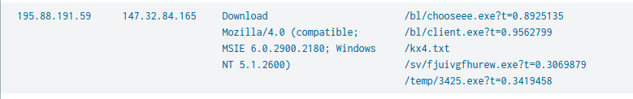
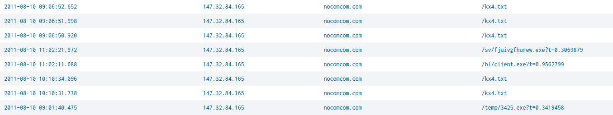
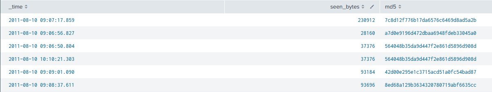
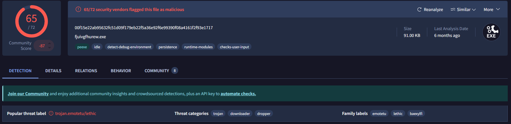
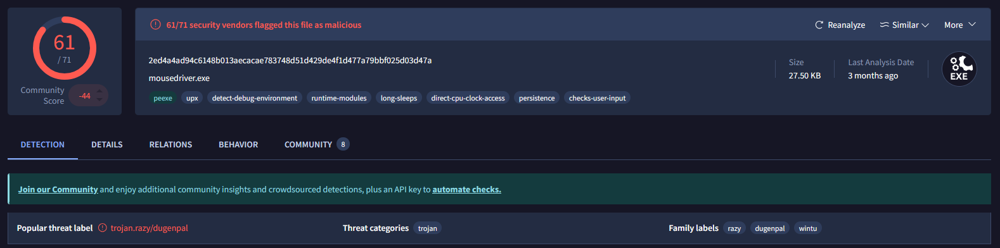
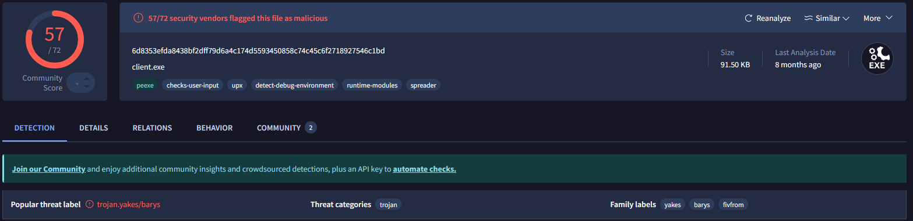
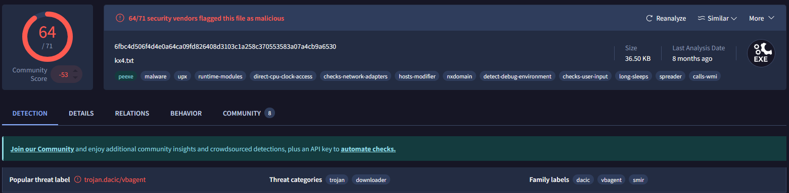
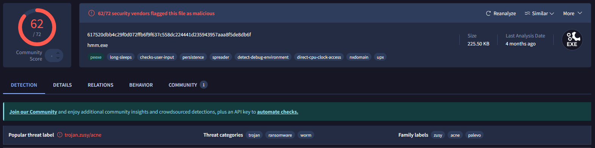

### <span class="hl">TL;DR</span>

A victim host at 147.32.84.165 was observed downloading multiple malicious executables from the attacker-controlled domain nocomcom.com (147.32.84.165) via HTTP. The downloads included `fjuivgfhurew.exe` (Emotet/Lethic), `client.exe` (Yakes/Barys), `mousedriver.exe` (Razy/Dugenpal), `hmm.exe` (Zusy/Acne - ransomware+worm), and a configuration file `kx4.txt` (Dacic/VBAgent). All five unique file hashes extracted from Zeek file logs were confirmed malicious on VirusTotal with detection rates ranging from 57 to 65 out of 72 vendors.

### <span style="color:red">Initial Triage</span>

I started the investigation in **Splunk** - a SIEM platform that ingests and indexes log data from multiple sources, enabling search, correlation, and visualization of security events. My first step was examining the `eventtype` field distribution across all events to identify which log sources and categories were present.



The field summary showed 6 distinct values covering 3.492% of all events. The `suricata_eve_dns` type dominated with 85.2% of those events, but the entry that drew my attention was `suricata_eve_ids_attack` with 532 events (2.151%) - **Suricata** is a network-based IDS that generates `ids_attack` events when traffic matches known malicious signatures, making this the highest-priority category to investigate first.

### <span style="color:red">File Downloads</span>

I ran a query against `suricata_eve_ids_attack` events to identify what was being downloaded and by whom:
```
index=* sourcetype=suricata eventtype=suricata_eve_ids_attack 
| stats values(dest_ip) values(http.http_user_agent) values(http.url) by src_ip
```



The results showed src IP **195.88.191.59** communicating with dest **147.32.84.165** (the victim host). The User-Agent was `Mozilla/4.0 (compatible; MSIE 6.0.2900.2180; Windows NT 5.1.2600)` - a spoofed Internet Explorer 6 string consistent with malware using a hardcoded legacy UA rather than a real browser. The URLs in the request confirmed active malware staging: `/bl/chooseee.exe`, `/bl/client.exe`, `/kx4.txt`, `/sv/fjuivgfhurew.exe`, and `/temp/3425.exe`.

To confirm the full download timeline, I pivoted to HTTP logs filtered by the attacker IP:
```
index=* src_ip="195.88.191.59" | table _time, dest_ip, http.hostname, http.url
```



The results confirmed all downloads resolved through the domain **nocomcom.com** (147.32.84.165). The earliest requests for `/kx4.txt` appeared at **09:06:50**, followed by `/temp/3425.exe` at **09:01:40**, then `/bl/client.exe` and `/sv/fjuivgfhurew.exe` in the **11:02** window, suggesting a staged download sequence where `kx4.txt` likely served as a configuration or URL list for subsequent payload retrieval.

### <span style="color:red">File Analysis</span>

To extract file hashes from the downloaded transfers, I queried **Zeek** file logs - Zeek is a network analysis framework that reconstructs file transfers from packet captures and computes cryptographic hashes:
```
index=* sourcetype=zeek:files tx_hosts="195.88.191.59"
| table _time seen_bytes SHA256 sha1 sha256
```



The query returned 5 unique SHA256 hashes across 6 transfer events, with one hash (`564048b35da9d447f2e861d5896d908d`) appearing twice at **09:06:50** and **10:10:21** - indicating the same file was downloaded on two separate occasions. I submitted all five unique hashes to **VirusTotal** for static reputation checks.

`fjuivgfhurew.exe` (SHA256: `00f15e22ab95632fc51d09f179eb22f5a36e92f6e99390f08a4161f2f93e1717`, 91 KB) was flagged by 65/72 vendors as **trojan.emotetu/lethic** - Emotet is a modular banking trojan and malware loader historically used to deliver secondary payloads.



`mousedriver.exe` (SHA256: `2ed4a4ad94c6148b013aecacae783748d51d429de4f1d477a79bbf025d03d47a`, 27.5 KB) was flagged by 61/71 vendors as **trojan.razy/dugenpal**.



`client.exe` (SHA256: `6d8353efda8438bf2dff79d6a4c174d5593450858c74c45c6f2718927546c1bd`, 91.5 KB) was flagged by 57/72 vendors as **trojan.yakes/barys**, with the `spreader` behavioral tag indicating self-propagation capability.



`kx4.txt` (SHA256: `6fbc4d506f4d4e0a64ca09fd826408d3103c1a258c370553583a07a4cb9a6530`, 36.5 KB) was flagged by 64/71 vendors as **trojan.dacic/vbagent** despite its `.txt` extension - the `hosts-modifier`, `spreader`, and `calls-wmi` behavioral tags confirm this is an executable masquerading as a text file.



`hmm.exe` (SHA256: `617520dbb4c29f0d072ffb6f9f637c558dc224441d235943957aaa8f5de8db6f`, 225.5 KB) was flagged by 62/72 vendors as **trojan.zusy/acne** with threat categories of trojan, **ransomware**, and **worm** - making it the most dangerous payload in the set.



### <span class="hl">IOCs</span>

**IPs**  
\- `195.88.191.59` - attacker IP, malware distribution server  
\- `147.32.84.165` - victim host  

**Domains**  
\- `nocomcom.com` - attacker-controlled malware staging domain
  
**Files**  
\- `fjuivgfhurew.exe` - SHA256: `00f15e22ab95632fc51d09f179eb22f5a36e92f6e99390f08a4161f2f93e1717`   
\- `mousedriver.exe` - SHA256: `2ed4a4ad94c6148b013aecacae783748d51d429de4f1d477a79bbf025d03d47a` - 
\- `client.exe` - SHA256: `6d8353efda8438bf2dff79d6a4c174d5593450858c74c45c6f2718927546c1bd`
\- `kx4.txt` - SHA256: `6fbc4d506f4d4e0a64ca09fd826408d3103c1a258c370553583a07a4cb9a6530`   
\- `hmm.exe` - SHA256: `617520dbb4c29f0d072ffb6f9f637c558dc224441d235943957aaa8f5de8db6f` 

### <span class="hl">Attack Timeline</span>


%%{init: {'theme': 'base', 'themeVariables': { 'background': '#ffffff', 'mainBkg': '#ffffff', 'primaryTextColor': '#000000', 'lineColor': '#333333', 'clusterBkg': '#ffffff', 'clusterBorder': '#333333'}}}%%
graph TD
    classDef default fill:#f9f9f9,stroke:#333,stroke-width:1px,color:#000;
    classDef access fill:#e1f5fe,stroke:#0277bd,stroke-width:2px,color:#000;
    classDef exec fill:#ffebee,stroke:#c62828,stroke-width:2px,color:#000;
    classDef c2 fill:#e8f5e9,stroke:#2e7d32,stroke-width:2px,color:#000;
    classDef mal fill:#fff3e0,stroke:#e65100,stroke-width:2px,color:#000;

    A([195.88.191.59<br/>Attacker]):::c2 --> B[Aug 10 09:01:40 - HTTP GET /temp/3425.exe<br/>nocomcom.com]:::access
    B --> C[Aug 10 09:06:50 - HTTP GET /kx4.txt<br/>Dacic/VBAgent - hosts-modifier, spreader]:::mal
    C --> D[Aug 10 09:06:56 - HTTP GET /bl/client.exe<br/>Yakes/Barys trojan - spreader]:::mal
    D --> E[Aug 10 09:07:17 - HTTP GET /bl/chooseee.exe<br/>download confirmed via Zeek]:::mal
    E --> F[Aug 10 10:10:21 - HTTP GET /kx4.txt<br/>second download of same payload]:::mal

    subgraph LateStage [Late Stage Downloads]
        F --> G[Aug 10 11:02:11 - HTTP GET /bl/client.exe<br/>re-download]:::exec
        G --> H[Aug 10 11:02:21 - HTTP GET /sv/fjuivgfhurew.exe<br/>Emotet/Lethic trojan]:::exec
    end

    subgraph Payloads [Confirmed Malicious Payloads - VirusTotal]
        H --> I[fjuivgfhurew.exe - Emotet 65/72]:::mal
        H --> J[mousedriver.exe - Razy 61/71]:::mal
        H --> K[client.exe - Yakes/Barys 57/72]:::mal
        H --> L[kx4.txt - Dacic/VBAgent 64/71]:::mal
        H --> M[hmm.exe - Zusy/Acne ransomware 62/72]:::mal
    end
