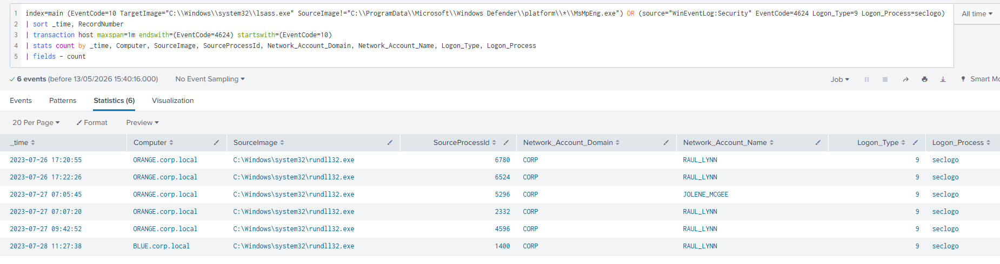
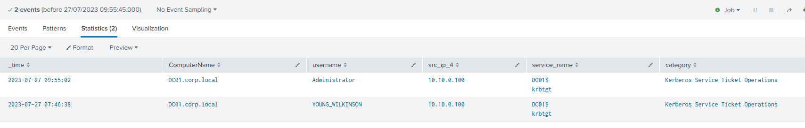

### <span style="color:red">Pass-the-Hash</span>

Pass-the-Hash exploits the NTLM protocol: an attacker can authenticate using a stolen NTLM hash instead of a plaintext password because Windows only verifies the hash itself.

This is possible due to how Windows manages sessions. Every process has a copy of an *Access Token* that defines its privileges. This token links to a *LogonSession* stored in the memory of *lsass.exe*, which holds the actual credentials (like NTHash) used when accessing remote resources.

Tools like Mimikatz abuse this mechanism by overwriting the credentials inside the LogonSession directly in memory. Once the legitimate data is replaced with the stolen hash, Windows automatically uses it for all future network requests tied to that Access Token.

Attack steps:
1. The attacker extracts password hashes from *lsass.exe* process memory using tools such as Mimikatz, administrative privileges are required to do this.
2. Then he uses one of the stolen hashes to authenticate as the targeted user on other systems or network resources without needing the actual password.
3. Finaly uses the authenticated session to move laterally within the network, gaining unauthorized access to other systems and resources.

#### how to detect

PtH via Mimikatz *sekurlsa::pth* generates **4624 with Logon Type 9** (NewCredentials), but the same event is produced by the legitimate `runas /netonly` command, which also creates a process with alternate credentials for remote access only.

The reliable way to separate PtH from legitimate `runas /netonly` usage is to correlate Logon Type 9 with **Event ID 10**, Process Access targeting *lsass.exe*. With PtH, Mimikatz must access and modify the LogonSession credential materials inside *lsass.exe* before the logon event fires. If lsass was accessed just before the NewCredentials logon on the same host within the same minute, it's PtH.

```
index=main
    (EventCode=10
     TargetImage="C:\\Windows\\system32\\lsass.exe"
     SourceImage!="C:\\ProgramData\\Microsoft\\Windows Defender\\platform\\*\\MsMpEng.exe")
    OR
    (source="WinEventLog:Security" EventCode=4624 Logon_Type=9 Logon_Process=seclogo)
| sort _time, RecordNumber
| transaction host maxspan=1m endswith=(EventCode=4624) startswith=(EventCode=10)
| stats count by _time, Computer, SourceImage, SourceProcessId, Network_Account_Domain, Network_Account_Name, Logon_Type, Logon_Process
| fields - count
```

Results with both signals are PtH. Results with only Logon Type 9 and no prior lsass access are likely legitimate `runas /netonly` usage.



### <span style="color:red">Pass-the-Ticket</span>

Pass-the-Ticket leverages Kerberos tickets instead of NTLM hashes. The attacker extracts valid TGT or TGS tickets from memory of a compromised system and injects them into a different logon session, allowing authentication to other systems as the ticket owner without knowing the password.


Attack steps:
1. The attacker extracts valid TGT or TGS tickets from the compromised system's memory using tools such as Mimikatz or Rubeus.
2. Then he submits the extracted ticket into the current logon session to assume the identity of the ticket owner.
3. And he uses the injected ticket to authenticate to other systems and network resources without needing plaintext passwords.

#### Detection Logic

**TGT obtained**
In normal Kerberos authentication the following events appear in sequence: **4768** (TGT Request), **4769** (Service Ticket Request) and **4624** (Logon). When PtT is used, the attacker skips the TGT request step entirely because the ticket was already obtained elsewhere and is injected directly.
When the attacker imports a stolen TGT and uses it to request service tickets, the DC sees 4769 events from a source that never generated a 4768. 
```
index=main earliest=1690392405 latest=1690451745 source="WinEventLog:Security" user!=*$ EventCode IN (4768,4769,4770)
| rex field=user "(?<username>[^@]+)"
| rex field=src_ip "(\:\:ffff\:)?(?<src_ip_4>[0-9\.]+)"
| transaction username, src_ip_4 maxspan=10h keepevicted=true startswith=(EventCode=4768)
| where closed_txn=0
| search NOT user="*$@*"
| table _time, ComputerName, username, src_ip_4, service_name, category
```



**TGS obtained**

When a TGS is imported directly, both 4768 and 4769 are skipped so the attacker presents the service ticket straight to the target server and the DC sees nothing. Detection shifts to the target server:   4624 with Logon Type 3 without any prior 4769 from the same source IP for the same service within a reasonable time window.


### <span style="color:red">Overpass-the-Hash</span>

Overpass-the-Hash bridges the gap between NTLM and Kerberos. The attacker has a stolen NTLM hash but wants a Kerberos TGT rather than NTLM authentication because Kerberos is less likely to be blocked at the network level and leaves a different audit trail. The NTLM hash is mathematically equivalent to the RC4 key used in older Kerberos encryption, so tools like Rubeus can craft a valid AS-REQ using the hash directly, receive a TGT, and inject it into the current session.

Attack steps:
1. The attacker obtains an NTLM hash from the compromised system using tools such as Mimikatz.
2. Then he uses the stolen hash to request a valid Kerberos TGT with RC4 encryption via tools such as Rubeus.
3. Finally, he injects the TGT into the current session and proceeds with Kerberos-based authentication to move laterally.

#### how to detect

Overpass-the-Hash produces **Event ID 4768** with **RC4-HMAC encryption type 0x17**. Rubeus defaults to RC4 because it can derive the key directly from the NTLM hash, while AES would require the actual plaintext password. In modern environments that enforce AES-only Kerberos, an RC4 TGT request from a workstation stands out as anomalous.

```
index=main EventCode=4768 Ticket_Encryption_Type=0x17
| rex field=src_ip "(\:\:ffff\:)?(?<src_ip>[0-9\.]+)"
| table _time, src_ip, user, Ticket_Encryption_Type, Pre_Authentication_Type
```

Results should be cross-referenced with known service accounts that legitimately use RC4. Any workstation generating an RC4 TGT request for a user account is a strong indicator of Overpass-the-Hash.