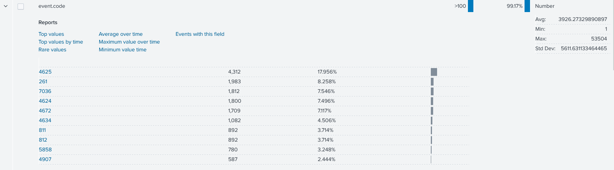
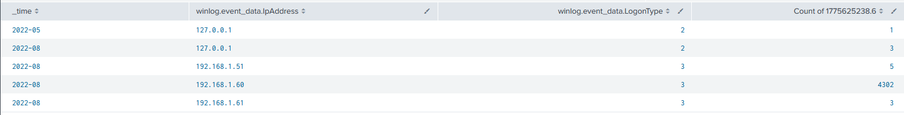
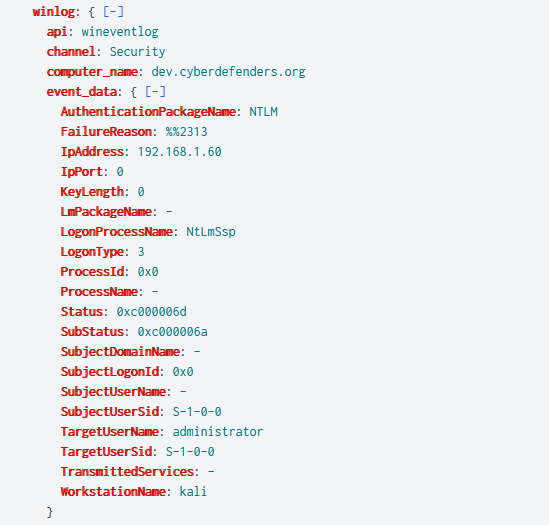
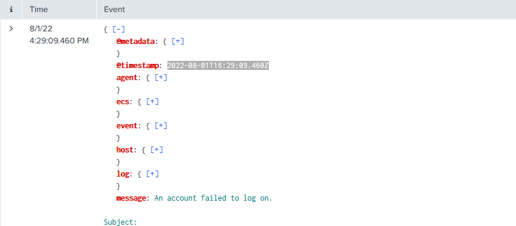
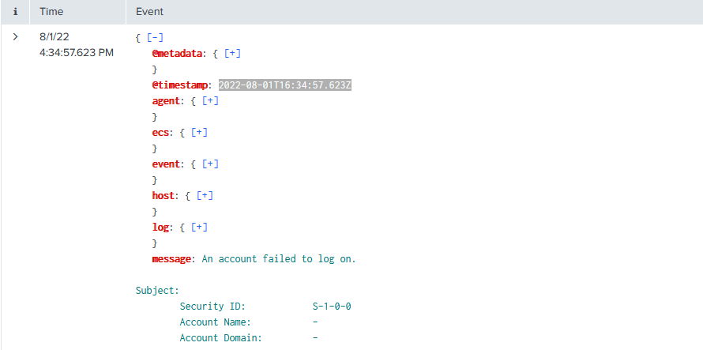
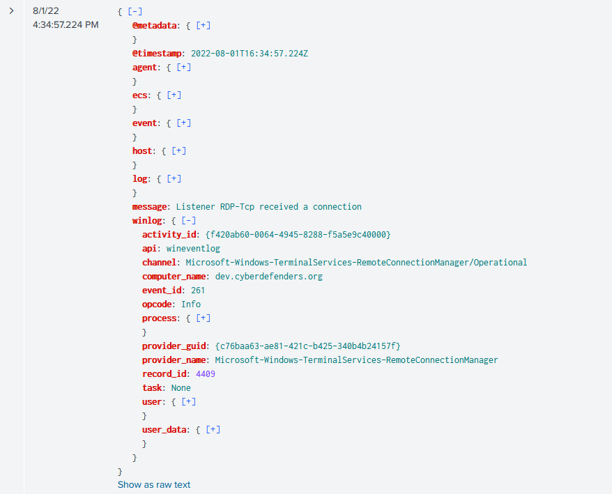
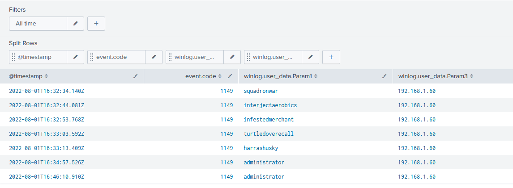

### TL;DR

An attacker operating from **192.168.1.60** (WorkstationName: `kali`) conducted a password spraying attack against `dev.cyberdefenders.org` over RDP. The attack generated 4,302 failed logon attempts (Event ID 4625) over approximately 5 minutes and 48 seconds, targeting multiple usernames via NTLM LogonType 3. Event ID 261 confirmed active RDP-Tcp connection attempts throughout the attack window. Following the brute-force, Event ID 1149 (RDP authentication success) recorded six compromised accounts: `squadronwar`, `interjectaerobics`, `infestedmerchant`, `turtledoverecall`, `harrashusky`, and `administrator` - the last of which was accessed again 11 minutes after the initial compromise.

### Initial Triage

I started the investigation in **Splunk** by examining the `event.code` field distribution across all ingested Windows Security and TerminalServices logs to identify the dominant activity type.

**Event ID 4625** (An account failed to log on) led with 4,312 occurrences at 17.956% of all events - a volume far exceeding normal authentication noise. Also notable was Event ID **261** with 1,983 events (8.258%), which corresponds to `Microsoft-Windows-TerminalServices-RemoteConnectionManager` logging each inbound RDP-Tcp connection attempt. The combination of mass 4625 and high 261 counts immediately pointed to an RDP brute-force or password spraying campaign.

### Attack Source and Scope

I pivoted to identify the source IP behind the 4625 events, grouping by `winlog.event_data.IpAddress` and `winlog.event_data.LogonType`.

The table confirmed **192.168.1.60** as the sole significant attacker, responsible for **4,302 failed LogonType 3 attempts** in August 2022 - LogonType 3 is a network logon, consistent with remote authentication over RDP/SMB. Two other IPs (192.168.1.51 and 192.168.1.61) each produced 3-5 attempts, consistent with legitimate activity. Expanding one of the 4625 events from 192.168.1.60 confirmed the attack profile.

The event showed `TargetUserName: administrator`, `AuthenticationPackageName: NTLM`, `LogonProcessName: NtLmSsp`, `WorkstationName: kali`, and `FailureReason: %%2313` (unknown username or bad password). The `kali` workstation name is a direct indicator of an attacker-controlled Linux machine running a spraying tool.

### Attack Timeline

To establish the duration of the attack I examined the first and last 4625 events from 192.168.1.60.

The first failed logon was recorded at **2022-08-01T16:29:09.460Z** and the last at **2022-08-01T16:34:57.623Z** - a total attack window of **5 minutes and 48 seconds**. This short, high-volume window across multiple usernames is characteristic of **T1110.003 - Password Spraying**, where an attacker cycles a small number of passwords across many accounts to avoid lockout thresholds.

Concurrent with the 4625 flood, Event ID **261** was generated at `2022-08-01T16:34:57.224Z` - one second before the last failed logon - confirming the RDP-Tcp listener on `dev.cyberdefenders.org` was actively receiving and processing each connection attempt from 192.168.1.60.

### Compromised Accounts

I filtered for **Event ID 1149** - logged by `Microsoft-Windows-TerminalServices-RemoteConnectionManager` when a user successfully authenticates to an RDP session - to identify which accounts the attacker successfully accessed.

Six accounts authenticated successfully from 192.168.1.60: `squadronwar` at **16:32:34**, `interjectaerobics` at **16:32:44**, `infestedmerchant` at **16:32:53**, `turtledoverecall` at **16:33:03**, `harrashusky` at **16:33:13**, and `administrator` at **16:34:57**. The `administrator` account was then accessed again at **16:46:10** - 11 minutes after the initial compromise - suggesting the attacker returned for a second interactive RDP session under the highest-privilege account on the host.

### IOCs

| Value | Description |
|-------|-------------|
| `192.168.1.60` | attacker, WorkstationName: kali |
| `dev.cyberdefenders.org` | targeted host |
| `administrator` | compromised account |
| `squadronwar` | compromised account |
| `interjectaerobics` | compromised account |
| `infestedmerchant` | compromised account |
| `turtledoverecall` | compromised account |
| `harrashusky` | compromised account |

### Attack Timeline


%%{init: {'theme': 'base', 'themeVariables': { 'background': '#ffffff', 'mainBkg': '#ffffff', 'primaryTextColor': '#000000', 'lineColor': '#333333', 'clusterBkg': '#ffffff', 'clusterBorder': '#333333'}}}%%
graph TD
    classDef default fill:#f9f9f9,stroke:#333,stroke-width:1px,color:#000;
    classDef access fill:#e1f5fe,stroke:#0277bd,stroke-width:2px,color:#000;
    classDef exec fill:#ffebee,stroke:#c62828,stroke-width:2px,color:#000;
    classDef success fill:#e8f5e9,stroke:#2e7d32,stroke-width:2px,color:#000;
    classDef mal fill:#fff3e0,stroke:#e65100,stroke-width:2px,color:#000;

    A([192.168.1.60 - kali]):::default --> B[2022-08-01 16:29:09 - First 4625 Password spray begins NTLM LogonType 3]:::exec
    B --> C[16:29 - 16:34 - 4302 failed logons Event ID 4625 multiple usernames targeted]:::exec
    C --> D[16:34:57.224 - Event ID 261 RDP-Tcp connection received dev.cyberdefenders.org]:::access

    subgraph Spray [Successful Authentications - Event ID 1149]
        D --> E[16:32:34 - squadronwar]:::success
        D --> F[16:32:44 - interjectaerobics]:::success
        D --> G[16:32:53 - infestedmerchant]:::success
        D --> H[16:33:03 - turtledoverecall]:::success
        D --> I[16:33:13 - harrashusky]:::success
        D --> J[16:34:57 - administrator]:::success
    end

    J --> K[16:46:10 - administrator second RDP session 11 minutes later]:::mal
