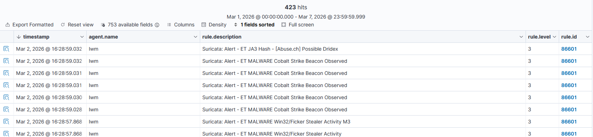
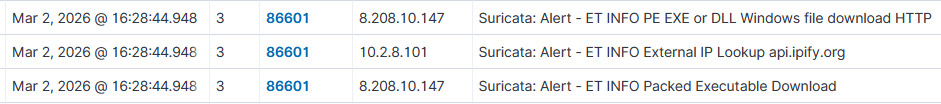




### <span style="color:lightblue">Objective</span>
Replay a PCAP file through Suricata integrated with
Wazuh to practice network-based threat detection, analyze generated alerts,
reconstruct the infection chain, and map findings to MITRE ATT&CK.

### <span style="color:lightblue">PCAP Overview</span>
The PCAP file contains network traffic captured from an
infected Windows 7 (64-bit) host on an internal network.

**Timeline:**  
\- **Start:** Feb 8, 2021 @ 17:59:18  
\- **End:** Feb 8, 2021 @ 18:18:18  
\- **Duration:** ~19 minutes  

**Hosts involved:**

| Host | Type | Role |
|------|------|------|
| 10.2.8.101 | Internal | Infected Windows 7 victim |
| 10.2.8.2 | Internal | Gateway / DNS — target of lateral movement |
| 8.208.10.147 | External | roanokemortgages.com — payload delivery |
| 213.5.229.12 | External | satursed.com — Hancitor C2 |
| 198.211.10.238 | External | Cobalt Strike / Meterpreter / Dridex C2 |
| 185.100.65.29 | External | Ficker Stealer C2 |
| 162.241.149.195 | External | Phishing / Let's Encrypt IDN |
| 54.235.147.252 | External | api.ipify.org — IP lookup |

**Victim OS:** Windows 7 64-bit, identified via User-Agent strings:  
\- `Windows NT 6.1; Win64; x64; Trident/7.0` (Internet Explorer 11)  
\- `Windows NT 6.1; WOW64; Trident/5.0` (Internet Explorer 9)  

### <span style="color:red">What Suricata Detected</span>
Suricata generated **423 alerts** forwarded to Wazuh via `eve.json`.
All alerts appeared under Wazuh `rule.id: 86601` in the Security Events dashboard.



**Suricata Signature IDs triggered:**

| Signature ID | Rule Name | Category |
|-------------|-----------|----------|
| 2034127 | ET MALWARE Tordal/Hancitor/Chanitor Checkin | Malware C2 |
| 2033713 | ET MALWARE Cobalt Strike Beacon Observed | Malware C2 |
| 2028765 | ET JA3 Hash - [Abuse.ch] Possible Dridex | Malware C2 |
| 2035651 | ET MALWARE Meterpreter or Other Reverse Shell SSL Cert | Malware C2 |
| 2031074 | ET MALWARE Win32/Ficker Stealer Activity | Malware |
| 2014819 | ET INFO Packed Executable Download | Execution |
| 2018358 | ET HUNTING GENERIC SUSPICIOUS POST to Dotted Quad | Hunting |
| 2024227 | ET PHISHING Lets Encrypt Free SSL Cert with IDN/Punycode | Phishing |
| 2047702 | ET INFO External IP Lookup Domain (ipify.org) in DNS | Reconnaissance |
| 2029622 | ET INFO External IP Lookup (ipify.org) | Reconnaissance |
| 2067085 | ET INFO NTLM Session Setup Request - Negotiate | Lateral Movement |

### <span style="color:red">Infection Chain Reconstruction</span>
By correlating alert timestamps, a complete infection chain is visible:

**Payload Delivery**
```
ET INFO Packed Executable Download
→ src: 10.2.8.101 → dest: 8.208.10.147 (roanokemortgages.com)
→ File: /6lhjgfdghj.exe (42,405 bytes — application/octet-stream)
→ Hancitor dropper delivered over HTTP
→ MITRE T1105: Ingress Tool Transfer
```

```json
"http": {
        "hostname": "roanokemortgages.com",
        "protocol": "HTTP/1.1",
        "http_method": "GET",
        "http_content_type": "application/octet-stream",
        "length": "42405",
        "url": "/6lhjgfdghj.exe",
        "http_user_agent": "Mozilla/5.0 (Windows NT 6.1; Win64; x64; Trident/7.0; rv:11.0) like Gecko",
        "status": "200"
      },
      "files": [
        {
          "filename": "/6lhjgfdghj.exe",
          "size": 42405,
          "stored": false,
          "state": "UNKNOWN",
          "tx_id": 2,
          "gaps": false
        }
```
**Reconnaissance**
```
ET INFO External IP Lookup Domain (ipify.org) in DNS Lookup
ET INFO External IP Lookup (ipify.org)
→ src: 10.2.8.101 → dest: 54.235.147.252 (api.ipify.org)
→ Malware checks victim's external IP — standard post-infection behavior
→ MITRE T1590: Gather Victim Network Information
```

**Hancitor C2 Check-in**
```
ET MALWARE Tordal/Hancitor/Chanitor Checkin
ET HUNTING GENERIC SUSPICIOUS POST to Dotted Quad
→ src: 10.2.8.101 → dest: 213.5.229.12 (satursed.com)
→ Hancitor dropper reports to C2, receives next-stage payload instructions
→ MITRE T1071.001: Application Layer Protocol: Web Protocols
```

**Secondary Payload C2**
```
ET MALWARE Cobalt Strike Beacon Observed
ET MALWARE Meterpreter or Other Reverse Shell SSL Cert
ET HUNTING Suspicious Empty SSL Certificate — Cobalt Strike
ET JA3 Hash - [Abuse.ch] Possible Dridex
→ src: 10.2.8.101 → dest: 198.211.10.238
→ Cobalt Strike beacon and Dridex banking trojan establish C2 over TLS
→ MITRE T1071.001, T1573.001: Encrypted Channel
```

**Infostealer Activity**
```
ET MALWARE Win32/Ficker Stealer Activity
→ src: 10.2.8.101 → dest: 185.100.65.29
→ Ficker Stealer active — targets browsers, credentials, crypto wallets
→ MITRE T1041: Exfiltration Over C2 Channel
```

**Lateral Movement**
```
ET INFO NTLM Session Setup Request - Negotiate
→ src: 10.2.8.101 → dest: 10.2.8.2 (internal gateway)
→ NTLM authentication attempt against internal host via SMB
→ MITRE T1550.002: Pass the Hash / T1021.002: SMB
```

**Phishing Infrastructure**
```
ET PHISHING Lets Encrypt Free SSL Cert with IDN/Punycode Domain
→ dest: 162.241.149.195
→ Contact with phishing domain using lookalike certificate
→ MITRE T1566: Phishing
```

### <span style="color:lightblue">Detection Gap</span>
All 423 Suricata alerts arrived in Wazuh at **rule.level 3** — informational
severity. This is a default integration gap: Wazuh rule 86601 maps all Suricata
alerts to level 3 regardless of the underlying Suricata severity.

### <span style="color:lightblue">Response</span>
To escalate Cobalt Strike detections to critical severity, a custom rule
was added to `/var/ossec/etc/rules/local_rules.xml`:
```xml
<group name="suricata,">
  <rule id="100002" level="12">
    <if_sid>86601</if_sid>
    <field name="data.alert.signature">Cobalt Strike</field>
    <description>Suricata: Cobalt Strike C2 Beacon — Critical</description>
    <mitre>
      <id>T1071.001</id>
    </mitre>
  </rule>
</group>
```

The recommended response would be:  
\- Block all identified external C2 IPs at the perimeter firewall  
\- Isolate the infected host (10.2.8.101) from the network immediately  
\- Search for the dropper binary (6lhjgfdghj.exe) across all endpoints  
\- Reset credentials for all accounts active on the infected host  
\- Hunt for Cobalt Strike beacon artifacts in memory and persistence mechanisms  

### <span style="color:lightblue">Conclusion</span>
Replaying a PCAP through Suricata integrated with Wazuh
produced 423 alerts covering a complete infection chain — from initial
payload delivery through C2 communication, credential theft, and
lateral movement attempts.

**Key takeaways:**  
\- Hancitor acted as initial dropper, deploying Cobalt Strike, Dridex, and Ficker Stealer  
\- Suricata + Wazuh provides full visibility into multi-stage malware behavior  
\- Default Wazuh integration sets all Suricata alerts at level 3 — custom rules required for critical escalation  
\- Correlating timestamps across 11 signature IDs revealed a complete 7-stage infection chain