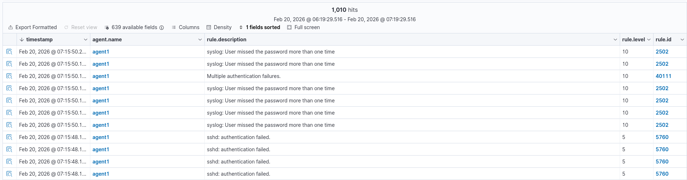




### <span style="color:lightblue">Objective</span>
Simulate an SSH brute force attack from a Kali Linux machine against
an Ubuntu 22.04 agent, observe Wazuh detection capabilities, identify
gaps in the default ruleset, and configure automated response.

### <span style="color:lightblue">Environment</span>
| Role     | OS                  | IP                |
|----------|---------------------|-------------------|
| Attacker | Kali Linux          | 192.168.248.129   |
| Agent    | Ubuntu 22.04 Server | 192.168.248.140   |
| Wazuh    | Ubuntu 24.04 Server | 192.168.248.50    |

### <span style="color:red">Attack Simulation</span>
The attack was simulated using Hydra from the Kali Linux machine targeting
the Ubuntu 22.04 agent over SSH. Two brute force attempts were executed
against different usernames:
```bash
# Attempt 1 — targeting root
hydra -l root -P /usr/share/wordlists/fasttrack.txt ssh://192.168.248.140

# Attempt 2 — targeting user 'w'
hydra -l w -P /usr/share/wordlists/fasttrack.txt ssh://192.168.248.140
```

Each run tried 262 passwords at ~220 attempts/min.
Both attempts failed — no valid credentials were found.
Total duration: ~1 min 17 sec per run.

### <span style="color:red">What Wazuh Detected</span>


Wazuh generated 1,010 authentication failure alerts across both runs.
0 successful logins were recorded. Two distinct spikes are visible
on the timeline (~07:08 and ~07:15), corresponding to each Hydra run.
MITRE ATT&CK: T1110.001 - Brute Force: Password Guessing via SSH.



Seven rule IDs were triggered during the attack:

| Rule ID | Level | Description                                    |
|---------|-------|------------------------------------------------|
| 5760    | 5     | sshd: authentication failed                    |
| 5551    | 5     | sshd: Invalid user                             |
| 5503    | 5     | sshd: Connection closed                        |
| 5768    | 5     | sshd: Maximum authentication attempts exceeded |
| 2501    | 5     | User missed the password                       |
| 2502    | 10    | User missed the password more than once        |
| 40111   | 10    | Multiple authentication failures               |

Rules 5760, 5551, 5503, 5768, and 2501 fire per individual event (level 5).
Rules 2502 and 40111 are correlation rules that aggregate multiple failures
into a higher severity alert (level 10).
Notable: 0 alerts reached level 12 or above — addressed in Tuning section.

Expanded view of a single Rule 5760 alert:

\- **Source IP:** 192.168.248.129  
\- **Target user:** w  
\- **Source port:** 41772  
\- **Full log:** `Failed password for w from 192.168.248.129 port 41772 ssh2`  
\- **MITRE:** T1110.001 - Password Guessing / T1021.004 - SSH  
\- **Fired times:** 533  
```json
{
  "agent": { "ip": "192.168.248.140", "name": "agent1", "id": "001" },
  "data": { "srcip": "192.168.248.129", "dstuser": "w", "srcport": "41772" },
  "rule": {
    "id": "5760",
    "level": 5,
    "description": "sshd: authentication failed.",
    "firedtimes": 533,
    "mitre": {
      "technique": ["Password Guessing", "SSH"],
      "id": ["T1110.001", "T1021.004"],
      "tactic": ["Credential Access", "Lateral Movement"]
    }
  },
  "full_log": "Feb 20 12:15:46 w sshd[7202]: Failed password for w from 192.168.248.129 port 41772 ssh2",
  "timestamp": "2026-02-20T12:15:48.177+0000"
}
```

### <span style="color:red">What Was Missed & Why</span>
No Level 12 or above alerts were triggered during the initial simulation.
Wazuh's built-in ruleset caps brute force detection at Level 10, meaning
the attack would not trigger a critical notification by default — a potential
blind spot in a real SOC environment.

### <span style="color:lightblue">Tuning & Custom Rules</span>
To address the detection gap, a custom rule was created in
`/var/ossec/etc/rules/local_rules.xml`:
```xml
<group name="sshd,authentication_failed,">
  <rule id="100001" level="12">
    <if_matched_sid>40111</if_matched_sid>
    <description>SSH Brute Force: High volume of authentication failures from same source</description>
    <mitre>
      <id>T1110.001</id>
    </mitre>
  </rule>
</group>
```

### <span style="color:lightblue">Response</span>
After the custom rule 100001 triggered, Wazuh executed the built-in
`firewall-drop` active response on agent1, automatically blocking
the attacker's IP via iptables. The active response was configured
in `/var/ossec/etc/ossec.conf`:
```xml
<active-response>
  <command>firewall-drop</command>
  <location>local</location>
  <rules_id>100001</rules_id>
  <timeout>180</timeout>
</active-response>
```

The effect was immediately visible in Hydra's output — attempt rate
dropped from 107 tries/min to 44 tries/min as connections began failing,
and eventually all tasks were disabled:
```
[ERROR] all children were disabled due too many connection errors
[ERROR] 1 targets did not complete
```


Level 12 alerts: **2** — rule 100001 fired successfully.

Expanded view of Rule 100001 alert:

\- **Rule ID:** 100001 (custom)  
\- **Level:** 12  
\- **Source IP:** 192.168.248.129   
\- **Target user:** w  
\- **Fired times:** 2  
\- **mail: true** — level 12 triggers email notification if configured  
\- **Full log:** `maximum authentication attempts exceeded for w from 192.168.248.129`  
\- **MITRE:** T1110.001 - Credential Access: Password Guessing  

The block was automatically lifted after the configured timeout of 180 seconds.
To make a permanent block, the timeout value can be set to `0`.

### <span style="color:lightblue">Conclusion</span>
Wazuh successfully detected the SSH brute force attack out of the box,
generating 1,010 alerts across 7 rule IDs. However, the default ruleset
did not escalate the alert to critical severity (level 12), which would
be a gap in a real SOC environment where level 12 triggers priority notifications.

Adding a single custom rule resolved this gap and enabled automated
IP blocking via active response — stopping the attack mid-execution
without any manual intervention.

**Key takeaways:**  
\- Default Wazuh rules detect brute force but cap at level 10    
\- Custom rules can bridge the gap with minimal configuration  
\- Active response provides automated containment within seconds of detection  
\- Timeout-based blocks are suitable for automated response; permanent blocks require manual review to avoid blocking legitimate users