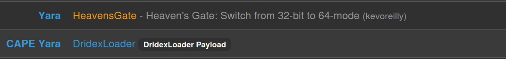
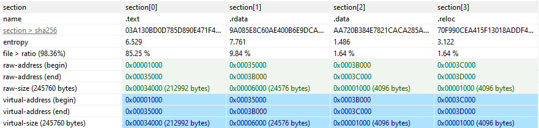
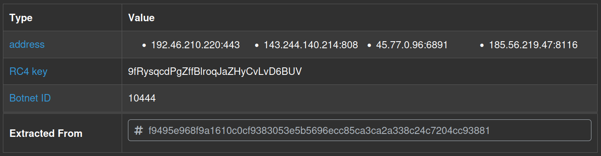
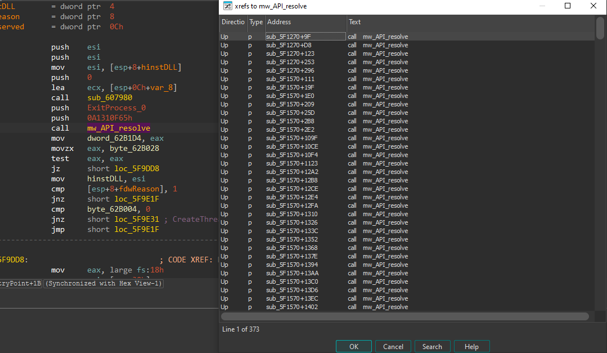
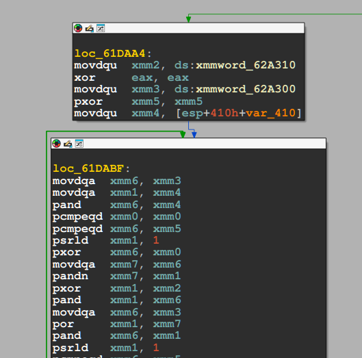
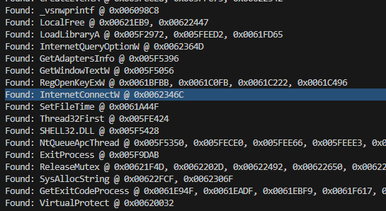
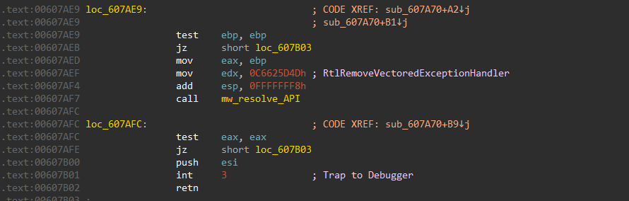
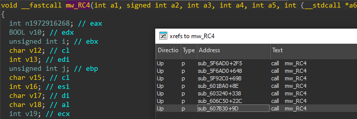
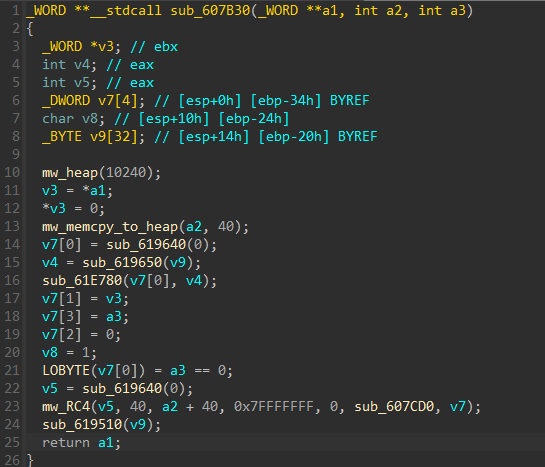
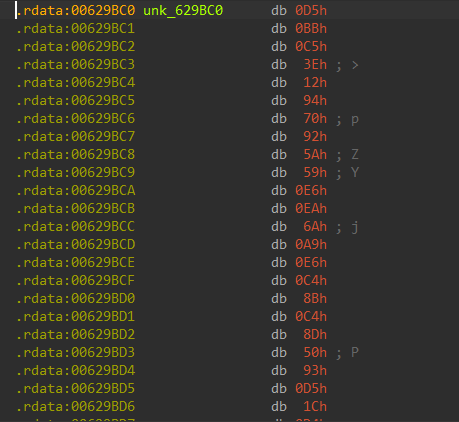



### <span style="color:lightblue">TL;DR</span>
A Dridex loader DLL with minimal static imports (`OutputDebugStringA`,
`Sleep`). It dynamically resolves all needed APIs at runtime using CRC32
hashing XOR-ed with `0x38BA5C7B`, and calls them indirectly via `int3`/`retn`
with a registered vectored exception handler — neutralizing debugger
breakpoints in the process. Embedded strings are encrypted with RC4 using a
40-byte reversed key. After passing anti-VM and execution delay checks, it
connects to four hardcoded C2 servers to download additional modules via
`InternetConnectW` and `InternetReadFile`.
### <span style="color:red">Initial Analysis</span>

| Field     | Value                                                                    |
|-----------|--------------------------------------------------------------------------|
| Type      | DridexLoader Payload: 32-bit DLL                                         |
| File Name | malware.dll                                                              |
| File Type | PE32 executable (DLL) (GUI) Intel 80386, for MS Windows                  |
| File Size | 249856 bytes                                                             |
| MD5       | df1b0f2d8e1c9ff27a9b0eb50d0967ef                                         |
| SHA256    | f9495e968f9a1610c0cf9383053e5b5696ecc85ca3ca2a338c24c7204cc93881         |

The binary was identified by CAPA as `DridexLoader Payload` and matched
the YARA rule `HeavensGate` — indicating use of the Heaven's Gate technique
to switch from 32-bit to 64-bit mode at runtime.



#### <span style="color:red">Imports</span>
Only two static imports were found:
```
OutputDebugStringA
Sleep
```

#### <span style="color:red">Exports</span>
```
.text:0x00009D70   .rdata:0x0003AB08   DllRegisterServer
```

#### <span style="color:red">Sections</span>
The `.rdata` section showed unusually high entropy of `7.761`, suggesting
compressed or encrypted data. The `.text` section had entropy of `6.529`.



### <span style="color:red">CAPEv2 Sandbox</span>
The anti-VM functionality limited sandbox visibility, but CAPEv2 successfully
extracted the malware configuration — revealing four C2 servers and the RC4
encryption key used for communication:
```
C2:  192.46.210.220:443
     143.244.140.214:808
     45.77.0.96:6891
     185.56.219.47:8116
RC4: 9fRysqcdPgZffBlroqJaZHyCvLvD6BUV
```




### <span style="color:red">Static Analysis</span>
#### <span style="color:red">Resolving API</span>
Function `mw_API_resolve` is called twice from the entry point function, both times with the same value for the first parameters. For the second call, the return value is called as a function, so we know that it must be **dynamically resolving API** through the hashes from its parameters. Since both calls share the same value for the first parameter but different values for the second one, we can assume that the first hash corresponds to a library name, and the second one corresponds to the name of the target API in that library.

```c
BOOL __stdcall DllEntryPoint(HINSTANCE hinstDLL, DWORD fdwReason, LPVOID lpReserved)
{
  v7[0] = v3;
  v4 = hinstDLL;
  sub_607980(v7, 0);
  dword_62B1D4 = mw_API_resolve(-1590620315, 497732535);
  if ( !byte_62B028 )
  {
    if ( hinstDLL != NtCurrentTeb()->ProcessEnvironmentBlock )
      byte_62B265 = 1;
    if ( !byte_62B265 )
    {
      mw_anti_vm(v7[0]);
      dword_62B1D4(0);
    }
//...[snip]...
    || (byte_62B004 = 0, (v6 = mw_API_resolve(-1590620315, -1462740277)) != 0)
    && v6(0, 0, sub_5F5100, hinstDLL, 0, 0) )
```

Investigation of cross-references (xrefs) to `sub_6015C0` reveals that this function is called multiple times throughout the malware's code, each time with different hash values as parameters. which confirms that our assumption about tecnhique dynamic API resolving



The subroutine first starts with passing the DLL hash to the functions `sub_686C50` and `sub_687564`. The return value and the API hash are then passed into `sub_6067C8` as parameters. From this, we can assume the first two functions retrieve the base of the DLL corresponding to the DLL hash, and this base address is passed to the last function with the API hash to resolve the API.
```c
int __stdcall mw_API_resolve(int maybe_DLL_hash, int maybe_API_hash)
{
//...[snip]...
v6 = sub_607564(maybe_DLL_hash, maybe_DLL_hash);
  if ( !v6 )
  {
    if ( sub_606C50(maybe_DLL_hash) )
      v6 = sub_607564(maybe_DLL_hash, maybe_DLL_hash);
  }
  if ( !v6 )
    return 0;
  else
    return sub_6067C8(v6, maybe_API_hash, v7, v8);
}
```

#### <span style="color:red">Hashing algorithm</span>
`sub_607564` is the hashing algorithm. The target API hash is XOR-ed with `0x38BA5C7B` before being compared to the hash of each API name
```c
void *__userpurge sub_607564@<eax>(int maybe_DLL_hash@<eax>, int maybe_API_hash)
{
//...[snip]...
  if ( dll_hash == (sub_61D620(v43, v16) ^ 0x38BA5C7B) )
//...[snip]...
```

Depend on constant values being loaded or used in the program can pick out the algorithm.

Among the three constants being used in this function, one stands out with the repetition of the value `0x0EDB8832`, which is typically used in the CRC32 hashing algorithm. So, `sub_69D620` is a function to generate a CRC32 hash from a given string, and the API hashing algorithm of DRIDEX boils down to XOR-ing the CRC32 hash of API/DLL names with `0x38BA5C7B`. 

```nasm
.rdata:0062A2F0 xmmword_62A2F0  xmmword 3000000020000000100000000h
.rdata:0062A2F0                                         ; DATA XREF: sub_61D620+11↑r
.rdata:0062A300 xmmword_62A300  xmmword 1000000010000000100000001h
.rdata:0062A300                                         ; DATA XREF: sub_61D620+2D↑r
.rdata:0062A300                                         ; sub_61D620+9A↑r ...
.rdata:0062A310 xmmword_62A310  xmmword 0EDB88320EDB88320EDB88320EDB88320h
```

I used hashdb to look up the hashes in the sample. The hash `0x1DAACBB7` corresponds correctly to the `ExitProcess` API, which confirms that our assumption about the hashing algorithm is correct.


#### <span style="color:red">C2 Communication</span>
To identify all resolved APIs without manually tracing each hash, I wrote
an IDAPython script that extracted all `push` arguments preceding calls to
`mw_API_and_DLL_resolve` and saved them to a file. Each hash was then resolved against the hashdb API using the XOR key
`0x38BA5C7B` identified earlier:
```python
import requests

filename = r"C:\Users\f\Desktop\calls.txt"
xor_key = 0x38BA5C7B

unique_args = {}

with open(filename, "r") as file:
    for line in file:
        parts = line.split()
        if len(parts) >= 3:
            addr, dll_h, api_h = parts[0], int(parts[1]), int(parts[2])
            for h in [dll_h, api_h]:
                if h not in unique_args:
                    unique_args[h] = set()
                unique_args[h].add(addr)

for hash_value in sorted(unique_args):
    response = requests.get(
        f"https://hashdb.openanalysis.net/hash/crc32/{str(hash_value ^ xor_key)}"
    )
    if response.status_code == 200:
        data = response.json()
        if data.get("hashes"):
            name = data["hashes"][0]["string"]["string"]
            addrs = ", ".join(sorted(unique_args[hash_value]))
            print(f"Found: {name} @ {addrs}")
```

The full WinINet call chain was recovered, confirming a complete HTTP-based
C2 communication stack:
```
Found: InternetOpenA        @ 0x00623238
Found: InternetConnectW     @ 0x0062346C
Found: HttpOpenRequestW     @ 0x00623508
Found: HttpSendRequestW     @ 0x0062388E
Found: InternetReadFile     @ 0x00623AD6
Found: HttpQueryInfoW       @ 0x0062392F, 0x00623985, 0x006239DE
Found: InternetSetOptionW   @ 0x006235FF, 0x00623622, 0x0062367B
Found: InternetQueryOptionW @ 0x0062364D
Found: InternetCloseHandle  @ 0x0062327D, 0x0062330D, ...
```



The function responsible for C2 connection is at `0x00623370`
(`InternetConnectW`), and the module download function is at `0x00623820`
(`InternetReadFile`).

#### <span style="color:red">Resolved API Analysis</span>
The full resolved API list revealed several additional capability clusters
beyond the C2 stack.

**Process injection** — a complete injection toolkit using `Nt*` functions
directly from NTDLL to bypass higher-level API monitoring:
`NtAllocateVirtualMemory`, `NtWriteVirtualMemory`, `NtReadVirtualMemory`,
`NtProtectVirtualMemory`, `NtMapViewOfSection`, `NtUnmapViewOfSection`,
`NtCreateSection`, `RtlCreateUserThread`, `NtQueueApcThread`, `NtResumeThread`.

**Registry persistence** — `RegCreateKeyExW`, `RegSetValueExA`,
`RegLoadKeyW`, `RegUnLoadKeyW`, `RegOpenKeyExW`, `RegQueryValueExW/A`
indicate reading and writing of registry keys including hive load/unload
operations — `NTUSER.DAT` was also present in the decrypted strings.

**Cryptography** — `CryptAcquireContextW`, `CryptGenRandom`,
`CryptCreateHash`, `CryptHashData`, `CryptGetHashParam`, `CryptDestroyHash`
indicate use of the Windows CryptoAPI for key generation or data hashing
separate from the RC4 string encryption.

**Process and memory enumeration** — `K32GetProcessImageFileNameW`,
`K32EnumProcessModulesEx`, `K32GetModuleBaseNameW`,
`NtQuerySystemInformation`, `NtQueryVirtualMemory`,
`CreateToolhelp32Snapshot`, `Thread32First`, `Thread32Next` point to
thorough process and module scanning consistent with injection target
selection.

**Inter-process atom communication** — `GlobalAddAtomW`,
`GlobalGetAtomNameA/W`, `GlobalDeleteAtom` are used for stealthy
inter-process signaling without named pipes or sockets.

**COM usage** — `CoCreateInstance`, `CoInitializeEx`, `CoUninitialize`
suggest use of COM objects, possibly for `IWebBrowser2`-based form
grabbing consistent with Dridex's known banking capabilities.


#### <span style="color:red">Exception Handler</span>
The sample does not use the call instruction to call APIs. Instead, the malware uses a combination of int3 and retn instructions to call its Windows APIs after dynamically resolving them.



The function `sub_607980` dynamically resolves `RtlAddVectoredExceptionHandler` and calls it 
to register `sub_607D40` as a vectored exception handler. This means that when the program 
encounters an `int3` instruction, `sub_607D40` is invoked by the kernel to handle the interrupt 
and transfer control to the API stored in `eax`.
```c
LABEL_9:
    v8 = mw_DLL_base(0x588AB3EA, 0x588AB3EA);
    if ( !v8 && sub_606C50(NTDLL_DLL) )
      v8 = mw_DLL_base(0x588AB3EA, 0x588AB3EA); // NTDLL.DLL
    if ( v8 )
      v9 = mw_API_resolve(v8, 0x82115E73, v10, v11);// RtlAddVectoredExceptionHandler
    else
      v9 = nullptr;
LABEL_12:
    n787139894 = sub_607A60(v9);
    byte_62B26C = 0;
  }
```
`sub_607D40` handles three exception codes:

| NTSTATUS Code  | Symbolic Name             | Description               |
|----------------|---------------------------|---------------------------|
| `0xC0000005`   | `STATUS_ACCESS_VIOLATION` | Invalid memory access     |
| `0xC00000FD`   | `STATUS_STACK_OVERFLOW`   | Stack exhaustion          |
| `0xC0000374`   | `STATUS_HEAP_CORRUPTION`  | Heap metadata corruption  |
```c
int __stdcall sub_607D40(int **a1)
{
  v1 = **a1;
  if ( v1 == 0xC0000005 || v1 == 0xC00000FD || v1 == 0xC0000374 )
  {
    //...[snip]...
    kernel32_base = mw_DLL_base(0xA1310F65, 0xA1310F65);
    if ( !kernel32_base )
    {
      if ( sub_606C50(0xA1310F65) )
        kernel32_base = mw_DLL_base(0xA1310F65, 0xA1310F65);// KERNEL32.DLL
    }
    if ( kernel32_base )
    {
      TreminateProcess = mw_API_resolve(kernel32_base, 0x93FAE3F6, v7, v8);// TreminateProcess
//...[snip]...
        __debugbreak();
        return TreminateProcess;
```
For these exceptions, the handler dynamically resolves an API using module hash `0xA1310F65`(KERNEL32.DLL) 
and function hash `0x93FAE3F6`(TerminateProcess)

For `STATUS_BREAKPOINT` (`0x80000003`), the handler manually patches the exception context 
record, advancing `EIP` past the breakpoint and adjusting the stack before returning 
`EXCEPTION_CONTINUE_EXECUTION` (`-1`):
```c
//...[snip]...
  else if ( v1 = 0x80000003 )
  {
    ++a1[1][46];                       
    a1[1][49] -= 4;
    *a1[1][49] = a1[1][46] + 1;        
    a1[1][49] -= 4;
    *a1[1][49] = a1[1][44];          
    return -1;                         
  }
```
This is a known **anti-debugging technique**: by silently swallowing `STATUS_BREAKPOINT`, 
DRIDEX neutralizes software breakpoints set by a debugger, allowing execution to continue 
transparently from the next instruction.


#### <span style="color:red">Anti-VM</span>
The callback function `sub_5F5100` called `mw_anti_vm()`, resolved two
APIs via hash, then performed an unconditional `jmp` to a resolved address —
consistent with a stager or loader pattern that transfers execution to
unpacked code:
```c
void __cdecl sub_5F5100(int a1)
{
  int v1; // [esp+0h] [ebp-8h]

  mw_anti_vm();
  v1 = mw_API_resolve(-1590620315, -169236058);
  mw_API_resolve(-1590620315, -1206567270);
  __asm { jmp     [ebp+var_8] }
}
```

`mw_anti_vm()` implemented an execution delay loop that ran up to
199,999,100 iterations, calling `OutputDebugStringA` and `Sleep(0xA)`
repeatedly — a common sandbox evasion technique designed to exhaust
sandbox time limits:
```c
while ( 1 )
{
  sub_615CB0(20, 80);
  OutputDebugStringA(lpOutputString[0]);
  Sleep(0xAu);
  sub_610B10(lpOutputString);
  if ( ++v1 >= 199999100 )
    break;
  while ( v1 >= 4987 )
  {
    if ( ++v1 >= 199999100 )
    {
      OutputDebugStringA(v75);
      goto LABEL_9;
    }
  }
```

#### <span style="color:red">Strings Encryption</span>
`capa` identified RC4 encryption capabilities in the binary:
```
encrypt data using RC4 KSA
namespace  data-manipulation/encryption/rc4
scope      function
matches    0x61E5D0

encrypt data using RC4 PRGA
namespace  data-manipulation/encryption/rc4
scope      function
matches    0x61E5D0
```

I renamed `0x61E5D0` to `mw_RC4`. The `signed int a2` parameter may indicates
the key length:
```c
void __fastcall mw_RC4(int a1, signed int a2, int a3, int a4, int a5, int (__stdcall *a6)(int, int), int a7)
```



Tracing the callers of `mw_RC4` confirmed the key length is **40 bytes**
— passed as the second parameter. Before the key is applied, `sub_61E780`
performs a byte-reversal on the key bytes:



Following the call chain to identify the encrypted data source, I found
that `sub_607B30` is called with `&unk_629BC0` as the data parameter:
```c
_WORD **__fastcall sub_5FAC00(_WORD **a1, int a2)
{
  sub_607B30(a1, &unk_629BC0, a2);
  return a1;
}
```



The RC4 key (before reversal) is:
```
D5BBC53E129470925A59E6EA6AA9E6C48BC48D5093D51CD433884126BAE4A81560E7B19148933CDB
```

After accounting for the byte-reversal and decrypting,
the plaintext strings from `0x629BC0` were recovered:
```
Program Manager
Progman
AdvApi32~PsApi~shlwapi~shell32~WinInet
/run /tn "%ws"
"%ws" /grant:r "%ws":F
\NTUSER.DAT
winsxs
x86_*
amd64_*
*.exe
\Sessions\%d\BaseNamedObjects\
```

These strings reveal the malware's targets and internal logic:
`AdvApi32~PsApi~shlwapi~shell32~WinInet` is a tilde-delimited list of
DLLs the malware dynamically resolves, `Program Manager` / `Progman`
indicate process or window targeting, and the `schtasks` `/run /tn "%ws"`
template suggests scheduled task abuse for execution or persistence.


### <span style="color:lightblue">IOCs</span>

**Files**  
\- `malware.dll`  
\- MD5: `df1b0f2d8e1c9ff27a9b0eb50d0967ef`  
\- SHA256: `f9495e968f9a1610c0cf9383053e5b5696ecc85ca3ca2a338c24c7204cc93881`  

**Network**  
\- C2: `192.46.210.220:443`  
\- C2: `143.244.140.214:808`   
\- C2: `45.77.0.96:6891`  
\- C2: `185.56.219.47:8116`  

**Encryption**  
\- Algorithm: RC4  
\- Key (pre-reversal): `D5BBC53E129470925A59E6EA6AA9E6C48BC48D5093D51CD433884126BAE4A81560E7B19148933CDB`  
\- CAPEv2 key: `9fRysqcdPgZffBlroqJaZHyCvLvD6BUV`  

### <span style="color:lightblue">Attack Flow</span>


%%{init: {'theme': 'base', 'themeVariables': { 'background': '#ffffff', 'mainBkg': '#ffffff', 'primaryTextColor': '#000000', 'lineColor': '#333333', 'clusterBkg': '#ffffff', 'clusterBorder': '#333333'}}}%%
graph TD
    classDef default fill:#f9f9f9,stroke:#333,stroke-width:1px,color:#000;
    classDef input fill:#e1f5fe,stroke:#0277bd,stroke-width:2px,color:#000;
    classDef check fill:#fff9c4,stroke:#fbc02d,stroke-width:2px,stroke-dasharray: 5 5,color:#000;
    classDef exec fill:#ffebee,stroke:#c62828,stroke-width:2px,color:#000;
    classDef term fill:#e0e0e0,stroke:#333,stroke-width:2px,color:#000;

    Load([malware.dll Loaded<br/>DllEntryPoint]):::input --> APIResolve[Dynamic API Resolution<br/>CRC32 XOR 0x38BA5C7B]:::exec

    subgraph Evasion [Evasion]
        APIResolve --> VEH[Register VEH<br/>RtlAddVectoredExceptionHandler]:::exec
        VEH --> Int3[int3 + retn<br/>Indirect API Calls]:::exec
        Int3 --> AntiVM{Anti-VM<br/>Execution Delay Loop<br/>199,999,100 iterations}:::check
        AntiVM -.->|Timeout / VM| Exit[Exit]:::term
        AntiVM -- Pass --> HeavensGate[Heaven's Gate<br/>32-bit → 64-bit switch]:::exec
    end

    subgraph Init [Initialization]
        HeavensGate --> RC4[RC4 String Decryption<br/>40-byte reversed key]:::exec
        RC4 --> Strings["Program Manager, Progman<br/>AdvApi32~PsApi~shlwapi~shell32~WinInet<br/>NTUSER.DAT, schtasks /run /tn"]:::exec
        Strings --> Loader[sub_5F5100<br/>Resolve APIs + jmp to unpacked code]:::exec
    end

    subgraph Persistence [Persistence]
        Loader --> Reg[Registry R/W<br/>RegCreateKeyExW / RegSetValueExA]:::exec
        Loader --> Hive[Offline Hive Manipulation<br/>RegLoadKeyW / NTUSER.DAT]:::exec
        Loader --> Task[Scheduled Task<br/>schtasks /run /tn]:::exec
    end

    subgraph Injection [Process Injection]
        Loader --> Enum[Process Enumeration<br/>Toolhelp32 / NtQuerySystemInformation]:::exec
        Enum --> Target[Select Injection Target]:::exec
        Target --> Alloc[NtAllocateVirtualMemory<br/>NtWriteVirtualMemory]:::exec
        Alloc --> Protect[NtProtectVirtualMemory<br/>NtMapViewOfSection]:::exec
        Protect --> Thread[RtlCreateUserThread<br/>NtQueueApcThread / NtResumeThread]:::exec
    end

    subgraph C2 [C2 Communication]
        Thread --> IOpen[InternetOpenA]:::exec
        IOpen --> IConnect[InternetConnectW<br/>0x00623370]:::exec
        IConnect --> IRequest[HttpOpenRequestW<br/>HttpSendRequestW]:::exec
        IRequest --> IRead[InternetReadFile<br/>0x00623820<br/>Download modules]:::exec
        IRead --> IP1((192.46.210.220:443)):::exec
        IRead --> IP2((143.244.140.214:808)):::exec
        IRead --> IP3((45.77.0.96:6891)):::exec
        IRead --> IP4((185.56.219.47:8116)):::exec
    end

    subgraph Banking [Banking Capabilities]
        Thread --> COM[CoCreateInstance<br/>IWebBrowser2 Form Grabbing]:::exec
        Thread --> Atoms[GlobalAddAtomW<br/>Inter-process Signaling]:::exec
        Thread --> Crypt[CryptoAPI<br/>CryptGenRandom / CryptHashData]:::exec
    end
