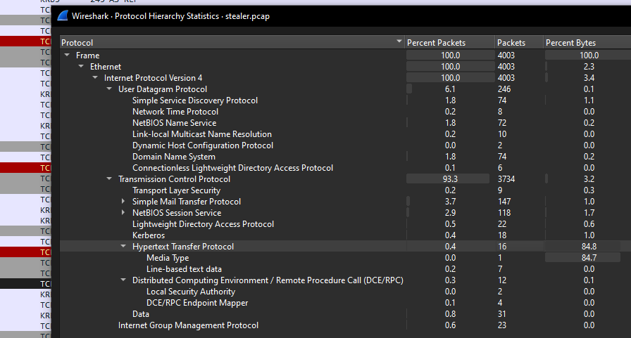
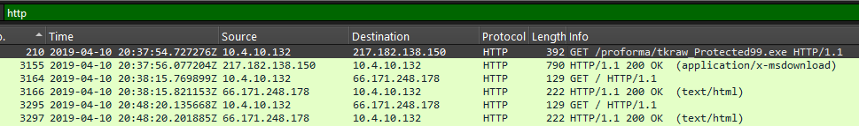
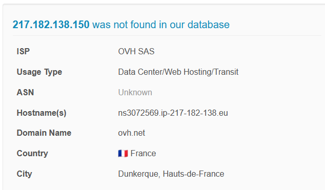
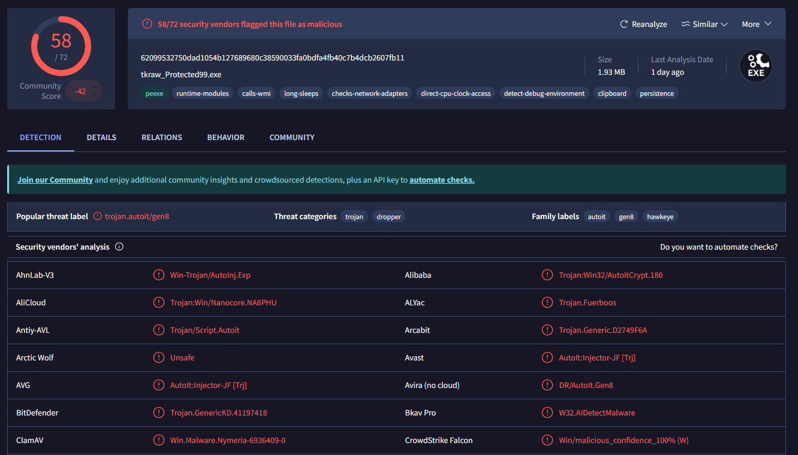
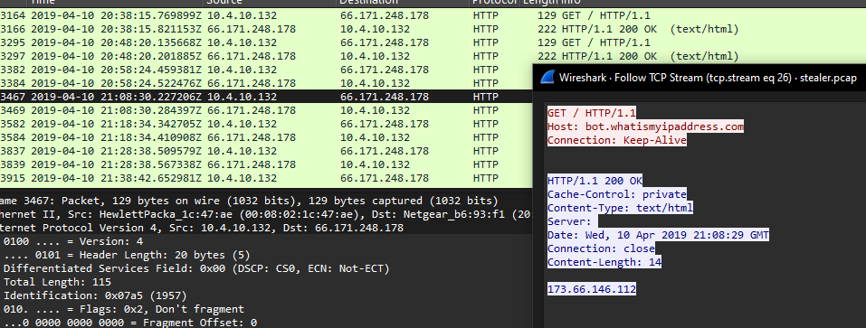
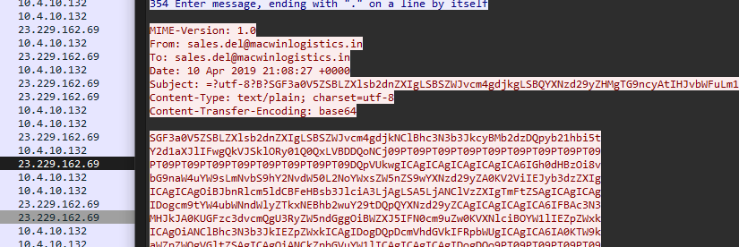



### <span style="color:lightblue">TL;DR</span>

A victim host at `10.4.10.132` downloaded a malicious executable via HTTP from an OVH-hosted server in France. The file was a **HawkEye Keylogger - Reborn v9** dropper, detected by 58 out of 72 vendors on VirusTotal. After execution, the malware periodically beaconed to `bot.whatismyipaddress.com` to retrieve the victim's external IP, and exfiltrated harvested credentials every 10 minutes via SMTP to an attacker-controlled inbox at `macwinlogistics.in`.

### <span style="color:red">Initial Analysis</span>

The capture contains 4003 frames. TCP dominates at 93.3% of packets. Two protocols stood out as relevant to a investigation — **HTTP** (0.4% of packets but 84.8% of bytes, indicating a large file transfer) and **SMTP** (3.7% of packets, suggesting email activity). I decided to start with HTTP since the large byte ratio suggested a file download.

### <span style="color:red">Malware Download</span>

I found a `GET` request from the victim `10.4.10.132` to `217.182.138.150`:

```
GET /proforma/tkraw_Protected99.exe HTTP/1.1
```

The server responded with `HTTP/1.1 200 OK` and `Content-Type: application/x-msdownload`, confirming a successful executable download.



I looked up the source IP `217.182.138.150` on **AbuseIPDB** - it was not found in their database, but the IP belongs to **OVH SAS**, a French hosting provider, located in Dunkerque, France. Attacker infrastructure hosted on VPS/hosting providers like OVH is common for malware distribution.



I then submitted the file hash to **VirusTotal**:

```
MD5: 71826ba081e303866ce2a2534491a2f7
File: tkraw_Protected99.exe (1.93 MB)
```

**58 out of 72** security vendors flagged it as malicious. The popular threat label is `trojan.autoit/gen8`, with family labels including **hawkeye** - confirming this is a **HawkEye Keylogger** dropper packed with AutoIt. VirusTotal behavior tags include `persistence`, `clipboard`, `checks-network-adapters`, `detect-debug-environment` and `long-sleeps` - consistent with a keylogger.



### <span style="color:red">Beaconing Behavior</span>

After the download, filtering HTTP traffic revealed a recurring pattern - every 10 minutes, `10.4.10.132` sent a `GET /` request to `66.171.248.178`.

```
GET / HTTP/1.1
Host: bot.whatismyipaddress.com
Connection: Keep-Alive
```

The server responded with the victim's external IP address - `173.66.146.112`. This is a common technique used by malware to determine the public IP of the infected machine before exfiltration, allowing the attacker to correlate the victim's identity.



### <span style="color:red">Data Exfiltration</span>

Switching focus to SMTP traffic, I followed the TCP streams on port 25 connections going to `23.229.162.69`. The captured SMTP session revealed the attacker's exfiltration channel:

```
From: sales.del@macwinlogistics.in
To:   sales.del@macwinlogistics.in
Content-Transfer-Encoding: base64
```

The credentials used to authenticate to the SMTP server: `Sales@23`. The email body was base64-encoded - after decoding, the content confirmed the malware identity and revealed stolen credentials:

```
HawkEye Keylogger - Reborn v9
Passwords Logs
roman.mcguire \ BEIJING-5CD1-PC

URL               : https://login.aol.com/account/challenge/password
Web Browser       : Internet Explorer 7.0 - 9.0
User Name         : roman.mcguire914@aol.com
Password          : P@ssw0rd$
Password Strength : Very Strong
...
```



The malware exfiltrated keylogger output - including saved browser credentials - every 10 minutes, sending them to the attacker-controlled inbox `sales.del@macwinlogistics.in`.


### <span style="color:lightblue">IOCs</span>

**IPs**  
\- `217.182.138.150` — malware distribution server (OVH SAS, France)  
\- `66.171.248.178` — `bot.whatismyipaddress.com` — IP beacon target  
\- `23.229.162.69` — SMTP exfiltration server  
**Files**  
\- `tkraw_Protected99.exe` — HawkEye Keylogger Reborn v9 dropper  
\- MD5: `71826ba081e303866ce2a2534491a2f7`  
\- SHA256: `62099532750dad1054b127689680c38590033fa0bdfa4fb40c7b4dcb2607fb11`  
**Accounts**  
\- `sales.del@macwinlogistics.in` — attacker SMTP inbox  
\- `roman.mcguire914@aol.com` — stolen credential  
**Credentials**  
\- SMTP password: `Sales@23`  
\- Stolen AOL password: `P@ssw0rd$`  

### <span style="color:lightblue">Recommendations</span>

**Immediate Actions**
1. **Isolate** host 10.4.10.132 from the network
2. **Block** IP 217.182.138.150 and domain macwinlogistics.in at the perimeter
3. **Reset** all credentials for user`roman.mcguire across all services
4. **Scan** all hosts on the 10.4.10.0/24 subnet for the same IOCs

**Preventive Measures**
1. **Deploy email filtering** to block outbound SMTP to unauthorized servers
2. **Block** outbound connections to IP-lookup services like bot.whatismyipaddress.co
3. **Enable EDR** to detect AutoIt-based droppers at execution time
4. **Restrict executable downloads** via web proxy - block application/x-msdownloa` from unknown hosts
5. **Enable MFA** on all user email accounts to limit impact of stolen credentials


### <span style="color:lightblue">Attack Timeline</span>


%%{init: {'theme': 'base', 'themeVariables': { 'background': '#ffffff', 'mainBkg': '#ffffff', 'primaryTextColor': '#000000', 'lineColor': '#333333', 'clusterBkg': '#ffffff', 'clusterBorder': '#333333'}}}%%
graph TD
    classDef default fill:#f9f9f9,stroke:#333,stroke-width:1px,color:#000;
    classDef access fill:#e1f5fe,stroke:#0277bd,stroke-width:2px,color:#000;
    classDef action fill:#ffebee,stroke:#c62828,stroke-width:2px,color:#000;
    classDef exfil fill:#fce4ec,stroke:#880e4f,stroke-width:2px,color:#000;
    classDef persist fill:#f3e5f5,stroke:#6a1b9a,stroke-width:2px,color:#000;
    classDef start fill:#e8f5e9,stroke:#2e7d32,stroke-width:2px,color:#000;

    A([10.4.10.132</br>Victim Host]):::start --> B[2019-04-10 20:37:54</br>HTTP GET tkraw_Protected99.exe</br>from 217.182.138.150]:::access
    B --> C[2019-04-10 20:38:15</br>File downloaded</br>application/x-msdownload]:::action

    subgraph Beaconing [Beaconing — every 10 minutes]
        C --> D[GET bot.whatismyipaddress.com</br>Returns external IP 173.66.146.112]:::persist
    end

    subgraph Exfiltration [Exfiltration — every 10 minutes]
        D --> E[SMTP to 23.229.162.69</br>sales.del@macwinlogistics.in</br>Base64-encoded credentials]:::exfil
        E --> F([HawkEye Keylogger Reborn v9</br>Stolen: roman.mcguire914@aol.com</br>P@ssw0rd$]):::exfil
    end
