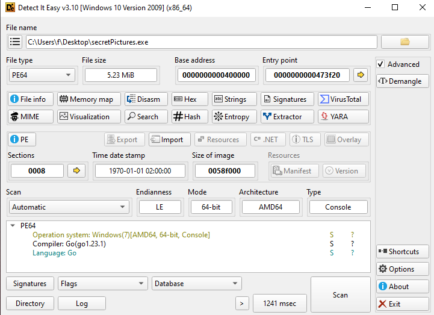


### <span style="color:lightblue">TL;DR</span>
A Go-based backdoor that copies itself to `C:\Systemlogs\logscheck.exe`,
establishes persistence via `HKCU\...\Run\HealthCheck`, enumerates
connected drives via `GetDriveType`, and attempts to connect to
`malware.invalid.com`.

### <span style="color:red">Initial Analysis</span>
```
secretPictures.exe: PE32+ executable (console) x86-64, 8 sections
SHA256: 80e82415a26ac7c0124bbaa2133192dadd51cbc5ed22b202ebb24f6fddf8c8ab
```

Static analysis confirmed the binary was written in Go.



### <span style="color:red">Sandbox Analysis</span>
Seconds after execution the sample copied itself to `C:\Systemlogs\`
and renamed itself to `logscheck.exe`.


#### <span style="color:red">Persistence</span>
A registry Run key was set to execute `logscheck.exe` on every user login:
```
HKEY_CURRENT_USER\SOFTWARE\Microsoft\Windows\CurrentVersion\Run\HealthCheck
```


#### <span style="color:red">C2 Communication</span>
The sample attempted to connect to the hardcoded domain `malware.invalid.com`.


#### <span style="color:red">Drive Enumeration</span>
The sample called the `GetDriveType` WinAPI function to enumerate all
connected drives — likely to identify removable media or network shares
for lateral movement or data staging.


### <span style="color:lightblue">IOCs</span>

**Files**  
\- `secretPictures.exe`  
\- SHA256: `80e82415a26ac7c0124bbaa2133192dadd51cbc5ed22b202ebb24f6fddf8c8ab`  
\- `C:\Systemlogs\logscheck.exe` — persistence copy  

**Registry**  
\- `HKCU\SOFTWARE\Microsoft\Windows\CurrentVersion\Run\HealthCheck`  

**Network**  
\- C2 Domain: `malware.invalid.com`  