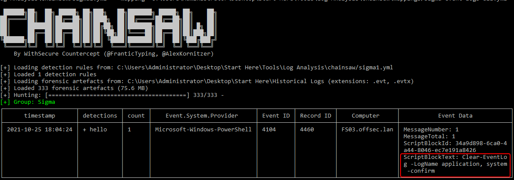
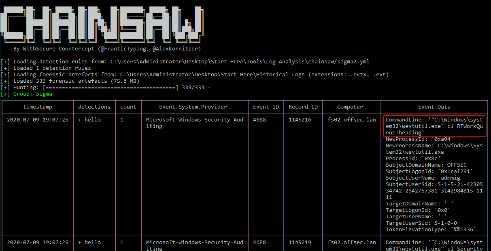
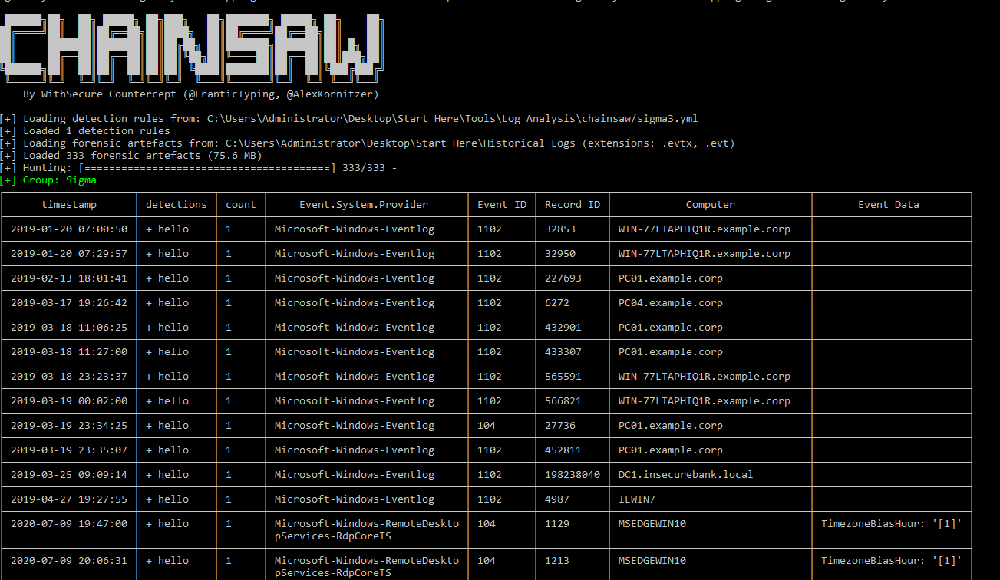

### overview

### Who can clean logs?
### wevutil
wevtutil cl system
wevtutil cl application
wevtutil cl security

### powershell cmdlets
тут напиши про Clear-EventLog та Remove-EventLog
тут також напиши про EventLogSession.ClearLog,EventLog.Clear


### log files
тут напиши про C:\Windows\System32\winevt\logs\.

### wmic
тут напиши про nteventlog

### evnt ids
тут напиши про event id 104,1102

ось це залиш в кінці після написання теоретичних даних вище
I analyze logs with chainsaw 



```
Clear-EventLog -LogName application, system -confirm
wevtutil  cl WitnessClientAdmin
wevtutil  cl Windows.Globalization/Analytic
wevtutil  cl Windows PowerShell
wevtutil  cl WINDOWS_WMPHOTO_CHANNEL
wevtutil  cl WINDOWS_KS_CHANNEL
wevtutil  cl UIManager_Channel
wevtutil  cl TabletPC_InputPanel_Channel/IHM
wevtutil  cl TabletPC_InputPanel_Channel
wevtutil  cl SystemEventsBroker
wevtutil  cl System
wevtutil  cl SmbWmiAnalytic
wevtutil  cl Setup
wevtutil  cl Security
wevtutil  cl RTWorkQueueTheading
wmic  nteventlog where "LogfileName='System'" cl
wmic  nteventlog where filename="security" cl
```


### Rules
```yml
title: Detect Event Log Clearing via PowerShell ScriptBlock
id: 879f3bcc-acfb-467b-b002-8c4f18599d44
status: test
description: Detects attempts to clear Windows Event Logs using PowerShell cmdlets
    captured via ScriptBlock Logging (Event ID 4104).
references:
    - https://attack.mitre.org/techniques/T1070/001/
author: bubka
date: 2026-05-01
tags:
    - attack.t1685.005
logsource:
    product: windows
    service: powershell
detection:
    selection:
        EventID: 4104
        ScriptBlockText|contains:
            - 'Clear-EventLog'
            - 'Remove-EventLog'
            - 'wevtutil'
            - '[System.Diagnostics.EventLog]'
            - '[System.Diagnostics.Eventing]'
    condition: selection
falsepositives:
    - Legitimate administrative or maintenance scripts
    - Automated monitoring or housekeeping tasks
level: high
```

```yml
title: Detect Event Log Clearing via wevtutil (Process Creation)
id: bec2570d-f182-4b48-ab17-6c35f1b4bda4
status: test
description: Detects wevtutil usage to clear Windows Event Logs via process creation
    events (Sysmon EventID 1 or Security EventID 4688).
references:
    - https://attack.mitre.org/techniques/T1070/001/
author: bubka
date: 2026-05-01
tags:
    - attack.t1685.005
logsource:
    category: process_creation
    product: windows
detection:
    selection1:
        Image|contains: 'wevtutil.exe'
        OriginalFileName: 'wevtutil.exe'
        CommandLine|contains:
            - 'clear-log'
            - 'cl'
    selection2:
        Image|contains: 'wmic.exe'
        OriginalFileName: 'wmic.exe'
        CommandLine|contains:
            - 'nteventlog'
    condition: selection1 or selection2
falsepositives:
    - Legitimate administrative or maintenance scripts
    - Automated monitoring or housekeeping tasks
level: high
```

```yml
title: Detect Event Log Clearing
id: 54c48b69-e2a4-43b7-a3e0-f636bc814c28
status: test
description: Detects attempts to clear Windows Event Logs via Event Log Clearing events (Event ID 1102 or 104).
references:
    - https://attack.mitre.org/techniques/T1070/001/
author: bubka
date: 2026-05-01
tags:
    - attack.t1685.005
logsource:
  product: windows
  service: system
detection:
    selection:
        EventID:
            - 1102
            - 104
    condition: selection
falsepositives:
    - Legitimate administrative or maintenance scripts
    - Automated monitoring or housekeeping tasks
level: high
```

