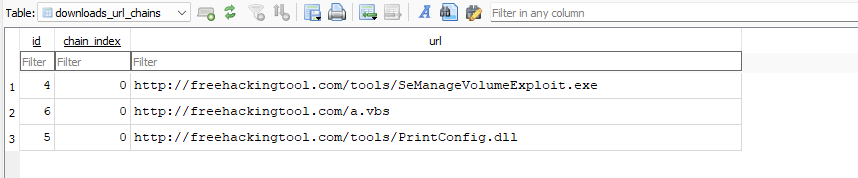




### <span style="color:lightblue">TL;DR</span>
A victim clicked a phishing link impersonating a corporate login page, leading to credential theft. The attacker used stolen credentials to gain RDP access, then escalated privileges via SeManageVolumeExploit, deployed malicious DLLs using certutil, and established persistence through a hidden VBS script in the Startup folder.

### <span style="color:red">Initial Access</span>
#### Phishing URL
By analyzing the victim's Chrome history using ChromeHistoryView, I identified that on **2025-05-23 14:20:07** the victim visited the legitimate company intranet. Two days later, on **2025-05-25 13:36:42**, they clicked a phishing URL that harvested their credentials:
```
http://intranet.wowzainc.co.th/landing.php     2025-05-23 14:20:07
https://login.wowzalnc.co.th/logon.php         2025-05-25 13:36:42  <- phishing
https://mail.wowzainc.co.th/inbox.php          2025-05-23 14:21:17
```

The phishing domain `wowzalnc.co.th` impersonates the legitimate `wowzainc.co.th` by replacing the letter `i` with `l`.

#### RDP Access
Using the harvested credentials, the attacker gained remote access via RDP on **2025-05-27 11:59:57**. This was confirmed by Event ID 4624 in `Security.evtx` with Logon Type 10 (RemoteInteractive):
```
# Security.evtx / Event ID 4624
Logon Type:       10
Account Name:     otello.j
Account Domain:   WORKSTATION6
Logon ID:         0x2A017F
Security ID:      S-1-5-21-888844466-1397619329-4015378808-1001
```


### <span style="color:red">Privilege Escalation</span>
#### SeManageVolumeExploit
On **2025-05-28 12:36:59**, the attacker visited `freehackingtool.com` and browsed its tools section:
```
http://freehackingtool.com/              2025-05-28 12:36:59
http://freehackingtool.com/tools/        2025-05-28 12:37:09
http://freehackingtool.com/tools/        2025-05-28 12:53:36
http://freehackingtool.com/              2025-05-28 12:55:02
```

From this site, download attempts were made for three files: `SeManageVolumeExploit.exe`, `a.vbs`, and `PrintConfig.dll`.



At **2025-05-28 12:43:33**, `SeManageVolumeExploit.exe` was successfully downloaded. This tool exploits the `SeManageVolumePrivilege` — a Windows privilege that allows volume-level operations such as mounting, dismounting, and defragmenting volumes. When abused, it can grant an attacker full control over the C: drive, enabling them to bypass access controls, manipulate the file system, and potentially execute arbitrary code.


### <span style="color:red">Malware Deployment</span>
#### PrintConfig.dll — Malicious DLL via certutil
At **2025-05-28 12:44:01**, the browser download of `PrintConfig.dll` was interrupted with interrupt code 41 (`USER_SHUTDOWN` — the browser was closed before the download completed).


To work around this, the attacker used the LOLBIN `certutil.exe` to download the file at **2025-05-28 12:45:37**. This was confirmed by analyzing the `CryptnetUrlCache/Metadata` artifacts. The legitimate DLL at `C:\Windows\system32\spool\drivers\x64\12\PrintConfig.dll` was then removed and replaced with the malicious version.

At **2025-05-28 15:19:35**, Windows Defender detected and flagged the replaced DLL:
```
Name:      Trojan:Win64/Meterpreter.E
ID:        2147721833
Severity:  Severe
Path:      C:\Windows\system32\spool\drivers\x64\3\PrintConfig.dll
           service: PrintNotify
Detection Origin:  Local machine
User:              NT AUTHORITY\SYSTEM
Engine Version:    AM: 1.1.25050.2
```

#### tzres.dll — Secondary Malicious DLL
At **2025-05-28 12:54:23**, a second malicious DLL `tzres.dll` was downloaded via `certutil.exe` and placed at `C:\Windows\system32\wbem\tzres.dll`.


#### PrintConfig.dll Execution
From the PowerShell console history, I found that the attacker triggered execution of the malicious `PrintConfig.dll` by instantiating a COM object associated with the Windows spooler service:
```powershell
dir
$type = [Type]::GetTypeFromCLSID("{854A20FB-2D44-457D-992F-EF13785D2B51}")
$object = [Activator]::CreateInstance($type)
dir
reg add "HKCU\control panel\desktop" /v wallpaper /t REG_SZ /d "C:/Users/Public/Pictures/gg.bmp" /f
```

The CLSID `{854A20FB-2D44-457D-992F-EF13785D2B51}` is associated with the `PrintNotify` service. Instantiating it caused `spoolsv.exe` to load and execute the malicious `PrintConfig.dll`. Additionally, the attacker downloaded an image `gg.bmp` and set it as the desktop wallpaper — likely to signal successful compromise.


### <span style="color:red">Persistence</span>
#### a.vbs — Startup Script
At **2025-05-28 12:55:05**, `a.vbs` was downloaded and moved to the Windows Startup folder to ensure execution on every boot:
```
C:\ProgramData\Microsoft\Windows\Start Menu\Programs\StartUp\a.vbs
```

The script creates a `WScript.Shell` object and silently runs `systeminfo`:
```vbscript
Set WshShell = CreateObject("WScript.Shell")
WshShell.Run "cmd.exe /c systeminfo", 0, False
```

`systeminfo` collects data via WMI, which triggers the WMI Provider Host (`wmiprvse.exe`). Since `wmiprvse.exe` executes all providers from the `\wbem\` directory, this causes the malicious `tzres.dll` to be loaded automatically.

At **2025-05-28 12:56:11**, the `Hidden` attribute was set on `a.vbs` to conceal it from the victim:
```
a.vbs  12:56:11  BasicInfoChange  Hidden|Archive
```


### <span style="color:lightblue">Attack Timeline</span>
```
2025-05-23 14:20:07 - Victim visits legitimate intranet site
2025-05-25 13:36:42 - Victim clicks phishing URL, credentials harvested
2025-05-27 11:59:57 - Attacker gains RDP access as otello.j (Logon Type 10)
2025-05-28 12:36:59 - Attacker visits freehackingtool.com
2025-05-28 12:43:33 - SeManageVolumeExploit.exe successfully downloaded
2025-05-28 12:44:01 - Browser download of PrintConfig.dll interrupted (code 41)
2025-05-28 12:45:37 - PrintConfig.dll downloaded via certutil, replaces legitimate DLL
2025-05-28 12:54:23 - tzres.dll downloaded via certutil, placed in wbem\
2025-05-28 12:55:05 - a.vbs downloaded and placed in Startup folder
2025-05-28 12:56:11 - Hidden attribute set on a.vbs
2025-05-28 15:19:35 - Windows Defender detects PrintConfig.dll as Trojan:Win64/Meterpreter.E
```


### <span style="color:lightblue">IOCs</span>
**Domains**  
\- `login.wowzalnc.co.th` — phishing domain (typosquat of wowzainc.co.th)  
\- `freehackingtool.com` — malware hosting  

**Files**  
\- `C:\Windows\system32\spool\drivers\x64\3\PrintConfig.dll` — Trojan:Win64/Meterpreter.E  
\- `C:\Windows\system32\wbem\tzres.dll` — malicious secondary DLL  
\- `C:\ProgramData\Microsoft\Windows\Start Menu\Programs\StartUp\a.vbs` — persistence script  
\- `SeManageVolumeExploit.exe` — privilege escalation tool  

**Registry**  
\- `HKCU\control panel\desktop\wallpaper` — set to `C:/Users/Public/Pictures/gg.bmp`  

**Accounts**  
\- `otello.j` — compromised via phishing  


### <span style="color:lightblue">Recommendations</span>

**Immediate Actions**
1. Isolate the compromised workstation from the network
2. Block domains `wowzalnc.co.th` and `freehackingtool.com` at the perimeter
3. Remove `a.vbs` from the Startup folder
4. Restore legitimate `PrintConfig.dll` and `tzres.dll` from a clean source
5. Reset credentials for `otello.j` and audit for lateral movement
6. Review all RDP logon events (Event ID 4624, Logon Type 10) across the environment

**Preventive Measures**
1. Enable MFA on all remote access solutions to mitigate phishing-based credential theft
2. Restrict `certutil.exe` usage via AppLocker or WDAC to prevent LOLBIN abuse
3. Enable and monitor Windows Defender alerts centrally via SIEM
4. Audit and restrict `SeManageVolumePrivilege` assignments
5. Deploy DNS filtering to block known phishing and malware-hosting domains